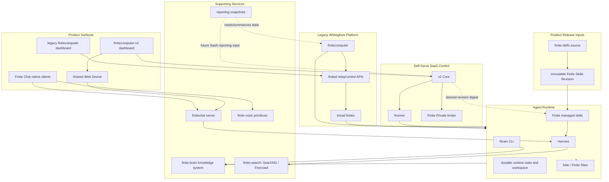

# Architecture Overview

> Status: imported from `finite-eng-docs` during Phase 7 on 2026-07-06. This
> document has not been fully revalidated after the monorepo import. Treat it as
> orientation background, not an authoritative current runbook.

This is the current high-level map. It is meant to help a new engineer decide
where to look first, not to specify every runtime or protocol flow.

## Product Shape

Finite is a hosted-agent environment. A user gets an account, lands in a
dashboard, and can interact with a provisioned Agent Runtime that already has
Hermes, the Finite Chat plugin, tools such as `fsite` and `fbrain`, skills,
workspace state, Finite Private access, and publishing paths configured.

The current product split is explicit:

- Self-serve SaaS: `finitecomputer-v2` is the product being built now. It owns
  WorkOS auth, the dashboard, Core, Projects, runner launch state, runtime image
  promotion, Finite Private grants, and hosted Finite Chat deploy coordination.
- Legacy whiteglove product: `finitecomputer` remains the product already
  shipped to box1/TRF/smoke while those users are unmigrated. It owns the
  existing dashboard relay loop, broad `finitec`/`finited` operations, host
  runbooks, and migration bridge code.
- Product chat for v2: `finitechat` owns the encrypted protocol, server,
  native clients, CLI/core, Hosted Web Device behavior, and Hermes `finitechat`
  plugin. The canonical BoxOne-derived dashboard chat runs through a trusted,
  revocable Hosted Web Device; Electron and native clients later join as
  separate local Devices using the same product account and Rooms.

The security ordering is recoverability first, then progressively stronger
operator privacy. The trusted first cohort targets O1: normal product paths
minimize Finite access, while an explicit audited Finite-assisted recovery path
remains available. Kata is isolated but host-operator-trusted; Phala/TEE can
raise the privacy level only after the same Recovery Set, key-release path, and
empty-target restore are proven. See
[ADR 0001](adr/0001-recoverability-precedes-operator-blindness.md).

## Layer Map



## Ownership Boundaries

`finitecomputer-v2` owns the new self-serve SaaS boundary. If the question
involves WorkOS signup, Projects, Core state, runner launch records, Finite
Private grants, runtime image promotion, hosted Finite Chat deploy mechanics,
or the v2 dashboard, start there.

`finitecomputer` owns the legacy whiteglove platform boundary. If the question
involves box1/TRF/smoke users, the dashboard relay path, broad `finitec` or
`finited` commands, host state, k3s, backups, or migration bridge behavior,
start there.

`finitechat` owns the encrypted chat boundary. If the question involves room
state, OpenMLS, shared Finite identity use in CLI/agent flows, iOS chat, native
client behavior, chat server contracts, or the Hermes chat bridge, start there.
For v2 releases, the deploy coordination handoff crosses through
`finitecomputer-v2`.

`finite-skills` owns the only editable source for the Managed Skills Baseline.
CI publishes immutable Finite Skills Revisions; each Runtime image embeds one
offline revision and compatible promoted revisions activate between turns
through a narrow Runtime Capability. A Finite Sites repository is a read-only
distribution mirror, and neither it nor the dashboard nor an old GitHub repo is
an authoring source. User-local skills remain runtime-owned data.

`finite-search` owns the self-hosted search and extraction services consumed by
agent tools. It is an ops/integration repo, not a product app.

`finite-brain` owns the encrypted Vault/Folder knowledge system, trusted
Product Client, `fbrain` CLI, Vault Working Tree sync, and FiniteBrain-specific
policy. Reusable Nostr primitives still belong in `finite-nostr`; FiniteBrain
Vault, Folder, access, sync, and Product Client policy stays in `finite-brain`.

`finite-nostr` owns reusable Nostr helpers. Product-specific policy should stay
out of it.

`reporting` owns generated reporting outputs and notes that summarize platform
state across time.

## State Boundaries

High-level state buckets:

- Git-owned state: source code, runtime baseline definitions, the editable
  skill baseline, runbooks, and deployment definitions.
- Release-owned state: immutable skill artifacts, manifests, digests,
  compatibility evidence, and Product Release pins.
- SaaS-owned state: v2 Core database records for accounts, Projects, runtime
  launches, entitlements, Finite Private grants, and desired/observed Finite
  Skills Revision ids.
- Host-owned state: legacy control plane databases, secrets, rendered
  manifests, deployment state, backups.
- Runtime-owned state: agent home, Hermes state, workspace files, that agent's
  Finite Home identity shared only by its local Finite tools, runtime-scoped
  Finite Private credentials, managed-revision caches, and user-owned skill
  overrides. Managed caches are reproducible; user skill content is not.
- Reporting-owned state: generated snapshots and evidence logs.

Do not assume one repo owns all copies of a concept. For example, a Hermes
integration change may touch `finitechat`, be deployed through
`finitecomputer-v2` for SaaS, still have legacy exposure through
`finitecomputer`, and depend on skills from `finite-skills`.

## Current Local Development Anchor

Pick the local loop by product lane:

- v2 dashboard/Core UI work starts in `finitecomputer-v2/apps/dashboard`.
  The documented lightweight loop is `npm ci`, then `npm run dev`; v2 product
  acceptance still climbs the Hermes runtime test matrix in
  `../finitecomputer-v2/docs/hermes-runtime-test-matrix.md`.
- v2 runtime proof starts with the resident streaming Hermes sidecar, then the
  same runtime contract under local full-product Docker, Kata, and Phala before
  dashboard-controlled SaaS launch. The target Runtime image packages
  `finitechat`, the Hermes `finitechat` plugin, `fsite`, `fbrain`, and one baked
  Finite Skills Revision in lockstep; the current image still omits the skills
  revision and its activation client.
- Legacy dashboard relay/chat work still uses the old `finitecomputer`
  MicroSandbox harness:

```bash
# From /Users/alex/Projects/finite
cd finitecomputer
nix develop
just chat-local-bootstrap smoke-finite
just chat-local-up
```

That starts the legacy dashboard, a local relay, and a MicroSandbox agent
runtime. Use `../../finitecomputer/docs/chat-local-dev.md` as the canonical
guide for that lane.
Use [Local development matrix](local-dev-matrix.md) when choosing between repo
specific loops or when onboarding an external contributor.

Other repos have local loops, but they are scoped:

- `finitechat`: local server, iOS simulator, Hermes gateway/canary scripts.
- `finite-brain`: Cargo workspace checks, local `finite-brain-app` server,
  Product Client at `/client`, Smoke UI at `/smoke/ui`, and the `fbrain` CLI.
- `finite-search`: static checks plus remote-service smokes through SSH tunnels.
- `finite-nostr`: Rust library checks.
- `finite-skills`: content validation through managed runtime usage.
- `reporting`: local snapshot/site generation, with optional live probes.

## Open Questions

- What is the first one-command v2 local proof for Core plus runtime launch
  once the Docker/Kata/Phala ladder is stable?
- Which legacy users and docs remain blocked on `finitecomputer` before the
  migration bridge can be deleted?
- Which docs are canonical versus historical in older root-level markdown files?
- Which cross-component changes require synchronized version pins or deployment
  gates?
- Should stable Finite Skills Revisions automatically activate fleet-wide after
  a canary cohort, or require per-Project opt-in?
