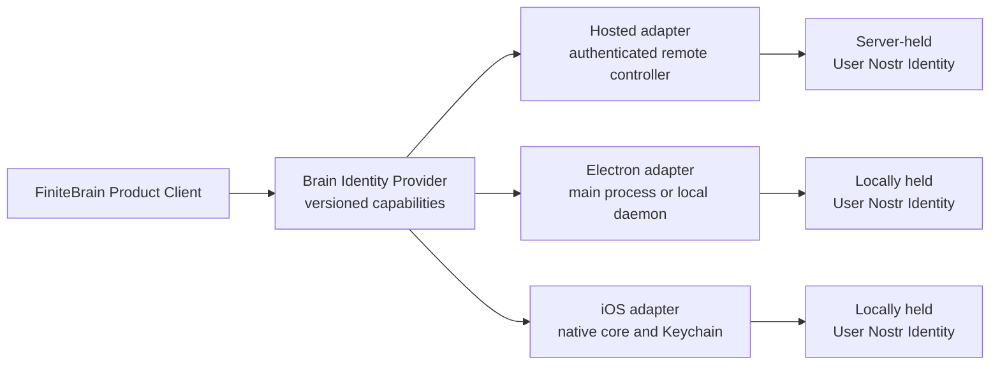

# Brain and Sites Integrated Viewing Across Web, Electron, and iOS

Status: **Draft for Austin review — planning only; no implementation is authorized by this document**

Date: 2026-07-13

Primary reviewer: Austin, FiniteBrain maintainer

Product direction: Paul

## Executive recommendation

Finite should present one human **User Nostr Identity** across Hosted Web,
Electron, and iOS while allowing each surface to keep the custody model that
fits it:

- Hosted Web uses the server-held User Nostr Identity already required by the
  Hosted Web Chat experience.
- Electron and iOS use the same User Nostr Identity from local protected
  storage.
- The FiniteBrain Product Client talks to one versioned, product-owned
  **Brain Identity Provider** contract. Hosted, Electron, and iOS implement
  different adapters behind that contract; normal Brain UI and crypto flows do
  not branch by platform.
- No browser or native renderer receives the raw nsec. The provider exposes
  only bounded Brain identity operations.
- The Product Client continues to hold Session Folder Keys and decrypt/encrypt
  Pages and Assets client-side. Hosted custody means Finite can technically use
  the User Nostr Identity, so Hosted Web Brain is a trusted hosted experience,
  not browser E2EE or operator-blind.
- Finite Sites uses the same User Nostr Identity as a Native Principal for
  signed-in Finite users. A user does not send themselves an email or depend on
  an email-shaped Share to view an Output their Project's Agent Principal just
  created.
- FiniteBrain remains its own product UI and policy owner. Its Product Client
  should adopt the dashboard's visual system and participate in the dashboard
  shell without moving Brain authorization, crypto, Vault, Folder, Page, or
  Asset policy into the dashboard.
- The current chat Preview evolves into a typed contextual **Artifact Viewer**
  that can render Sites Outputs, Brain Markdown Pages, and Brain PDF Assets by
  delegating authorization and content handling to the owning product.

The maintainability rule is: **one capability contract and conformance suite,
not one implementation of key custody**.

## Decision status

Agreed product direction:

- Hosted Web Brain acts as the server-held User Nostr Identity's Member
  Identity, accepting the trusted-hosted privacy trade-off.
- Brain stays its own product UI while becoming visually and navigationally
  coherent with the dashboard.
- Multi-Vault selection belongs in persistent sidebar navigation rather than a
  repeated setup ceremony.
- The contextual viewer should grow beyond Sites to Brain Markdown and PDFs.
- A signed-in Finite user should not need an email ceremony to view an Output
  their Project's agent just created.

Recommendations in this draft, pending Austin and owning-maintainer review:

- keep the nsec out of browser and renderer JavaScript;
- introduce one Brain Identity Provider contract with hosted and native
  adapters;
- use typed Brain operations rather than permanent general Nostr methods;
- add npub-native Sites Shares and Viewer Sessions; and
- isolate the signing/decryption-enabled Brain surface from arbitrary
  dashboard and Sites content.

Still open:

- the final provider operation shapes and transport;
- the hosted Brain origin/process owner;
- how old/different Member Identities migrate or recover;
- which authority creates an Agent Output's initial Project-owner Share;
- the exact Vault-switcher ownership boundary; and
- the PDF rendering mechanism.

## Why this decision is needed

The current product has one visible symptom with two different causes:

1. A person signed into the dashboard can open the Brain or Sites surface and
   still be asked to authenticate again.
2. Brain requires a specific Member Identity plus Folder Key Grants before it
   can decrypt content. Account Auth alone cannot provide either.
3. Sites can already exchange a verified account email for a Viewer Cookie,
   but only when an email Share already exists. A newly Agent-published Output
   is private by default and may have no Share for the Project owner.
4. Electron and iOS will hold the User Nostr Identity locally. A Hosted-Web-
   only Brain solution would create a second auth architecture unless the
   shared boundary is designed first.

The goal is a seamless viewing experience without collapsing Account Auth,
the User Nostr Identity, Agent Principal Keys, Brain grants, and Sites Shares
into one ambiguous authorization concept.

## Constraints and non-goals

Must:

- preserve existing readable Vault data and explicit revocation;
- keep Brain authorization and Folder Key policy in `finite-brain`;
- keep Sites sharing and Viewer Cookie policy in `finite-sites`;
- retain Account Auth as a dashboard gate rather than a cryptographic
  identity;
- use the same User Nostr Identity across human surfaces;
- maintain Session Lock and memory-only Brain plaintext/key rules; and
- design Hosted, Electron, and iOS adapters against the same contract and
  conformance cases.

Must not:

- expose a raw nsec or general signing/decryption oracle to arbitrary page or
  renderer JavaScript;
- infer that the human and Agent Principal are the same Principal;
- let a Sites Viewer Session or dashboard proxy create access implicitly;
- treat email or Account Auth as a Folder Key Grant;
- make Agent-created Outputs public by default;
- persist decrypted Brain content in ordinary dashboard/Core state; or
- weaken a Recovery Authority before the same Recovery Set restores through
  its replacement path.

Preferences:

- reuse the Brain Product Client across surfaces before funding separate
  native presentations;
- use typed product operations and shared Rust validation;
- keep happy-path identity/custody details out of normal user workflow while
  making them inspectable in security/account settings; and
- preserve product-scoped releases while pinning one compatible Finite Product
  Release for acceptance.

Escalate before implementation if:

- Austin identifies a conflict with current Brain grant or Product Client
  work;
- the Sites owner cannot identify a legitimate issuer for the initial
  Project-owner Share;
- native reuse would require loading unpinned remote Product Client code into
  a privileged renderer;
- existing user Vaults use identities without a safe regrant/recovery path; or
- the proposed bridge requires general-purpose Nostr authority to function.

This decision does not resume the parked Electron Chat parity run, change the
canonical Hosted Web Chat UI, authorize a production deployment, or define a
new Brain protocol compatibility promise by itself.

## Existing boundaries and implementation facts

The proposal follows the existing glossary:

- **Account Auth** is the WorkOS-backed dashboard identity. It is not a Nostr
  signer.
- **User Nostr Identity** is the human-controlled Nostr identity used by the
  user's Finite Chat account and eligible for native Finite operations.
- **Agent Principal Key** belongs to one Agent Runtime and stays distinct from
  the human identity.
- **Member Identity** is the npub to which FiniteBrain membership, Folder
  Access, and Folder Key Grants attach.
- **Native Principal** is a Sites Principal represented by npub.
- **Session Folder Key** is an opened Folder Key held only for the current
  trusted-client session.

Relevant current facts:

- `finitechat-hosted-device` already loads or creates a distinct Finite
  identity under each verified WorkOS user's server-side Finite Home. Its
  account secret remains in the hosted process boundary.
- The dashboard Brain route currently embeds the Product Client through a
  proxy. The proxy composes transport and UI but provides no Member Identity.
- The Product Client currently expects `window.nostr` and uses
  `getPublicKey`, event signing, and NIP-44 encrypt/decrypt. It already has
  adapter helpers and strong Session Lock/session-epoch behavior, but several
  UI paths still access `window.nostr` directly.
- Electron already protects its renderer with context isolation, sandboxing,
  a narrow preload surface, trusted-sender IPC checks, and protected main-
  process identity storage.
- iOS already stores its Nostr identity in Keychain-backed storage.
- Sites' implemented Share and Viewer Cookie path is email-shaped. The native
  npub viewer-session design exists only as a draft RFC today.
- The contextual Preview currently extracts Finite Sites URLs from chat and
  displays one selected Site in a sandboxed iframe.

## Proposed decision

### 1. Use one User Nostr Identity on all human surfaces

Hosted Web Brain acts as the same User Nostr Identity already used for Hosted
Web Chat. That npub is the acting FiniteBrain Member Identity.

Electron and iOS use that same identity from local custody. They do not create
desktop-only or phone-only Brain Member Identities merely because their key
storage differs.

This choice gives one stable Principal for:

- Brain Vault membership and Folder Key Grants;
- Sites native Shares and Viewer Sessions;
- human-authored Brain revisions and access mutations; and
- recovery or enrollment of another human device.

It does not make the User Nostr Identity equal to an Agent Principal Key or
make Account Auth a cryptographic identity.

### 2. Keep the raw nsec out of browser and renderer JavaScript

Hosted Web must not send the nsec to the browser, even temporarily. Electron
and iOS must likewise keep the raw key behind their main-process/native
boundary instead of exposing it to a web renderer.

Sending the nsec into JavaScript would be mechanically simple but would turn
one renderer compromise into permanent, offline User Nostr Identity theft.
The attacker could continue signing or decrypting outside the Account Auth
session and across Finite products. Ending a browser session would not revoke
the copied key; recovery would require identity rotation and explicit regrant
of every affected resource.

A provider-backed session cannot prevent compromised UI code from reading
plaintext that the user is actively viewing. Its narrower benefit is still
material: it prevents that compromise from automatically becoming permanent
identity theft or unrelated cross-product authority.

### 3. Define one Brain Identity Provider contract

`finite-brain` should own a versioned Brain Identity Provider contract. The
Product Client depends on the contract, never directly on hosted-service,
Electron, iOS, WorkOS, Keychain, or safe-storage details.

Conceptually:

The contract should expose Brain operations, not general Nostr authority. The
minimum conceptual capabilities are:

- report the acting public key;
- authorize and sign a bounded FiniteBrain HTTP request;
- authorize and sign a bounded FiniteBrain object or access mutation;
- open a validated Folder Key Grant addressed to the acting Member Identity;
- wrap a Folder Key Grant for a validated recipient and Brain operation; and
- clear or invalidate the current provider session.

The preferred end state is typed operation intents whose event shape is built
or validated by shared Brain policy. A generic `signEvent(anything)` plus
generic `nip44.decrypt(peer, ciphertext)` should not become the permanent
product contract.

For incremental adoption, the Product Client may use a NIP-07-shaped adapter
internally while the provider validates every request against exact Brain
event kinds, URL/method/payload bindings, recipients, Vault/Folder scope, and
the current session. `window.nostr` should be treated as a compatibility seam,
not the architecture.

### 4. Share policy and tests across adapters

Maintaining Hosted Web and native versions is reasonable only if the adapters
share policy and conformance evidence:

- Put event, request, grant-envelope, recipient, and size validation in
  reusable FiniteBrain Rust policy where practical.
- Version the provider contract independently of its transport.
- Run the same provider conformance cases against an in-process test provider,
  the Hosted adapter, Electron's local adapter, and iOS's local adapter.
- Keep Product Client state transitions, Session Lock, Vault switching,
  grant opening, object crypto, graph/search indexes, and UI behavior identical
  across platforms.
- Permit platform-specific copy only for custody and availability disclosures,
  such as “Hosted by Finite” versus “Key stored on this device.”
- Pin or package the Product Client assets used by native apps. Native key
  bridges must never be injected into arbitrary remote pages.

The adapters differ only below the contract:

| Surface | Key custody | Provider transport | Expected availability |
| --- | --- | --- | --- |
| Hosted Web | Finite-operated server storage | Authenticated, revocable remote bridge | Requires Account Auth and hosted services |
| Electron | Local protected storage/main process or daemon | Narrow IPC or loopback capability | Can operate without the Hosted identity bridge |
| iOS | Keychain/native process | Native/FFI capability | Can operate without the Hosted identity bridge |

This approach avoids two bad forms of duplication:

- a separate web-specific Brain protocol; and
- three renderers that each construct and validate security-sensitive events
  differently.

### 5. Preserve client-side Brain content crypto

The custody adapter does not decide where Page and Asset content crypto runs.
The Product Client remains the trusted client:

1. It asks the provider to open encrypted Folder Key Grants.
2. It holds resulting Session Folder Keys only in memory.
3. It decrypts and encrypts Folder Objects locally.
4. It builds readable Page, search, graph, replay, Markdown, and PDF state only
   inside the unlocked client session.
5. Lock, navigation, provider identity change, failed resume, or Vault switch
   clears Session Folder Keys and Ephemeral Client Plaintext according to the
   existing Brain contract.

Hosted Web remains a trusted hosted mode because the server-held User Nostr
Identity can technically open the same grants. We should not describe it as
browser E2EE or operator-blind. Electron and iOS provide local custody, but
they still need the same recoverability and explicit-grant story.

### 6. Use the User Nostr Identity for seamless Sites viewing

Sites and Brain should share the human identity/session capability, although
their authorization records remain product-owned.

For signed-in Finite users:

- Sites accepts a bounded Native Viewer Session request signed by the User
  Nostr Identity.
- Hosted Web obtains that signature through the hosted provider; Electron and
  iOS sign through their local provider.
- Sites verifies the exact output host, request method, payload, freshness,
  nonce/replay policy, and Native Principal access, then sets its existing
  host-scoped HttpOnly Viewer Cookie.
- The rendered Site receives neither the nsec nor a general signing bridge.
- Email login remains available for external collaborators and users who have
  not adopted a Native Principal.

For an Output created by a Project's Agent Principal, the first-slice product
rule should be:

> The Project owner's User Nostr Identity receives an explicit, revocable
> Sites Share when the Project Output is created, while the Output remains
> private to everyone else.

This is not the same as making the Output public, treating the human and agent
as the same Principal, or letting a Viewer Session create access. Sites must
store and re-check the Share on every request. The exact trusted Project-
binding proof and which actor records the initial owner Share still need a
Sites-owner decision; the dashboard must not forge an Agent Principal
mutation merely because Account Auth owns the Core Project.

### 7. Keep Brain UI ownership in `finite-brain`

FiniteBrain remains primarily its own UI. The integration goal is visual and
navigational coherence, not absorption into the dashboard:

- Brain owns the Product Client, Vault/Folder/Page/Asset terminology, session
  states, access controls, and crypto behavior.
- The Product Client adopts the dashboard's color, typography, spacing,
  control, focus, loading, empty, and error language.
- Dashboard navigation opens Brain without an additional connect-signer or
  email-login ceremony.
- When exactly one Vault is visible, the UI can omit a Vault switcher. When
  multiple Vaults are visible, the active Vault and switcher move into the
  persistent Brain sidebar rather than occupying a transient setup panel.
- Vault switching must use the existing Session Lock clearing rule before
  another Vault opens.

Whether the Vault switcher lives inside the Brain-owned sidebar or in the
outer dashboard navigation is still a UX boundary to review. If it lives in
the outer shell, communication must use a small, origin-checked, versioned
message contract and must not expose Folder Keys or content.

### 8. Generalize Preview into a contextual Artifact Viewer

The current chat Preview should evolve from “URLs that look like Finite Sites”
into a typed Artifact Viewer. Initial supported artifact kinds are:

- Finite Sites Project Output;
- FiniteBrain Markdown Page; and
- FiniteBrain PDF Asset.

The viewer should receive typed references, not arbitrary filesystem paths or
unclassified URLs. Each product remains responsible for resolving access:

- Sites establishes a Native Viewer Session and serves the Output through its
  normal serving plane.
- Brain opens the referenced Folder through the current Member Identity and
  Session Folder Key, then renders Markdown or a PDF from Ephemeral Client
  Plaintext.
- Lock or revocation removes the Brain artifact from the viewer immediately.
- A Sites iframe never receives the Brain Identity Provider.

PDF bytes should remain in memory for the unlocked session unless the user
explicitly exports them. The implementation must not silently write decrypted
PDFs, rendered Markdown, previews, titles, or derived indexes into browser
storage or ordinary dashboard/Core state.

## Hosted browser isolation recommendation

The current same-origin `/client` proxy is a useful composition prototype but
should not by itself be treated as isolation for a signing/decryption bridge.
The recommended production shape is an isolated first-party Brain frame or
origin with:

- an account-to-Brain session exchange bound to the exact Account Auth user;
- strict frame-ancestor and Content Security Policy rules;
- no bridge exposure on arbitrary dashboard or Sites routes;
- exact origin/source checks for any parent/frame messages;
- short session lifetime, CSRF protection, replay protection, request limits,
  and audit records; and
- immediate invalidation on Account Auth logout, explicit Brain Lock,
  provider identity change, or recovery-required state.

Austin should advise whether the Brain service should own this hosted
controller directly or consume a separate identity-controller service. Brain
must own the allowed operation policy either way.

## Recovery and migration

This decision must not strand existing knowledge:

- Existing Vaults already granted to the selected User Nostr Identity require
  no principal migration; each new surface opens the same encrypted grants.
- A Vault attached to a different Member Identity requires explicit regrant,
  recovery, or ownership migration. Account Auth and matching email are not
  substitutes.
- Loss of a Hosted Web controller while Electron or iOS still holds the same
  User Nostr Identity should permit explicit hosted re-enrollment without
  changing the npub or Folder Key Grants.
- Loss of every copy of the User Nostr Identity requires the declared Recovery
  Authority. Generating a new keypair does not recover existing Brain access.
- Adding native custody does not justify removing Finite's current Recovery
  Authority until the same Recovery Set has restored onto an empty target.
- Session Folder Keys, decrypted Pages/Assets, and derived indexes remain
  outside durable recovery state unless stored as approved encrypted recovery
  material.

## Alternatives considered

### Send the nsec to browser JavaScript for each session

Not recommended. It is simple and permits local signing, but any successful
exfiltration becomes permanent cross-product identity theft. Logout cannot
revoke it, operation policy cannot constrain it, and every browser session
becomes part of the key-custody and recovery surface.

### Give Hosted Web Brain a separate Member Identity

Not recommended. It would make the web experience a separate Principal,
require duplicate memberships and Folder Key Grants, complicate recovery, and
make web/native parity a recurring product problem.

### Keep Sites viewing email-only

Keep only as the external-user fallback. It is unnecessary ceremony for a
signed-in Finite user with a User Nostr Identity and does not align with the
native Electron/iOS direction.

### Expose a browser-wide remote `window.nostr`

Not recommended. A general signer/decrypter oracle is broader than Brain or
Sites need and is difficult to keep away from same-origin or user-controlled
content. A Brain-owned provider may temporarily adapt to the NIP-07 shape, but
the backing authority must remain operation-scoped.

### Move Brain plaintext processing to a normal server API

Not recommended. It would simplify rendering but discard the existing Product
Client boundary, client-derived indexes, Session Lock model, and encrypted
Folder Object architecture.

## Delivery phases

No phase begins implementation until this draft is reviewed and converted
into accepted plans/ADRs in the owning components.

### Phase 0 — Contract and conformance design

- Define the versioned Brain Identity Provider operations and error model.
- Decide typed intents versus validated NIP-07-shaped transition methods.
- Put reusable validation and test vectors in the owning Brain/Nostr Rust
  layer.
- Refactor Product Client access through one injected provider without
  changing product behavior.
- Define the provider conformance matrix before implementing platform
  adapters.

### Phase 1 — Hosted Brain adapter

- Bind Account Auth to the existing server-held User Nostr Identity.
- Establish an isolated, revocable Brain session.
- Implement only the allowlisted Brain provider operations.
- Enroll the User Nostr Identity as the correct Member Identity and deliver or
  recover its Folder Key Grants.
- Preserve Session Lock and memory-only plaintext/key rules.

### Phase 2 — Electron and iOS adapters

- Electron implements the same provider through its protected main-process or
  daemon boundary and narrow IPC.
- iOS implements it through native code/FFI and Keychain custody.
- Native Product Client assets are pinned or packaged; arbitrary remote pages
  cannot receive the bridge.
- Run the same provider conformance suite and Vault scenarios on all surfaces.

### Phase 3 — Sites Native Principal viewing

- Add npub Shares and the bounded Native Viewer Session endpoint to Sites.
- Establish the explicit Project-owner Share rule for Agent-created Outputs.
- Use hosted or local provider adapters to sign the same Viewer Session
  challenge.
- Retain email access only as an external-principal fallback.

### Phase 4 — Integrated Brain UI

- Align Product Client design tokens and states with the dashboard.
- Remove the extra connect-signer ceremony where the provider is already
  available.
- Put multi-Vault selection in the agreed persistent sidebar boundary.
- Prove keyboard, responsive, loading, lock, and error behavior.

### Phase 5 — Contextual Artifact Viewer

- Replace Site-URL scraping as the viewer's product model with typed artifact
  references.
- Preserve Sites viewer-session and Brain Folder-grant boundaries.
- Add Markdown Page and PDF Asset renderers with Session Lock cleanup.
- Keep exports explicit and prevent durable plaintext preview caches.

## Acceptance criteria

The later implementation is acceptable only when:

1. The same User Nostr Identity npub is reported by Hosted Web, Electron, and
   iOS for the same enrolled user.
2. Hosted Web opens an already-authorized Vault without another login or
   signer prompt.
3. Electron and iOS open the same Vault through local custody without
   depending on the Hosted identity bridge.
4. Browser and renderer JavaScript cannot read or export the nsec.
5. Provider requests outside exact Brain/Sites operations fail closed.
6. A provider identity change locks the Brain session before another protected
   request is sent.
7. Lock, navigation, failed resume, and Vault switching clear Session Folder
   Keys and Ephemeral Client Plaintext.
8. An Agent-created private Sites Output opens for the Project owner's User
   Nostr Identity without an email ceremony and remains inaccessible to an
   unshared Principal.
9. Removing a Sites Share blocks the next request despite a live Viewer
   Cookie.
10. Removing Brain Folder access prevents new grant opening and removes the
    artifact from a resumed session.
11. A Sites iframe or arbitrary dashboard page cannot call the Brain provider.
12. The Product Client presents the same Vault/Page/access behavior through
    Hosted, Electron, and iOS adapters.
13. Multiple Vaults show one stable sidebar switcher; a single Vault does not
    create unnecessary chrome.
14. The Artifact Viewer renders authorized Sites, Markdown, and PDF artifacts
    and rejects forged, revoked, inaccessible, or cross-product references.
15. Existing Vaults owned by another Member Identity produce an explicit
    migration/recovery state rather than an empty replacement Vault.

## Evaluation design

### Shared provider conformance

Run identical cases against every adapter:

- correct public key;
- allowed Brain request/mutation signature;
- wrong URL, method, body hash, event kind, Vault, Folder, recipient, or
  ciphertext rejection;
- stale, replayed, oversized, and post-lock request rejection;
- grant open/wrap success and wrong-recipient failure;
- identity-change detection; and
- session cancellation during an in-flight operation.

### Cross-surface product scenarios

- Create content on Electron, read/edit it on Hosted Web, then read it on iOS;
  all revisions attribute to the same Member Identity.
- Lock Hosted Web while Electron stays open; Hosted keys/plaintext clear
  without changing Electron's local session.
- Log out of Account Auth; hosted provider calls stop while native access
  continues.
- Disable the Hosted identity service; Electron/iOS still open authorized
  Vaults and Sites.
- Lose the Hosted controller and re-enroll it from a surviving native holder;
  the same npub and existing Vault access return.
- Present a Vault granted to an older/different npub; the UI explains regrant
  or recovery and does not silently mint replacement knowledge.

### Sites scenarios

- Agent creates a private Output for its Project; the Project owner opens it
  immediately through a Native Viewer Session with no email delivery.
- Another signed-in User Nostr Identity is denied.
- Revocation blocks the next iframe and top-level request.
- A valid signature without a Share does not create access.
- A Viewer Session cannot create or broaden a Share.

### Artifact Viewer scenarios

- The same viewer shell switches among an authorized Site, Brain Markdown
  Page, and PDF Asset.
- Locking Brain clears Markdown/PDF content while leaving an independently
  authorized Site session alone.
- A forged Brain object id, wrong Vault, wrong Folder, revoked grant, malformed
  PDF, and cross-origin message all fail closed.
- Browser storage inspection after Lock finds no raw Folder Keys, decrypted
  Markdown, PDF bytes, titles, or derived indexes.

### Recovery evidence

- Restore the declared identity and Brain recovery set onto an empty target,
  open the same Vaults, and decrypt known Pages/Assets.
- Prove a surviving native holder can re-enroll Hosted Web without identity
  rotation.
- Prove a new unrelated key cannot read old grants merely because Account Auth
  or email matches.

## Questions for Austin

Please review these in dependency order:

1. Should `finite-brain` own the Brain Identity Provider contract and shared
   policy, with platform adapters outside or beside the Product Client?
   **Recommendation: yes.**
2. Can the Product Client move from direct `window.nostr` reads to one injected
   provider without compromising its current grant, mutation, invite, and
   Session Lock behavior? **Recommendation: make this Phase 0.**
3. Should the durable contract accept typed Brain intents, or validated raw
   Nostr event templates? **Recommendation: typed intents; use a tightly
   validated NIP-07-shaped adapter only as a transition.**
4. Is returning an opened Session Folder Key to the Product Client the right
   hosted boundary, or should more grant-envelope processing move into shared
   Rust/Wasm? **Recommendation: preserve client-side Folder Object crypto, but
   centralize envelope validation.**
5. Should the Product Client be packaged and reused in Electron/iOS, or should
   native UIs share only the provider/domain contract? **Recommendation: reuse
   the canonical Product Client first, while keeping the contract able to
   support native presentation later.**
6. Should Hosted Brain run on an isolated Brain origin/frame rather than the
   current same-origin dashboard proxy? **Recommendation: yes for the
   signing/decryption-enabled surface.**
7. What is the least surprising explicit recovery/regrant UX for existing
   Vaults attached to another Member Identity?
8. Which sanitized Vault summaries, if any, may cross into an outer dashboard
   sidebar, and should the switcher instead remain entirely Brain-owned?
9. What PDF rendering path preserves Brain's memory-only plaintext rule while
   still supporting the contextual Artifact Viewer?
10. Which parts of this proposal conflict with current or planned FiniteBrain
    protocol work that are not visible in this monorepo snapshot?

## Governing documents and code

- [`finite-brain/CONTEXT.md`](../finite-brain/CONTEXT.md)
- [`finite-brain/docs/adr/0004-build-a-first-party-product-client.md`](../finite-brain/docs/adr/0004-build-a-first-party-product-client.md)
- [`finite-brain/docs/adr/0010-keep-opened-folder-keys-session-only.md`](../finite-brain/docs/adr/0010-keep-opened-folder-keys-session-only.md)
- [`finite-brain/docs/adr/0011-treat-the-device-as-the-v1-identity-boundary.md`](../finite-brain/docs/adr/0011-treat-the-device-as-the-v1-identity-boundary.md)
- [`finite-brain/docs/adr/0014-keep-browser-and-desktop-plaintext-ephemeral.md`](../finite-brain/docs/adr/0014-keep-browser-and-desktop-plaintext-ephemeral.md)
- [`finite-brain/docs/adr/0016-authorize-member-identities-not-controller-kinds.md`](../finite-brain/docs/adr/0016-authorize-member-identities-not-controller-kinds.md)
- [`finitecomputer-v2/docs/identity-boundary-v1.md`](../finitecomputer-v2/docs/identity-boundary-v1.md)
- [`finitechat/docs/adr/0011-hosted-web-chat-uses-a-revocable-device.md`](../finitechat/docs/adr/0011-hosted-web-chat-uses-a-revocable-device.md)
- [`finitechat/docs/rfc/0001-native-fsite-viewer-auth.md`](../finitechat/docs/rfc/0001-native-fsite-viewer-auth.md)
- [`finite-sites/docs/adr/0024-verified-email-viewer-session-exchange.md`](../finite-sites/docs/adr/0024-verified-email-viewer-session-exchange.md)
- [`docs/adr/0001-recoverability-precedes-operator-blindness.md`](adr/0001-recoverability-precedes-operator-blindness.md)
- [`finite-brain/crates/finite-brain-server/src/product-client.js`](../finite-brain/crates/finite-brain-server/src/product-client.js)
- [`finitecomputer-v2/apps/dashboard/src/app/dashboard/machines/[machineId]/brain/page.tsx`](../finitecomputer-v2/apps/dashboard/src/app/dashboard/machines/%5BmachineId%5D/brain/page.tsx)
- [`finitecomputer-v2/apps/dashboard/src/components/hosted-web-chat.tsx`](../finitecomputer-v2/apps/dashboard/src/components/hosted-web-chat.tsx)
- [`finitechat/apps/electron-chat/electron/preload.cjs`](../finitechat/apps/electron-chat/electron/preload.cjs)
- [`finitechat/ios/Sources/NostrIdentityStore.swift`](../finitechat/ios/Sources/NostrIdentityStore.swift)
