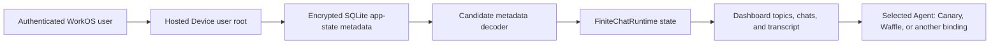

# Production Onboarding and Chat Causality Post-mortem

Date: 2026-07-25

Status: incident analysis and questions for future work. This report does not
prescribe a large new test suite or authorize another production change.

## The maxim

> **Don't Break Chat!**

Chat availability and durable history are Finite's primary product promise. A
feature is not worth shipping if we cannot explain and afford its compatibility
contract. A green candidate tested only with matching candidate components is
not evidence that an existing user, Device, Agent, or persisted state can enter
that candidate environment.

New-user onboarding is the next most important availability promise. It is
especially easy to neglect because the operator does not routinely create a
new account. A customer should not be the production probe for whether Finite
currently has an admissible Runner or whether a newly launched Agent has
crossed every readiness boundary.

## Executive summary

Finite had two user-visible production incidents with three distinct causal
failures:

1. **New-user onboarding had no available creator.** Both production Runners
   were drained, so the fleet-wide requirement that exactly one qualified
   Standard Runner accept new creation was false.
2. **A fresh Agent was healthy before its identity was ready.** The Runner
   accepted `/healthz`, then read `/contact` before it exposed `agent_npub`.
   The resulting HTTP 503 was reported as an Identity Authority binding
   failure and the fresh sandbox was cleaned up.
3. **Existing Hosted Chat state became unreadable.** The coordinated pairing
   work added an optional `paired_agent` field to encrypted app-state metadata
   but required the field to be present during deserialization. Candidate
   tests wrote and read the new shape together. Existing production metadata
   had no such field, so every chat view for that Hosted Device returned HTTP
   500.

The chat data was not lost. The affected store still contained 9 rooms, 4,439
messages, 5,000 retained events, and its app-state record. The incompatibility
blocked the reader before the dashboard could present them. The hotfix changed
a missing `paired_agent` to the intended `None`, retained fail-closed handling
for genuinely required fields, and restored both Upgrade Canary 0715 and
Waffle Prime.

The common failure was not lack of test volume. It was weak understanding and
review of **causal structure**:

- which production entry point reaches which implementation;
- which state and configuration each step requires;
- which readiness fact permits the next step;
- which older writers produced state the new reader must accept;
- which independently healthy components form a broken composition; and
- which implementations are real, shadow, historical, or unreachable.

We tested internally consistent worlds. Production contained time, history,
partial rollout, operational state, and old users.

## Terminology

“Signup” is overloaded. The user experiences one onboarding journey, but its
causal path contains different contracts:

- **Account enrollment:** establish the human's authenticated WorkOS account.
- **Agent admission:** reserve qualified production capacity and assign a
  creation request to a Runner.
- **Agent launch:** start compute and establish runtime health.
- **Agent identity readiness:** expose the Agent Principal through `/contact`.
- **Agent binding:** bind the human's Hosted Device and project to the
  canonical Agent room.
- **New-user onboarding:** the end-to-end product promise spanning all of the
  above.

This incident was observed as broken signup because new-user onboarding failed.
The evidence here specifically establishes failures in Agent admission and
launch/identity readiness; it does not establish that WorkOS account enrollment
itself failed.

This report uses four other terms:

- A **production through-line** is the real path from a user action to its
  durable product result, including configuration, queues, network calls,
  readers, writers, and cleanup.
- A **compatibility edge** is a transition between versions or independently
  deployed components, such as N-1 persisted state read by N code.
- An **existing-state wake-up** is an old user, Device, Agent, or database
  entering a candidate environment without being recreated by that candidate.
- **Reachability** asks whether production can call an implementation.
  Coverage asks whether a test can call it. They are not the same.

## Impact

- A valuable new user was blocked during onboarding at exactly the time they
  were trying the product.
- The operator's existing chats for Upgrade Canary 0715 and Waffle Prime did
  not load.
- The dashboard retried a server error and presented indefinite loading rather
  than the causal HTTP 500.
- The onboarding error named Identity Authority even though a direct
  non-mutating probe showed the Authority and credential were healthy.
- Detection came from a user and the operator, not a standing product-level
  availability signal.
- No chat history or Agent data was deleted. No database restore was required.

## The production through-lines

### New-user onboarding

```mermaid
flowchart LR
    A["WorkOS account enrollment"] --> B["Core creation request"]
    B --> C["Exactly one qualified Runner accepts admission"]
    C --> D["Runner launches Agent compute"]
    D --> E["Runtime /healthz is ready"]
    E --> F["Runtime /contact exposes agent_npub"]
    F --> G["Identity Authority registers/binds principal"]
    G --> H["Hosted Device binds canonical Agent room"]
    H --> I["User can chat"]
```



The incident broke two different edges:

- the fleet had zero creation-accepting Runners, so `B → C` was unavailable;
- `/healthz` did not imply `/contact` identity readiness, so `E → F` was
  traversed too early.

The first is a fleet invariant. No unit test of either Runner can prove it. The
second is a state-machine dependency. A test of final steady state can miss it.

### Existing Hosted Chat



The same per-user Hosted Device state feeds multiple Agent views. One unreadable
app-state record therefore blocked both Canary and Waffle before Agent-specific
selection mattered. Component-local reasoning about “the pairing field” hid a
larger blast radius: the field lived on the shared path to all Hosted Chat.

## What happened

### 1. Production reached zero admission capacity

The accepted host-role decision says lat1 remains drained for new creation and
lat3 is the sole initial creator. During the rollout work, both were drained.
Each Runner was individually in a valid, intentionally fail-closed state, but
their composition violated the availability promise for new-user onboarding.

The system had extensive drain, lease, capacity, and host-placement tests and
runbooks. Those controls explain how a Runner should refuse unsafe work. They
did not continuously answer the product question: “Can a qualified new user
successfully start an Agent now?”

This is not an argument for automatic lat1 fallback. The host-role ADR
explicitly rejects that because untargeted Runners can race and because a lat3
outage should fail closed. It is an argument that a deliberate zero-creator
state is a customer-facing maintenance condition, not merely two booleans that
happen to be true.

### 2. Health was mistaken for identity readiness

The fresh-launch path waited for runtime health, then proceeded before
`/contact` exposed the Agent Principal. Cold relocation already waited for that
same `agent_npub` because relocation had an expected identity to compare.
Fresh creation did not reuse the dependency.

PR [#302](https://github.com/finitecomputer/finite-mono/pull/302) moved
`wait_for_agent_npub` into every fresh launch and declared lat3's production
Identity Authority endpoint and root-only operator environment file.

The code change was small. The structural lesson is larger:

- the dependency existed in one lifecycle branch but not its sibling;
- `/healthz` described process health, not product readiness;
- the next step required a stronger fact than the prior step established; and
- the surfaced error pointed at a downstream subsystem rather than the failing
  readiness edge.

### 3. A new persisted field made pre-pairing Hosted Device state unreadable

PR [#281](https://github.com/finitecomputer/finite-mono/pull/281) added:

```rust
paired_agent: Option<StoredPairedAgent>
```

to `StoredAppState`, but the serialized metadata used:

```rust
#[serde(deserialize_with = "deserialize_required_option")]
paired_agent: Option<StoredPairedAgent>,
```

The value was optional, but its key was mandatory. Metadata written before the
feature did not contain the key. The new reader rejected that old state.

The tests did not merely omit compatibility coverage. One test explicitly
classified a missing `paired_agent` as a legacy shape that must fail closed.
The suite strongly reinforced the candidate's internal belief while violating
the actual compatibility edge.

The coordinated iOS, Electron, protocol, server, Hosted Device, and dashboard
work was tested all lined up. That was useful evidence for a new world created
entirely by the branch. It did not exercise an existing Hosted Device waking up
under the new reader.

PR [#304](https://github.com/finitecomputer/finite-mono/pull/304) changed the
field to `#[serde(default)]`, added an encrypted pre-pairing metadata fixture,
and retained required decoding for `selected_room_id` and `revoked_devices`.
Production app state returned HTTP 200 after deployment, both affected chat
views loaded, and the server contract gate passed.

## Why the tests did not protect production

The repo has many tests. More importantly, it has many good tests. The problem
was what world they made true.

### Candidate unanimity hid compatibility

When every component and fixture is produced by the same branch:

- new writers include new fields;
- new readers see those fields;
- new Agents expose the behavior expected by new clients;
- new local databases contain the candidate schema;
- every protocol participant agrees because it changed simultaneously.

That proves a coherent candidate. It does not prove a deploy.

Production rarely upgrades as a coherent blank slate. It contains old
ciphertext, old RuntimeSpecs, old Devices, sleeping Agents, old Electron
releases, new servers, retained `/data`, partially restarted services, and
operator state that code does not own.

### Component validity hid composition failure

“Lat1 is safely drained” and “lat3 is safely drained” can both be true while
“new-user onboarding is available” is false.

The required assertion lives over the deployment topology:

> Exactly one qualified Standard Runner is accepting new creation, unless
> onboarding is explicitly in maintenance.

No amount of isolated Runner correctness proves that statement.

### Steady-state health hid sequencing

The Agent eventually exposes `/healthz` and `/contact`. A final-state test can
observe both and pass while the production launcher races from the weaker fact
to the stronger one. The causal assertion is:

> The launcher cannot begin identity binding until the exact launched Agent
> Principal is available.

That is an ordering contract, not a pair of endpoint tests.

### Coverage hid reachability

PR [#288](https://github.com/finitecomputer/finite-mono/pull/288) is the most
concrete current example. Its archaeology found three named Core store/state
surfaces and two business-logic implementations, while only the row-native
Postgres path served production. The historical in-memory engine continued to
grow after it stopped being authoritative because tests and dispatch plumbing
kept it looking alive.

Moving tests onto the production path exposed defects that green tests against
the shadow implementation had hidden. The lesson is not “delete every fake.”
It is:

> A test's value depends on the causal relationship between its implementation
> and production, not on its count or fidelity in isolation.

PR #288 remains open and requires its own review. This report uses its finding
as evidence; it does not pre-approve that large refactor or waive its failed
Rust CI result.

## Root causes

### Primary

1. **We reviewed components more readily than production through-lines.**
   Ownership and tests are organized by crate, service, and app; user promises
   cross all of them.
2. **Persisted and independently deployed compatibility was implicit.** The
   type system made the new Rust world exhaustive but could not make historical
   JSON keys, old Devices, or old binaries exhaustive.
3. **The candidate environment was too self-consistent.** Coordinated tests
   proved all-new participants, not the old-to-new edges created by deployment.
4. **Operational configuration was outside the product acceptance picture.**
   Runner drain state was treated as host posture even though its composition
   determines onboarding availability.
5. **Reachability was inferred from code and tests.** A whole implementation
   can be internally referenced and heavily tested while remaining outside the
   production path.

### Contributing

- The pairing PR had a very large cross-product of iOS, Electron, protocol,
  server, Hosted Device, and dashboard changes.
- The optionality of `Option<T>` made the required JSON key easy to overlook.
- The test name “rejects legacy shapes” framed historical state as invalid
  rather than as a compatibility obligation.
- Product health endpoints did not distinguish process health, identity
  readiness, chat readability, and onboarding availability.
- Dashboard retry behavior hid a deterministic HTTP 500 as indefinite loading.
- Error attribution collapsed a runtime-contact failure into an Identity
  Authority failure.
- Fast iteration and coordinated feature work rewarded proving the new path
  before tracing every predecessor.

## What worked

- The chat store failed before rewriting unreadable state.
- Chat history remained present and the service-consistent recovery snapshots
  gave diagnosis and rollback boundaries.
- Nix retained historical binaries and generations, allowing the exact
  compatibility boundary to be reproduced against snapshot copies.
- Generation 92 read the old state; generations 93 and 94 failed. That isolated
  the regression from the NixOS 26.05 upgrade.
- The production repair followed the required order: read-only evidence,
  copied-state reproduction, synthetic compatibility proof, fresh snapshot,
  merged fix, immutable deploy, API verification, contract gate, and signed-in
  product verification.
- The hotfix was one compatibility annotation plus a focused historical-state
  regression, not a durable-state rewrite.
- Existing cold-relocation behavior already contained the correct identity
  readiness primitive and made the onboarding fix small.

## The direction test for future work

Before merging a feature, refactor, protocol change, persisted field, Runtime
change, or host-role change, a reviewer should be able to answer these in plain
language:

1. **What user promise can this change interrupt?**
2. **What is the production entry point for that promise?**
3. **What exact implementation does production reach?**
4. **What persisted state or old participant enters this path?**
5. **Who writes each changed field, and who reads it?**
6. **What fact allows each step to call the next step?**
7. **Does health mean alive, ready, compatible, or actually usable?**
8. **What happens when an existing Agent wakes up without being recreated?**
9. **Which N-1 → N and mixed-version edges does deployment create?**
10. **Which host configuration or fleet-wide invariant is part of success?**
11. **Could every component be locally valid while the composition is broken?**
12. **Is a tested implementation reachable from the production entry point?**
13. **Is there a shadow implementation whose tests create false confidence?**
14. **Can an error name the precise failed edge rather than a downstream guess?**
15. **Can we make the invalid state unrepresentable or delete a redundant path
    instead of fencing it with more tests?**
16. **Can we afford the compatibility and observability contract of this
    feature? If not, should we say no?**

The desired review artifact is not a ceremonial checklist. It is a small causal
map: entry point, nodes, durable state, compatibility edges, and product
postcondition. If the map is surprising, the design needs work before the test
plan does.

## Quality direction

This incident should not produce a reflexive matrix explosion or materially
slower default CI. The direction is fewer, higher-leverage proofs.

### Prefer through-line proofs

A good integration proof starts from the user-visible entry point, crosses the
same boundaries as production, and asserts the durable result. It should not
swap in a second business-logic implementation merely because that path is
easier to seed.

### Keep one existing-state wake-up per compatibility class

For stateful boundaries, retain the smallest representative predecessor:

- encrypted Hosted Device metadata written before a new field;
- an N-1 Runtime `/data` tree entering an N image;
- an old Electron/iOS Device pairing with the current service;
- the current production-like Postgres schema and rows entering a new Core;
- a pre-existing Agent waking after only control-plane services changed.

These do not all belong in every PR. Change classification should select the
relevant predecessor and run a focused lane.

### Review mixed versions before all-new versions

For a coordinated feature, write down the independently deployed participants
and the order in which they can change. Test or reject the meaningful mixed
states. If only an atomic deployment is supported, the deploy mechanism must
actually provide that atomicity and rollback boundary.

### Make production truth the easy fixture

Local and CI tests should prefer:

- the same database engine;
- the same decoder and projection functions;
- the same service entry points;
- the same readiness sequence;
- the same Nix/Runtime configuration shape; and
- anonymized or synthetic historical state produced by the prior release.

A fake remains useful for fault injection or a narrow unit boundary. It should
not silently become the authoritative behavioral implementation.

### Add a causality review, not a generic approval layer

A lightweight independent agent review before merge should trace:

- the changed user promises;
- callgraph and dataflow from real entry points;
- changed writers/readers and serialized state;
- N-1, sleeping-Agent, and partial-deploy edges;
- production configuration and global invariants;
- shadow/dead paths reinforced only by tests; and
- whether the feature's contract burden is justified.

The reviewer should be rewarded for deleting an unnecessary implementation,
shrinking a compatibility surface, or recommending “do not ship this feature,”
not for manufacturing a longer list of tests.

## Questions we should keep asking

These are intentionally not all answered here.

### Chat and state

- Which data structures are part of the durable chat compatibility contract,
  even if they are currently private Rust structs?
- Where are schema versions real, and where does a `V1` name merely imply a
  contract that no migration machinery enforces?
- Can additive optional fields default safely by construction?
- Which missing fields indicate historical state, and which indicate
  corruption?
- Can every current reader open state produced by the last deployed writer?
- Can the prior reader safely reopen state after the new writer touches it?
- What is the minimum historical transcript and identity fixture that proves
  access to important chat history?
- Can the dashboard distinguish unreadable state, unavailable Agent compute,
  and transient reconnect instead of rendering all three as loading?
- Should a shared Hosted Device state failure be isolated so one projection
  cannot block every Agent binding?

### Onboarding

- What is the canonical synthetic proof of first-time onboarding without
  repeatedly creating real human accounts?
- Can account enrollment, capacity admission, Agent launch, identity readiness,
  and chat readiness report distinct states to the user and operator?
- What continuously proves that exactly one qualified Runner accepts Standard
  creation?
- When zero creators is deliberate, how is onboarding put visibly into
  maintenance before a customer discovers it?
- Should a deploy fail or pause when it would leave no creator?
- Which endpoint represents “this Agent can complete onboarding,” rather than
  merely “a process is alive”?
- Can cleanup preserve enough evidence to diagnose a failed fresh launch
  without leaking or retaining unsafe compute?

### Existing Agents and coordinated features

- For every Agent-affecting feature, what does an existing Agent do when it
  wakes up under the new control plane?
- Which changes affect only new RuntimeSpecs, and which reach existing
  RuntimeSpecs on restart or upgrade?
- Do we have a named old-Agent/new-control-plane lane separate from an
  all-candidate launch?
- Which client/server combinations are actually supported during iOS,
  Electron, dashboard, server, and Runtime rollout?
- Are we accidentally calling a sequence of ordinary deploys “coordinated”
  without providing atomicity?
- When should a cross-component feature be split, staged behind compatibility,
  or rejected?

### Structure and reachability

- What are the real production roots for each product promise?
- Can we generate or maintain useful callgraphs from those roots without
  pretending dynamic configuration and network edges are ordinary Rust calls?
- Which implementations exist only because tests call them?
- Which interfaces have multiple implementations without a conformance reason?
- Which tests exercise a representation that production never stores?
- Which mocks echo inputs instead of reproducing the transformations where
  bugs occur?
- Can we delete a dead arm and move its useful scenarios onto production truth,
  as PR #288 proposes?
- What review evidence is required before merging PR #288's large deletion and
  migration?

### CI and rollout

- Can a change classifier cheaply identify persisted-state, protocol,
  RuntimeSpec, host-role, or deployment-topology changes?
- Can focused predecessor fixtures run only for the affected class?
- Can CI prove the candidate against the last deployed artifact without
  rebuilding a large historical matrix?
- Which production configuration invariants can be evaluated from candidate
  closures before switch?
- Can rollout reports name the user promises temporarily unavailable during
  activation?
- Do our health checks prove use, or only process existence?
- What is the smallest valuable product smoke after every broad Nix switch?

### Product judgment

- Does this feature add another state owner, protocol participant, or
  compatibility edge?
- Can we explain why it will continue to work six months and two releases from
  now?
- Is the feature important enough to pay for its state lineage, mixed-version
  behavior, recovery, and observability?
- Would a simpler product boundary remove more risk than another safety test?
- Are we vectoring toward fewer authoritative paths and clearer contracts, or
  toward more synchronized machinery that only works when everything moves
  together?

## Near-term follow-up candidates

These are candidates for separate, reviewed work, not commitments made by this
post-mortem:

1. Review PR #288 specifically through the production-reachability and
   migration-risk lens; merge only after its real Postgres path, schema
   migration, CI failure, and rollback boundary are resolved.
2. Define a compact causality-review template and use an independent agent on
   persisted-state, protocol, Agent Runtime, and host-role PRs.
3. Add one focused pre-pairing Hosted Device fixture to the normal Rust lane
   and decide how predecessor fixtures are retained without fixture sprawl.
4. Design an existing-Agent wake-up rung that boots retained N-1 state under
   the candidate control plane without requiring a full fleet rollout.
5. Surface the fleet-wide creator invariant and the stronger end-to-end
   onboarding readiness signal.
6. Make deterministic Hosted Device state failures visible in the dashboard
   instead of retrying forever.
7. Inventory the remaining duplicate state/business-logic implementations by
   tracing from production roots, not by counting test references.

## Standard for success

We should not measure the response to this incident by the number of tests,
gates, or documents added.

We are moving in the right direction when:

- a reviewer can sketch why chat and onboarding work end to end;
- persisted state has an explicit lineage across releases;
- existing Agents are first-class release participants;
- production and test entry points converge;
- global availability invariants are visible;
- errors identify the failed causal edge;
- dead implementations become easy to identify and delete;
- features reduce or justify their compatibility surface; and
- a small number of through-line proofs catch the failures users would
  otherwise discover.

We are moving in the wrong direction when:

- every component is green only when upgraded together;
- tests keep shadow implementations alive;
- a new field silently creates a historical-state requirement;
- health is treated as readiness;
- host configuration is excluded from product acceptance;
- retries turn deterministic failures into loading states;
- compatibility is delegated to production; or
- quality work adds barbed wire around a structure nobody can explain.

## Related evidence

- [PR #281: focused iOS/Finite Chat coordinated changes](https://github.com/finitecomputer/finite-mono/pull/281)
- [PR #302: wait for managed Agent identity readiness](https://github.com/finitecomputer/finite-mono/pull/302)
- [PR #304: load pre-pairing Hosted Chat state](https://github.com/finitecomputer/finite-mono/pull/304)
- [PR #288: one Core store implementation](https://github.com/finitecomputer/finite-mono/pull/288)
- [`finite-lat-capacity-and-redundancy.md`](../runs/finite-lat-capacity-and-redundancy.md)
- [ADR 0005: finite-lat host roles and placement](../adr/0005-finite-lat-host-roles-and-placement.md)
- [`finite-chat-reliability-remediation-2026-07-15.md`](../audits/finite-chat-reliability-remediation-2026-07-15.md)
- [`agent-runtime-upgrade-rollout-2026-07-16.md`](agent-runtime-upgrade-rollout-2026-07-16.md)
