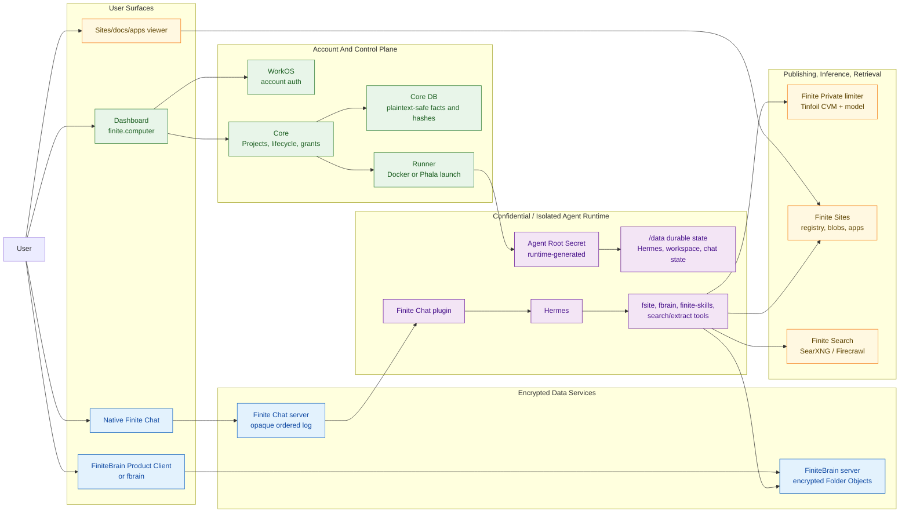

# System Flow And Trust Boundaries

> Status: imported from `finite-eng-docs` during Phase 7 on 2026-07-06. This
> document has not been fully revalidated after the monorepo import. Treat it as
> orientation background, not an authoritative current security model.

Status: orientation map for architecture conversations.

This document gives a high-level mental model for how users touch Finite, how
the front ends reach the services, and where security, encryption, key custody,
and confidential-compute boundaries sit.

It intentionally stays above per-service implementation details. Use it to have
the conversation first, then follow the owning-repo links when a boundary needs
more precision.

Related drawing: [system-flow-and-trust-boundaries.excalidraw](system-flow-and-trust-boundaries.excalidraw).

## The Short Model

Finite has four planes:

| Plane | User-facing shape | Main owner | What belongs there |
| --- | --- | --- | --- |
| Account and control plane | `finite.computer` dashboard | `finitecomputer-v2` | WorkOS login, Projects, lifecycle, billing/entitlements, runtime launch state, Finite Private grants, plaintext-safe support facts |
| Runtime execution plane | Hosted Agent Runtime | `finitecomputer-v2` runner plus runtime image | Hermes, Finite Chat plugin, `fsite`, `fbrain`, workspace files, runtime-local auth, Agent Root Secret, decrypted agent state |
| Encrypted collaboration plane | Native Finite Chat and FiniteBrain clients | `finitechat`, `finite-brain`, future `finite-auth` | E2EE chat payloads, encrypted Folder Objects, shared Finite/Nostr identity, user/device cryptographic identity, Folder Keys, signing sessions |
| Publishing and retrieval plane | Sites, apps, docs, search/extract tools | `finite-sites`, `finite-search` | Git-backed publishing, private/shared/public output ACLs, app hosting, SearXNG, Firecrawl, Tinfoil search candidates |

The most important rule is that **Account Auth is not cryptographic identity**.
WorkOS authorizes dashboard and billing operations. Shared Finite/Nostr keys,
and eventually the fuller `finite-auth` path, are the user and device
cryptographic identity path. Agent runtime keys and shared identity files are
created or opened inside the runtime boundary, not in Core.

## User Touchpoints

Users mainly interact with the system through these surfaces:

| Surface | User does | Service path | Security posture |
| --- | --- | --- | --- |
| SaaS dashboard | Sign in, create Project, inspect status, restart/stop/destroy, see invite, manage plaintext-safe ops | WorkOS -> dashboard -> Core -> runner | Account-authenticated control plane. Should not show chat messages, user files, Agent Root Secret, recovery package bytes, or raw runtime keys. |
| Native Finite Chat | Join a no-PIN invite and chat with the agent | Native app -> `chat.finite.computer` -> Agent Runtime Finite Chat plugin -> Hermes | Chat server orders and stores opaque MLS ciphertext. User device and runtime decrypt. |
| Agent runtime | Receives chat, runs Hermes/tools, edits workspace, publishes, searches, uses private inference | Runtime process -> Finite Private, Sites, Brain, Search, external web | Decrypted user/agent data exists here. This is the sensitive execution boundary. |
| FiniteBrain Product Client / `fbrain` | Open Vaults, unlock readable Folders, sync encrypted knowledge | Trusted client/runtime -> FiniteBrain server | Server stores encrypted Folder Objects and grants; trusted clients/runtimes open Folder Keys locally. |
| Finite Sites viewers/editors | View, share, publish sites/docs/apps | `fsite`/git/API -> Finite Sites registry/blob/app host -> `*.finite.chat` | Private by default and ACL-gated, but served output bytes are not automatically E2EE. Treat as access-controlled publishing. |
| Public/search web | Agent searches and extracts pages | Hermes tools -> SearXNG/Firecrawl, possibly Tinfoil SearXNG | Search/extract services can see queries and fetched content. Tinfoil can improve operator privacy for supported pieces, not make public web data secret. |

## Full Flow

Read the flow left to right:

1. The user signs in through WorkOS and uses the dashboard to create or manage a
   Project.
2. Core records Project and lifecycle state, issues or coordinates Finite
   Private grant state, and leases a launch to the runner.
3. The runner launches an Agent Runtime. Phala is the default confidential
   runner target for SaaS; Docker is the local/remote preflight runner.
4. On first boot, the runtime owns `/data`, creates or opens its Agent Root
   Secret and shared Finite identity inside the runtime boundary, and exposes
   readiness plus a no-PIN Finite Chat invite.
5. The user joins from the native Finite Chat client. The chat server orders
   opaque encrypted room events; the user device and runtime decrypt.
6. Hermes handles the agent behavior and reaches tools: Finite Private for
   managed private inference, Finite Sites for publishing, FiniteBrain for
   encrypted knowledge, and finite-search for web retrieval.

## Security Boundaries

| Boundary | Trusted to do | Should not be trusted to do |
| --- | --- | --- |
| WorkOS/account auth | Authenticate dashboard users, account linking, billing/admin access | Represent the user's cryptographic identity or decrypt user/agent data |
| Dashboard/Core | Store Project records, runtime status, provider handles, operation history, Finite Private grant/key hashes, entitlement facts | Store Agent Root Secret, chat contents, user files, raw recovery keys, raw provider fallback keys, decrypted runtime state |
| Runner/provider control | Start, stop, restart, and inspect provider-level health; inject runtime-scoped Finite Private key through provider env/sealing path | Read agent workspace, chat messages, Agent Root Secret, or user backup material |
| Agent Runtime | Run Hermes and tools; decrypt chat addressed to the runtime; hold runtime-owned keys and workspace data | Be treated as a generic dashboard-managed filesystem or stateless worker |
| Finite Chat server | Order, durably store, and route room events and Welcomes | Decide identity, read message contents, or become the source of cryptographic membership truth |
| FiniteBrain server | Gate Vault/Folder access, store encrypted objects/grants/sync records | Decrypt Page paths, Page titles, links, Page contents, graph/search/replay data |
| Finite Sites | Store, version, serve, and ACL-gate published project outputs | Provide E2EE semantics for served bytes unless an output explicitly implements its own encryption |
| Finite Private limiter | Reserve/settle usage and proxy model calls inside the private-inference lane | Become a general storage or chat authority |
| Search/extract services | Fetch public web search results and page content for agents | Hide queries/content from the service itself unless the specific deployment is designed and verified for that privacy property |

## Key And Secret Custody

| Secret or identity | Where it lives | Notes |
| --- | --- | --- |
| WorkOS account identity | WorkOS/dashboard session and Core user linkage | Product login and billing identity only. Not the user's Nostr identity. |
| User Primary Key | Shared Finite identity today; future `finite-auth` / Frostr path for richer custody | The current CLI/agent contract is one Nostr key at the shared identity path. The target model still allows a Frostr group public key with server, user-client, and native-secure-storage shares. |
| Agent Chat Identity | Agent Runtime Finite Chat state plus shared Finite identity on the durable runtime mount | The agent appears as its own chat participant. This is distinct from an Agent Signing Session that acts as the user's key. |
| Agent Root Secret | Generated and opened inside the Agent Runtime | Restores the runtime's own cryptographic identity and derives or unwraps runtime-owned service keys. Core, dashboard, runner, and operators should never see it. |
| User Backup Key | Delivered after first successful pairing; stored by the user's native app, such as iOS Keychain | Disaster recovery material, not routine restart unlock. The dashboard should show backup status, not backup secret material. |
| Runtime-scoped Finite Private key | Issued by Core, raw value returned/injected once, hashes and grant state stored in Core | The runner passes the key only to the target runtime. Hermes config references it through env rather than writing the raw key into config. |
| FiniteBrain Folder Keys | Opened by trusted clients or runtimes with Folder access | The server stores grants and encrypted object envelopes. Decryption and graph/search/replay happen client-side. |
| Shared Finite identity | `$FINITE_HOME/identity/identity.json` in trusted runtimes or `~/.finite/identity/identity.json` locally | Used by `finitechat` CLI/agent flows, `fsite`, and `fbrain` for Nostr identity and signing. Whichever trusted Finite tool runs first may mint it. Do not copy or print the secret. |
| Tinfoil / Phala / object-storage operator secrets | Provider secret manager or host-only ignored env files | Deployment credentials are operational secrets, not user identity or data-decryption keys. Real user-data unlock should not rely solely on operator-supplied secrets. |

## Data Classification

| Data | Classification | Why |
| --- | --- | --- |
| Project id, status, image/artifact id, provider handle, runtime heartbeat, invite/status URL | Plaintext-safe control metadata | Needed for support and lifecycle. Should not contain chat/user-file payloads. |
| Finite Private grants, API-key hashes, usage counters, reservations, audit events | Sensitive service metadata | Core needs it for entitlement and accounting. Raw keys should not be stored or logged. |
| Chat messages, command payloads, attachments metadata inside room messages | Encrypted collaboration data | Finite Chat server stores opaque MLS payloads; clients/runtimes decrypt. Attachment blobs are encrypted before external blob upload. |
| FiniteBrain Pages, paths, titles, links, assets, graph/replay/search indexes | Encrypted knowledge data | Server stores encrypted Folder Objects; trusted clients and runtimes materialize readable content. |
| Runtime workspace, Hermes memory, tool state, runtime-local auth, chat state | Decrypted runtime data | Lives inside `/data` and process memory in the Agent Runtime. This is the highest-sensitivity runtime data bucket. |
| Finite Sites source repos, rendered outputs, stateful app data | Access-controlled publishing data | Private/shared/public ACL controls visibility. Do not assume E2EE; public outputs are intentionally readable. |
| Search queries, extracted pages, web results | Retrieval data | Self-hosted/Tinfoil deployment can change operator exposure, but search/extract workloads still process plaintext queries and public web content. |
| Runtime backups in object storage for Tinfoil-style restore | Encrypted storage data | Object storage should only hold encrypted backups/manifests. Restore keys should come from user-mediated or attestation-gated paths before real user data. |

## Trusted Execution Environments

There are three separate TEE/confidential-compute conversations:

| Area | Current direction | Important caveat |
| --- | --- | --- |
| Agent Runtime | Phala is the default SaaS confidential runner target because it has durable mounts. Docker remains the local and remote preflight backend. | The launch architecture assumes `/data` survives normal restart. The exact Phala durable-volume encryption, sealing, migration, and operator-visibility guarantees still need a crisp product decision. |
| Finite Private inference | The limiter and model path run through a Tinfoil CVM lane. Core does accounting and grant checks. | The runtime sends prompts to this lane. It is private inference, not a general encrypted storage system. |
| Search/extract | SearXNG has a Tinfoil prototype with bearer-token gating. Firecrawl remains plain Docker until its state, browser, egress, and auth model are designed for Tinfoil. | Tinfoil containers are public-inbound through the shim and have no persistent disk by default. Do not describe a service as Tinfoil-ready without verifier/proxy proof. |

The older Tinfoil full-agent-runtime path is a useful privacy target and spike,
but it is not the current v2 launch default because Tinfoil lacks durable mounts.
If that path returns, runtime state must be restored from encrypted backups and
unlocked through user-mediated or attestation-gated key release.

## Open Questions To Resolve

- What exact Phala guarantees are acceptable for `/data` durable state:
  volume encryption, migration, snapshotting, deletion, and provider/operator
  visibility?
- Should the Agent Root Secret be wrapped at rest on `/data` immediately, and
  if so what sealing primitive or in-runtime wrapping key is available?
- What is the exact User Backup Key package shape, rotation story, and
  multi-device approval flow?
- How should future `finite-auth` link WorkOS accounts to User Primary Keys,
  especially for teams and multiple keys per account?
- Where should long-lived Tinfoil search tokens live when SearXNG moves beyond
  prototype use?
- Which user-facing labels should distinguish access-controlled private Sites
  from genuinely encrypted Chat/Brain data?

## Source Pointers

- `finitecomputer-v2`: [README](../finitecomputer-v2/README.md),
  [Context](../finitecomputer-v2/CONTEXT.md),
  [Stack deployment](../finitecomputer-v2/docs/finite-stack-deployment.md),
  [Auth and key custody brief](../finitecomputer-v2/docs/auth-key-custody-brief.md),
  [Runtime control contract](../finitecomputer-v2/docs/runtime-control-contract.md).
- `finitechat`: [Architecture](../finitechat/docs/architecture.md),
  [Protocol v1](../finitechat/docs/protocol-v1.md),
  [Hermes integration](../finitechat/integrations/hermes/README.md).
- `finite-brain`: [README](../../finite-brain/README.md),
  [Portability spec](../../finite-brain/docs/specs/finitebrain-portability-spec.md),
  [Folder Object crypto ADR](../../finite-brain/docs/adr/0003-keep-folder-object-crypto-in-finite-brain-core.md).
- `finite-sites`: [README](../finite-sites/README.md),
  [NIP-98 mutations ADR](../finite-sites/docs/adr/0002-authenticate-mutations-with-nip98.md),
  [Private-by-default sharing ADR](../finite-sites/docs/adr/0006-private-by-default-google-doc-sharing.md).
- `finite-auth`: [README](../../finite-auth/README.md),
  [Frostr signer ADR](../../finite-auth/docs/adr/0003-share-user-agent-signer-through-frostr.md),
  [Native secure secret storage](../../finite-auth/docs/specs/native-secure-secret-storage.md).
- `finite-search`: [README](../../finite-search/README.md),
  [Tinfoil evaluation](../../finite-search/docs/tinfoil-evaluation-2026-07-01.md).
