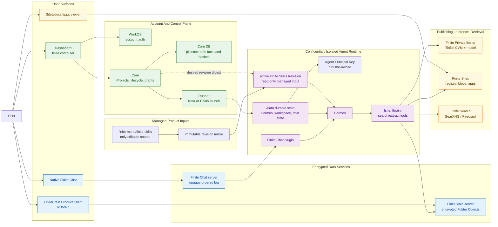

# System Flow And Trust Boundaries

> Status: imported from `finite-eng-docs` during Phase 7 on 2026-07-06. This
> document has not been fully revalidated after the monorepo import. Treat it as
> orientation background, not an authoritative current security model.

Status: orientation map for architecture conversations.

This document gives a high-level mental model for how users touch Finite, how
the front ends reach the services, and where security, encryption, key custody,
and confidential-compute boundaries sit.

It intentionally stays above per-service implementation details. Use it to have
the conversation first, then follow the owning-repo links when a boundary needs
more precision.

Related drawing: [system-flow-and-trust-boundaries.excalidraw](system-flow-and-trust-boundaries.excalidraw).

## The Short Model

Finite has five planes:

| Plane | User-facing shape | Main owner | What belongs there |
| --- | --- | --- | --- |
| Account and control plane | `finite.computer` dashboard | `finitecomputer-v2` | WorkOS login, Projects, lifecycle, billing/entitlements, runtime launch state, Finite Private grants, plaintext-safe support facts |
| Runtime execution plane | Hosted Agent Runtime | `finitecomputer-v2` runner plus runtime image | Hermes, Finite Chat plugin, `fsite`, `fbrain`, workspace files, Agent Principal Key, runtime-local auth, and decrypted agent state |
| Managed product-input plane | Finite Product Release plus `finite-skills` Distribution Mirror | `finite-skills`, release automation, Core desired state, Runtime updater | Immutable skill manifests/content, compatibility evidence, baked/desired/active/last-good digests, and atomic activation; never user-local skills |
| Chat and encrypted collaboration plane | Hosted Web, Electron/native Finite Chat, and FiniteBrain clients | `finitechat`, `finite-brain`, `finite-identity` | MLS chat payloads, encrypted Folder Objects, separate user/agent Nostr identities, Device state, and Folder Keys. Hosted Web is a trusted Finite-operated Device that decrypts in a Finite process; server-side ciphertext does not make that surface operator-blind. |
| Publishing and retrieval plane | Sites, apps, docs, search/extract tools | `finite-sites`, `finite-search` | Git-backed publishing, private/shared/public output ACLs, app hosting, SearXNG, Firecrawl, Tinfoil search candidates |

The most important rule is that **Account Auth is not cryptographic identity**.
WorkOS authorizes dashboard, billing, and Hosted Web Device access. A human's
Finite Chat identity is separate from every Agent Principal Key. Within one
Agent Runtime, `finitechat`, `fsite`, and `fbrain` share only that agent's key
through its Finite Home; Agent Principal Keys are created or opened inside the
runtime boundary, not in Core.

When a human lets an agent exercise grants addressed to the human's verified
email, each product owns an explicit, revocable Email Access Delegation. The
agent signs as itself; this never changes Principal Links or NIP-05 ownership.
Brain additionally issues Folder Key Grants to the agent npub before delegated
authorization can become readable content.

## Security Posture And Priority

Cryptography turns confidentiality problems into key-management and recovery
problems. Finite therefore orders its product promises this way:

1. preserve user access to durable data through tested backup, key recovery,
   migration, export, and restore paths;
2. minimize Finite and provider access during normal operation;
3. make every privacy downgrade explicit and audited during Break-Glass
   Recovery;
4. progressively remove Finite Recovery Authorities only after equivalent
   user-controlled recovery has been proven.

The trusted early cohort may run at an Operator-Privacy Level where Finite could
technically access some data through a controlled recovery path. That is still
stronger than ordinary hosted-agent operation when normal access is minimized,
but it is not "zero access" or cryptographic impossibility. A TEE is evidence
toward a stronger normal-operation boundary; it is not proof of safe key backup,
successful restore, or permanent operator-blindness.

## User Touchpoints

Users mainly interact with the system through these surfaces:

| Surface | User does | Service path | Security posture |
| --- | --- | --- | --- |
| SaaS dashboard | Sign in, create Project, use Hosted Web chat, connect services, manage Sites/Brain, inspect status and lifecycle | WorkOS -> dashboard -> Core/services/Hosted Web Device | Account-authenticated product plane. May render decrypted chat from the Hosted Web Device but must not expose user/agent nsecs, runtime files, or provider internals. |
| Native Finite Chat | Join a no-PIN invite and chat with the agent | Native app -> `chat.finite.computer` -> Agent Runtime Finite Chat plugin -> Hermes | Chat server orders and stores opaque MLS ciphertext. User device and runtime decrypt. |
| Agent runtime | Receives chat, runs Hermes/tools, edits workspace, publishes, searches, uses private inference | Runtime process -> Finite Private, Sites, Brain, Search, external web | Decrypted user/agent data exists here. This is the sensitive execution boundary. |
| FiniteBrain Product Client / `fbrain` | Open Vaults and sync encrypted knowledge with operation-scoped Folder Keys | Trusted client/runtime -> FiniteBrain server | Server stores encrypted Folder Objects and grants; trusted clients/runtimes open Folder Keys locally for the current operation or explicit client session. |
| Finite Sites viewers/editors | View, share, publish sites/docs/apps | `fsite`/git/API -> Finite Sites registry/blob/app host -> `*.finite.chat` | Private by default and ACL-gated, but served output bytes are not automatically E2EE. Treat as access-controlled publishing. |
| Public/search web | Agent searches and extracts pages | Hermes tools -> SearXNG/Firecrawl, possibly Tinfoil SearXNG | Search/extract services can see queries and fetched content. Tinfoil can improve operator privacy for supported pieces, not make public web data secret. |

## Full Flow

Read the flow left to right:

1. The user signs in through WorkOS and uses the dashboard to create or manage a
   Project.
2. Core records Project and lifecycle state, issues or coordinates Finite
   Private grant state, and leases a launch to the runner.
3. The runner launches an Agent Runtime. Kata is the first production runner;
   Phala is the confidential fast-follow candidate, and Docker is the local
   preflight runner.
4. On first boot, the runtime owns `/data`, creates or opens its Agent Root
   Agent Principal Key inside the runtime boundary, exposes the Product
   Release's baked Finite Skills Revision to Hermes, and only then exposes
   readiness plus a no-PIN Finite Chat invite.
5. The user joins from the native Finite Chat client. The chat server orders
   opaque encrypted room events; the user device and runtime decrypt.
6. Hermes handles the agent behavior and reaches tools: Finite Private for
   managed private inference, Finite Sites for publishing, FiniteBrain for
   encrypted knowledge, and finite-search for web retrieval.

## Security Boundaries

| Boundary | Trusted to do | Should not be trusted to do |
| --- | --- | --- |
| WorkOS/account auth | Authenticate dashboard users, account linking, billing/admin access | Represent the user's cryptographic identity or decrypt user/agent data |
| Dashboard/Core | Store Project records, runtime status, provider handles, operation history, Finite Private grant/key hashes, entitlement facts, and recovery audit metadata | Read user data during normal operation or silently exercise a Recovery Authority. Raw recovery secrets must live behind the declared Break-Glass Recovery boundary, not ordinary Core tables. |
| Runner/provider control | Start, stop, restart, inspect provider-level health, and execute the declared restore/rescue contract | Expose agent workspace, chat messages, Agent Principal Key, or user recovery material through normal product APIs. A privileged Kata host operator remains trusted, and an approved Break-Glass Recovery may expose data, until an attested/encrypted runner proves otherwise. |
| Agent Runtime | Run Hermes and tools; decrypt chat addressed to the runtime; hold runtime-owned keys and workspace data | Be treated as a generic dashboard-managed filesystem or stateless worker |
| Managed skills release path | Publish promoted immutable revisions, select a compatible digest, verify/activate it between turns, and retain last-known-good | Follow mutable branches, transport arbitrary files through Core/RMP, edit User Skills, or claim an attested image alone describes effective agent behavior |
| Finite Chat server | Order, durably store, and route room events and Welcomes | Decide identity, read message contents, or become the source of cryptographic membership truth |
| FiniteBrain server | Gate Vault/Folder access, store encrypted objects/grants/sync records | Decrypt Page paths, Page titles, links, Page contents, graph/search/replay data |
| Finite Sites | Store, version, serve, and ACL-gate published project outputs | Provide E2EE semantics for served bytes unless an output explicitly implements its own encryption |
| Finite Private limiter | Reserve/settle usage and proxy model calls inside the private-inference lane | Become a general storage or chat authority |
| Search/extract services | Fetch public web search results and page content for agents | Hide queries/content from the service itself unless the specific deployment is designed and verified for that privacy property |

## Key And Secret Custody

| Secret or identity | Where it lives | Notes |
| --- | --- | --- |
| WorkOS account identity | WorkOS/dashboard session and Core user linkage | Product login, billing, dashboard, and Hosted Web Device authorization only. Not a Nostr signer. |
| User Nostr Identity | Human-controlled Finite Chat identity and user Device stores | Generated or imported by the human; never copied into an Agent Runtime. |
| Agent Principal Key | `$FINITE_HOME/identity/identity.json` under the Agent Runtime's durable `/data/agent` | The agent's own identity used by Finite Chat, Sites, and Brain. It never defaults to the human's identity. |
| User Recovery Key | Planned user-controlled Recovery Authority, likely stored by a user Device or exported explicitly | Not implemented yet. It becomes a product claim only after it restores the declared Recovery Set onto an empty replacement target. |
| Runtime-scoped Finite Private key | Issued by Core, raw value returned/injected once, hashes and grant state stored in Core | The runner passes the key only to the target runtime. Hermes config references it through env rather than writing the raw key into config. |
| FiniteBrain Folder Keys | Opened by trusted clients or runtimes with Folder access | The server stores grants and encrypted object envelopes. Decryption and graph/search/replay happen client-side. |
| Finite Home identity | `$FINITE_HOME/identity/identity.json` in an agent runtime or the corresponding human-local identity home | Tools inside one Finite Home share that identity owner's key. Different humans, Devices, and Agent Runtimes do not share the secret. |
| Tinfoil / Phala / object-storage operator secrets | Provider secret manager or host-only ignored env files | Deployment credentials are operational secrets, not user identity or fleet-wide recovery keys. O1 may use a separately scoped Finite-Assisted Recovery Authority; O2/O3 must remove unilateral operator unlock. |

## Data Classification

| Data | Classification | Why |
| --- | --- | --- |
| Project id, status, image/artifact id, provider handle, runtime heartbeat, invite/status URL | Plaintext-safe control metadata | Needed for support and lifecycle. Should not contain chat/user-file payloads. |
| Finite Private grants, API-key hashes, usage counters, reservations, audit events | Sensitive service metadata | Core needs it for entitlement and accounting. Raw keys should not be stored or logged. |
| Chat messages, command payloads, attachments metadata inside room messages | Encrypted collaboration data | Finite Chat server stores opaque MLS payloads; clients/runtimes decrypt. Attachment blobs are encrypted before external blob upload. |
| FiniteBrain Pages, paths, titles, links, assets, graph/replay/search indexes | Encrypted knowledge data | Server stores encrypted Folder Objects; trusted clients and runtimes materialize readable content. |
| Runtime workspace, Hermes memory, tool state, runtime-local auth, chat state | Decrypted runtime data | Lives inside `/data` and process memory in the Agent Runtime. This is the highest-sensitivity runtime data bucket. |
| Finite Skills Revision prose and helper scripts | Trusted executable product input | Publicly inspectable content can still steer the agent or execute code. Its verified digest, compatibility evidence, and active status are part of the effective Runtime measurement. |
| User Skills and User Skill Overrides | Decrypted user runtime data | User/agent-owned behavior and helpers are writable, recoverable data; the managed updater must never rewrite or prune them. |
| Finite Sites source repos, rendered outputs, stateful app data | Access-controlled publishing data | Private/shared/public ACL controls visibility. Do not assume E2EE; public outputs are intentionally readable. |
| Search queries, extracted pages, web results | Retrieval data | Self-hosted/Tinfoil deployment can change operator exposure, but search/extract workloads still process plaintext queries and public web content. |
| Recovery Snapshots in off-host storage | Encrypted recovery data | A snapshot covers the declared Recovery Set and uses per-user or per-agent key material. O1 permits an audited Finite-assisted wrap; later levels require user-gated or operator-blind key release. |

An encrypted backup without a tested path to recover its decryption keys does
not satisfy the User Data Availability Invariant. Every Finite Product Release
must publish its Recoverability Contract and Operator-Privacy Level internally
before the same claims appear in dashboard or marketing copy.

## Trusted Execution Environments

There are three separate TEE/confidential-compute conversations:

| Area | Current direction | Important caveat |
| --- | --- | --- |
| Agent Runtime | Kata is the first production runner; Phala is the confidential fast-follow candidate. Docker remains the local preflight backend. | A Provider Durable Volume may survive normal restart but is not a backup. Kata trusts the privileged host operator; Phala earns stronger claims only after attestation, key release, volume visibility, backup, empty-target restore, and active Finite Skills Revision evidence pass. |
| Finite Private inference | The limiter and model path run through a Tinfoil CVM lane. Core does accounting and grant checks. | The runtime sends prompts to this lane. It is private inference, not a general encrypted storage system. |
| Search/extract | SearXNG has a Tinfoil prototype with bearer-token gating. Firecrawl remains plain Docker until its state, browser, egress, and auth model are designed for Tinfoil. | Tinfoil containers are public-inbound through the shim and have no persistent disk by default. Do not describe a service as Tinfoil-ready without verifier/proxy proof. |

The older Tinfoil full-agent-runtime path is a useful privacy target and spike,
but it is not the current v2 launch default because Tinfoil lacks durable mounts.
If that path returns, runtime state must be restored from encrypted backups and
unlocked through user-mediated or attestation-gated key release.

The generic Runner contract ships Kata first and Phala as a fast follow. Kata
provides isolation but does not make Finite host operators cryptographically
blind. Phala may raise the Operator-Privacy Level after attestation, persistent
volume, backup, restore, and key-release evidence passes; it does not erase the
Break-Glass Recovery disclosure by itself.

## Open Questions To Resolve

- What exact Phala guarantees are acceptable for `/data` durable state:
  volume encryption, migration, snapshotting, deletion, and provider/operator
  visibility?
- What is the exact User Recovery Key package shape, rotation story, and
  multi-device approval flow?
- Which first-slice Recovery Authorities can unlock each Recovery Snapshot,
  and what user consent, dual control, audit, and revocation gates apply to the
  Finite Break-Glass Recovery authority?
- Which verified Account Auth, email-challenge, or Google-consent flow issues
  and revokes each product's accepted Email Access Delegation?
- Where should long-lived Tinfoil search tokens live when SearXNG moves beyond
  prototype use?
- Which user-facing labels should distinguish access-controlled private Sites
  from genuinely encrypted Chat/Brain data?

## Source Pointers

- `finitecomputer-v2`: [README](../finitecomputer-v2/README.md),
  [Context](../finitecomputer-v2/CONTEXT.md),
  [Stack deployment](../finitecomputer-v2/docs/finite-stack-deployment.md),
  [Identity boundary](../finitecomputer-v2/docs/identity-boundary-v1.md),
  [Runtime control contract](../finitecomputer-v2/docs/runtime-control-contract.md).
- `finitechat`: [Architecture](../finitechat/docs/architecture.md),
  [Protocol v1](../finitechat/docs/protocol-v1.md),
  [Hermes integration](../finitechat/integrations/hermes/README.md).
- `finite-brain`: [README](../../finite-brain/README.md),
  [Portability spec](../../finite-brain/docs/specs/finitebrain-portability-spec.md),
  [Folder Object crypto ADR](../../finite-brain/docs/adr/0003-keep-folder-object-crypto-in-finite-brain-core.md).
- `finite-sites`: [README](../finite-sites/README.md),
  [NIP-98 mutations ADR](../finite-sites/docs/adr/0002-authenticate-mutations-with-nip98.md),
  [Private-by-default sharing ADR](../finite-sites/docs/adr/0006-private-by-default-google-doc-sharing.md).
- `finite-identity`: [README](../finite-identity/README.md),
  [Identity Authority](../finite-identity/docs/identity-authority.md),
  [Separate user and agent identities ADR](../finite-identity/docs/adr/0015-user-and-agent-nostr-identities-are-separate.md).
- `finite-search`: [README](../../finite-search/README.md),
  [Tinfoil evaluation](../../finite-search/docs/tinfoil-evaluation-2026-07-01.md).
