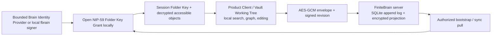

# FiniteBrain Source Research

Status: source-grounded orientation note, 2026-07-13

Scope: the active Rust implementation in this monorepo, its first-party browser
Product Client, the `fbrain` agent CLI, and the production deployment path. This
is not a replacement for the normative Portable v1 specification; it is a
compact guide to what the implementation does, where its trust boundaries are,
and which limits remain material.

## Executive readout

FiniteBrain is Finite Computer's encrypted knowledge system for humans and
agents. A **Vault** is a namespace of **Folders**; each Folder is both the
authorization boundary and the default LLM-wiki scope. Trusted clients or agent
runtimes open Folder Key Grants locally, decrypt accessible objects, and send
only encrypted object revisions and access-control records to the service.
The user-facing contract is Markdown-first, but non-Markdown Assets are also
supported when paired with Markdown Source Notes. [README, lines 3–10](../../README.md#L3-L10)
[Portable v1 product boundary, lines 17–36](../specs/finitebrain-portability-spec.md#L17-L36)

The important qualification is that "encrypted" does not mean every component
is blind to every fact. The server persists Vault/Folder/access metadata,
encrypted object envelopes, encrypted Folder Key Grant wrappers, and sync
records. It is intentionally plaintext-blind for readable page content and
local search/graph projections, but a trusted endpoint that opens a Folder Key
can read that Folder. [SQLite schema, lines 68–141](../../crates/finite-brain-store/src/schema.rs#L68-L141)
[server-side search boundary, lines 111–128](../../crates/finite-brain-server/src/routes/vaults.rs#L111-L128)

The diagram summarizes code paths, not an assertion that the server cannot see
metadata. The server checks Nostr HTTP authorization and Folder visibility
before it returns encrypted records; the client controls decryption. [protected
route validation, lines 67–99](../../crates/finite-brain-server/src/protected_routes.rs#L67-L99)
[sync-bootstrap filtering, lines 101–146](../../crates/finite-brain-server/src/routes/objects_sync.rs#L101-L146)

## Component map and responsibility boundaries

The workspace deliberately separates portable policy from storage, HTTP, and
agent ergonomics:

| Component | What it owns | Useful entry point |
| --- | --- | --- |
| `finite-brain-core` | Portable v1 types, validation, encrypted-object format, signed-record validation, OKF planning, and working-tree projection | [`lib.rs`](../../crates/finite-brain-core/src/lib.rs), [`portability.rs`](../../crates/finite-brain-core/src/portability.rs) |
| `finite-brain-store` | SQLite schema, transactions, grants/access invariants, append log, current encrypted-object projection, links, and mounts | [`lib.rs`](../../crates/finite-brain-store/src/lib.rs), [`schema.rs`](../../crates/finite-brain-store/src/schema.rs) |
| `finite-brain-server` | Axum router, Nostr-authenticated HTTP, CORS/body limits, static Product Client, and development-only Smoke UI | [`lib.rs`](../../crates/finite-brain-server/src/lib.rs) |
| `finite-brain-app` | Server binary and runtime environment wiring | [`main.rs`](../../crates/finite-brain-app/src/main.rs) |
| `finite-brain-cli` / `fbrain` | Local identity use, working-tree boundary, sync daemon state, conflict handling, and operator commands | [`lib.rs`](../../crates/finite-brain-cli/src/lib.rs) |
| `finite-nostr` | Reusable Nostr primitives, kept separate from FiniteBrain-specific policy | [crate layout](../../development.md#L44-L53) |

This division is architectural rather than merely organizational: the server
accepts opaque encrypted payload JSON after validating a signed event, while
the core defines the canonical envelope and validation constraints. The store
is the authoritative transaction boundary, rather than an in-memory cache.
[object-record acceptance, lines 3–104](../../crates/finite-brain-server/src/object_records.rs#L3-L104)
[SQLite store construction and migrations, lines 740–783](../../crates/finite-brain-store/src/lib.rs#L740-L783)

The browser Product Client is the normal member workflow. The Smoke UI is a
development inspection surface only; it must not be represented as a production
client or supplied production secrets. [development guide, lines 20–29](../../development.md#L20-L29)
[hardening security review, lines 56–65](../readiness/portable-v1-hardening.md#L56-L65)

## Domain and persistence model

### Authoritative domain objects

- **Vault.** A stable id, personal-or-organization kind, display name, optional
  personal owner, Folders, members, and admins. Personal and organization
  bootstrap shapes both begin with an accessible getting-started Folder and a
  restricted Folder. [core model, lines 737–853](../../crates/finite-brain-core/src/lib.rs#L737-L853)
  [bootstrap functions, lines 931–1031](../../crates/finite-brain-core/src/lib.rs#L931-L1031)
- **Folder.** Its id, display/path hierarchy, role, current key version,
  shared-source flag, and one of four access modes: `owner`, `admin_only`,
  `all_members`, or `restricted`. Folder—not a directory beneath a page—is the
  enforceable read boundary. [core model, lines 747–803](../../crates/finite-brain-core/src/lib.rs#L747-L803)
- **Folder Object.** A stable object id scoped to a Folder. Its current
  encrypted state is addressed by object id and revision; a trusted client
  decrypts it into a Page or Asset. Paths are validated as NFC, safe relative
  paths, which rejects absolute paths, backslashes, control characters, and
  `.`/`..` segments. [path validation, lines 691–729](../../crates/finite-brain-core/src/lib.rs#L691-L729)
  [opened Page/Asset shape, lines 80–124](../../crates/finite-brain-core/src/portability.rs#L80-L124)
- **Folder Key Grant.** Server-visible metadata names issuer, recipient, Folder,
  key version, creation time, and a NIP-59 wrapped-event JSON field; the
  encrypted key remains opaque to the server. [grant metadata, lines 120–154](../../crates/finite-brain-store/src/lib.rs#L120-L154)
- **Links and mounts.** The persistence model includes Vault invitations,
  restricted-Folder share links, personal mounts, Shared Folder connections,
  and organization mounts. They are not a separate plaintext-sharing system;
  access is backed by Folder Key Grant semantics. [schema, lines 195–325](../../crates/finite-brain-store/src/schema.rs#L195-L325)

SQLite makes those relationships executable: foreign keys, unique grants per
`(vault, folder, key version, recipient)`, and folder-access membership tables
enforce consistency near the authoritative state. [schema, lines 81–141](../../crates/finite-brain-store/src/schema.rs#L81-L141)

### Sync record model

Each Vault has a monotonic append log (`vault_record_index`) plus a current
encrypted-object projection. Record types include object revisions, tombstones,
Folder Key Grants, and admin access changes. The projection can be rebuilt from
the accepted log, which matters for restore and rebootstrap. [record schema,
lines 144–193](../../crates/finite-brain-store/src/schema.rs#L144-L193)
[projection rebuild entry point, lines 1035–1060](../../crates/finite-brain-store/src/lib.rs#L1035-L1060)

Writes are transactional and idempotent by signed event id: a duplicate returns
the original sequence, while a new revision checks that the submitted
`baseRevision` matches the current projection and advances exactly one step.
[submit transaction, lines 892–922](../../crates/finite-brain-store/src/lib.rs#L892-L922)
[optimistic-concurrency checks, lines 77–157](../../crates/finite-brain-store/src/sync_records.rs#L77-L157)

Pulls are cursor-based and bounded to 1,000 records. A cursor below the
retention floor returns a rebootstrap-required error rather than pretending an
incremental replay is complete. [pull implementation, lines 311–355](../../crates/finite-brain-store/src/sync_records.rs#L311-L355)
[retention handling, lines 1012–1050](../../crates/finite-brain-store/src/lib.rs#L1012-L1050)

## Cryptography, identity, and plaintext boundaries

### Object encryption and signed mutations

Each Folder Key is a random 32-byte AES-256 key. Object encryption uses a fresh
12-byte nonce with AES-256-GCM. Its canonical additional authenticated data
(AAD) binds the protocol version, Vault id, Folder id, Object id, and Folder Key
version, so an envelope cannot be replayed into a different object or key
context without failing authentication. [Folder Key and AAD types, lines
1133–1207](../../crates/finite-brain-core/src/lib.rs#L1133-L1207)
[encryption/decryption implementation, lines 1209–1321](../../crates/finite-brain-core/src/lib.rs#L1209-L1321)

The uploaded envelope contains its version, cipher name, key version, base64
nonce, and base64 ciphertext+tag. A create/update/move request additionally
carries a canonical signed Nostr payload including object identifiers,
operation, revisions, key version, ciphertext hash, author `npub`, and time.
The core verifies event integrity, canonical serialization, all expected fields,
the signer, tags, and ciphertext hash. [revision payload and validation, lines
1371–1504](../../crates/finite-brain-core/src/lib.rs#L1371-L1504)

### Identity and grants

The authorization subject is a Nostr public key encoded as an `npub`, called a
**Member Identity**. The system does not grant a different cryptographic class
to an agent versus a human; distinct attribution or revocation requires distinct
keypairs and the corresponding membership/access/grants. [member-identity ADR,
lines 5–15](../adr/0016-authorize-member-identities-not-controller-kinds.md#L5-L15)

The browser Product Client consumes a bounded Brain Identity Provider: identify
the current Member, authorize Brain HTTP/event intents, and open or wrap grant
payloads for named Brain purposes. The current compatibility adapter may use a
NIP-07 signer underneath, but raw `signEvent` and NIP-44 methods are not exposed
to the rest of the Product Client. A client decrypts a NIP-59-style grant only
after binding it to the connected recipient and grant metadata; the server
stores its wrapper rather than a raw Folder Key. [Portable v1 signer contract,
lines 97–106](../specs/finitebrain-portability-spec.md#L97-L106)
[browser grant opening, lines 2594–2712](../../crates/finite-brain-server/src/product-client.js#L2594-L2712)

Every protected HTTP request is a Nostr HTTP-auth event bound to method, full
public URL, time window, and (when present) request bytes. The server accepts
three header names, rejects replayed event ids during the auth window, and rate
limits by signer + method + path. [request authorization, lines
67–99](../../crates/finite-brain-server/src/protected_routes.rs#L67-L99)
[replay and rate limits, lines 119–158](../../crates/finite-brain-server/src/protected_routes.rs#L119-L158)

### Session versus working-tree plaintext

The browser starts locked. Locking clears its keyring, opened-grant metadata,
decrypted projection, drafts, conflicts, prepared writes, import state, and
invitation state; it also locks on page hide, back/forward-cache return, Vault
switch, and signer mismatch. [session reset and lock, lines
842–929](../../crates/finite-brain-server/src/product-client.js#L842-L929)
[memory clearing, lines 1911–1919](../../crates/finite-brain-server/src/product-client.js#L1911-L1919)

That does **not** erase an explicit Vault Working Tree. `fbrain open` creates a
private, persistent plaintext projection for the controlling OS account and
reports that its member-authored files remain until explicit removal. Its
managed root/control directory rejects symlinks and enforces owner-only 0700
directories and 0600 files on Unix. [open workflow, lines
926–1027](../../crates/finite-brain-cli/src/lib.rs#L926-L1027)
[working-tree enforcement, lines 25–87](../../crates/finite-brain-cli/src/working_tree_security.rs#L25-L87)
[permission checks, lines 305–345](../../crates/finite-brain-cli/src/working_tree_security.rs#L305-L345)

For agent knowledge work, Assets must live below `raw/assets/` and carry a
Markdown Source Note in the same Folder. The planner leaves invalid locations,
unpaired Assets, and over-limit Assets unresolved instead of silently uploading
them. [asset intent rules, lines 478–526](../../crates/finite-brain-core/src/portability/working_tree.rs#L478-L526)

## API and client surface

The server serves a small public/readiness and client shell surface—`/health`,
`/client`, `/client/config.json`, and development `/smoke/*`—plus authenticated
`/_admin/*` operations. The complete route declaration is the best current API
index. [router, lines 431–642](../../crates/finite-brain-server/src/lib.rs#L431-L642)

Practical API families are:

- **Vault and metadata:** list/create Vaults, metadata, encrypted export, and
  identity resolution. The nominal `/search` route deliberately returns `400`:
  plaintext search stays local. [vault routes, lines 487–504](../../crates/finite-brain-server/src/lib.rs#L487-L504)
  [search rejection, lines 111–128](../../crates/finite-brain-server/src/routes/vaults.rs#L111-L128)
- **Membership and access:** members/admins, Folder creation/setup, access
  grants/removal, and required key rotation/re-encryption when access is
  removed. [Folder mutation handlers, lines 3–55 and
  107–245](../../crates/finite-brain-server/src/routes/folders.rs#L3-L55)
- **Encrypted objects and sync:** `GET`/`PUT`/`DELETE` object, `POST` move,
  bootstrap, and cursor-based records. Secure reads filter by Folder visibility
  before returning an envelope. [object and sync handlers, lines
  3–228](../../crates/finite-brain-server/src/routes/objects_sync.rs#L3-L228)
- **Sharing:** Vault invitations, email-bootstrap claim/instructions, restricted
  Folder share links, Shared Folder invitations/connections, and mounts.
  [sharing route declarations, lines 518–618](../../crates/finite-brain-server/src/lib.rs#L518-L618)

The server applies an allowlist-derived CORS policy and a 1 MiB Axum extracted
body limit. These are deployment-relevant API constraints, not client-only
conventions. [CORS middleware, lines 23–65](../../crates/finite-brain-server/src/protected_routes.rs#L23-L65)
[router limits, lines 637–642](../../crates/finite-brain-server/src/lib.rs#L637-L642)

## `fbrain` CLI and agent workflow

`fbrain` is the agent-facing operational surface. It supports JSON output and
provides identity, signer, daemon, sync, working-tree, conflict, access, Vault,
Folder, mount, invitation, and share command families. The in-binary help is the
authoritative compact command inventory. [dispatcher and help, lines
90–128](../../crates/finite-brain-cli/src/lib.rs#L90-L128)

A normal agent loop is:

1. `fbrain doctor --server …` and `fbrain auth status --json` establish the
   local/server/identity state.
2. `fbrain open <vault-id> <path>` creates an explicit private Working Tree and
   attempts an initial signed sync.
3. Read the materialized Vault/Folder instructions, sync before editing,
   modify only readable materialized Folder contents, then run
   `fbrain sync now --summary` and inspect `fbrain conflicts --json`.
4. Use `fbrain status`, `activity`, and access/invitation commands to explain
   or resolve blocked work rather than editing `.finitebrain/` state directly.

This sequence is the documented agent contract, including the directive not to
print keys/grants or summarize restricted content into a less-restricted
Folder. [agent workflow, lines 95–132](../../development.md#L95-L132)
[agent rules, lines 163–177](../../README.md#L163-L177)

There is intentionally no durable `fbrain unlock` workflow: each key-using
operation reopens the encrypted grant into process-local Session Folder Keys,
and the removed command returns guidance to run `sync now` instead. [CLI hard
cut, lines 1057–1072](../../crates/finite-brain-cli/src/lib.rs#L1057-L1072)
[ADR, lines 5–10](../adr/0019-hard-cut-durable-cli-unlock-state.md#L5-L10)

## Deployment and configuration

The application binary binds `FINITE_BRAIN_ADDR` (default
`127.0.0.1:3015`), opens the `FINITE_BRAIN_DB` SQLite file, uses
`FINITE_BRAIN_PUBLIC_BASE_URL` to construct the public/auth origin, and can
optionally integrate a finite-identity Authority and an invite mailer. Mailer
credentials are read by name from the environment; no values belong in source
or documentation. [application environment wiring, lines
14–95](../../crates/finite-brain-app/src/main.rs#L14-L95)

The production Nix module runs `finite-brain-app` as a DynamicUser, loopback
only, with a StateDirectory and restricted filesystem privileges. The dashboard
proxies `/health`, `/client`, and `/_admin`; browser access to `/client` is
handled by dashboard auth, while Brain separately verifies signed Nostr proofs
for its protected routes. [Nix module, lines
1–35](../../../infra/nixos/modules/finite-brain.nix#L1-L35)
[deployment runbook, lines 1–12](../../../infra/runbooks/deploy-brain.md#L1-L12)

The normal deploy is a pinned monorepo NixOS revision, followed by service,
health, browser-client, signed-CLI, and authorized write/read verification.
Database migration is explicitly separate from compute deployment and must
retain a byte-for-byte rollback copy. [runbook, lines
14–61](../../../infra/runbooks/deploy-brain.md#L14-L61)

For releases, tags named `fbrain/vX.Y.Z` build Linux and macOS `fbrain` assets,
produce SHA-256 files, and refresh the component-scoped `fbrain-latest` alias.
[release workflow, lines 1–76](../../../.github/workflows/release-fbrain.yml#L1-L76)

## Verification evidence and material limits

The expected development gate is Rust format, workspace test, clippy with
warnings denied, workspace build, JavaScript syntax checks, and the Product
Client test file. [development checks, lines 55–67 and
149–164](../../development.md#L55-L67)

The readiness record maps core vectors, signed records, duplicate retry,
conflicts, restart/projection rebuild, protected-route behavior, and
Product-Client route tests. It is valuable evidence, but it explicitly says it
is a readiness record rather than a production runbook. [readiness scope and
matrix, lines 1–21](../readiness/portable-v1-hardening.md#L1-L21)

Most important limits for anyone evaluating FiniteBrain today:

- **Recovery is not proven end-to-end.** Loss of the sole Nostr key can leave
  valid server ciphertext unreadable. Durable SaaS use requires a tested,
  independent Recovery Principal/key path that reopens each Folder on an empty
  replacement client; the broader monorepo ADR says snapshots and empty-target
  restore remain TODO rather than a launch claim. [README, lines
 87–91](../../README.md#L87-L91)
  [recoverability ADR](../../../docs/adr/0001-recoverability-precedes-operator-blindness.md)
- **Trusted-device compromise is total for that Member Identity.** Session keys
  reduce redundant copies but do not make a compromised persistent local signer
  harmless. [device-boundary ADR, lines
 5–14](../adr/0011-treat-the-device-as-the-v1-identity-boundary.md#L5-L14)
- **A Working Tree is persistent plaintext.** Pausing/locking/sync stopping does
  not hide its ordinary files; removal is an explicit filesystem action and
  makes no secure-erasure promise. [README, lines
 144–158](../../README.md#L144-L158)
- **The server is not horizontally hardened yet.** The replay cache and
  protected-route rate limiter are in-process state, so a scaled deployment
  needs a shared edge policy or documented sticky-process assumption. [readiness
  residual risks, lines 120–132](../readiness/portable-v1-hardening.md#L120-L132)
- **Portable v1 has deliberate hard cuts and limits.** It does not preserve
  legacy prototype routes/migration behavior; client-side OKF import remains
  required; asset projection is bounded to 512 KiB per Asset and 1,000 Assets
  per projection. [hard-cut definition](../../CONTEXT.md#L321-L325)
  [working-tree bounds, lines 14–40](../../crates/finite-brain-core/src/portability.rs#L14-L40)

## Recommended reading order

1. This note, then the [Portable v1 specification](../specs/finitebrain-portability-spec.md).
2. The [component README](../../README.md) for real `fbrain` usage and working-tree
   safety.
3. The core encrypted-object and signed-record code, then the SQLite sync path.
4. The Product Client only after the crypto and session-boundary concepts are
   clear; its JavaScript is an executable client protocol, not merely UI code.
5. The deployment runbook before operating a live service.
