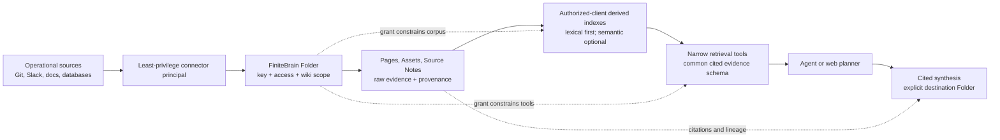

# Cerebras Knowledge and FiniteBrain: Architecture Comparison and Adoption Roadmap

Status: source-grounded architecture comparison, 2026-07-18

Scope: Cerebras's July 15, 2026 article, “How We Built Our Knowledge Base,”
the primary technologies it identifies, and the active FiniteBrain architecture.
This is an architecture recommendation, not an implementation plan or a claim
that unpublished Cerebras security properties have been independently verified.

> Naming note: the company is **Cerebras Systems**. The attached request calls it
> “Cerebrus”; this report uses the company's spelling.

## Executive conclusion

Cerebras Knowledge and FiniteBrain solve different halves of a company-brain
problem.

- **Cerebras Knowledge is a retrieval and answer layer over knowledge that stays
  in operational source systems.** Connectors ingest Slack, code, wikis, and
  custom databases into a common retrieval schema. Hybrid search, reranking,
  project scoping, and planner/executor/synthesizer orchestration turn that
  evidence into cited answers. It minimizes behavior change for employees.
- **FiniteBrain is an encrypted, access-scoped system of record and working
  substrate for human and agent knowledge.** Its Folder is simultaneously the
  encryption, authorization, sync-visibility, and wiki boundary. Trusted clients
  decrypt authorized objects locally; the Brain server cannot index plaintext.

They are therefore more complementary than competitive. FiniteBrain should
adopt Cerebras's **evidence and retrieval patterns**, but not its apparent
**central plaintext aggregation boundary**. The safe target is:

```text
authorized sources
  -> Folder-scoped provenance records
  -> authorized-client derived indexes
  -> access-safe retrieval primitives
  -> optional agent planning and cited synthesis
```

The first priority is still FiniteBrain recovery. Search sophistication must not
outrun the ability to restore the same encrypted user data and keys onto an
empty target. After recovery, the highest-leverage sequence is: define an
access-safe evidence contract and evaluation set; add exact/lexical retrieval;
add provenance-preserving connectors; expose narrow local tools; then evaluate
semantic indexing and LLM distillation. This order obtains much of Cerebras's
value without weakening FiniteBrain's defining security property.

## Source and confidence boundary

The principal Cerebras source is its official article: [How We Built Our
Knowledge Base](https://www.cerebras.ai/blog/how-we-built-our-knowledge-base),
published July 15, 2026. The company says the system had run internally for
roughly three months, answered more than 15,000 questions per day, and was used
by people, automations, and agents. The article is an engineering narrative, not
a security specification. It describes authorization, audit, and source/project
scoping at a high level, but does not establish client-side encryption,
cryptographic isolation of index rows, deletion guarantees, or recovery
semantics. This report does not infer those properties.

The implementation choices named in the article are consistent with their
upstream documentation:

- [pgvector](https://github.com/pgvector/pgvector) supports HNSW approximate
  nearest-neighbor indexes, Postgres full-text hybrid search, Reciprocal Rank
  Fusion, cross-encoder reranking, and metadata filtering. Its documentation
  also warns that approximate search applies filters after scanning unless
  iterative scans or suitable partition/index strategies are used—important for
  authorization-sensitive retrieval.
- [Anthropic's Contextual Retrieval](https://www.anthropic.com/engineering/contextual-retrieval)
  prepends chunk-specific context before embedding and BM25 indexing, matching
  Cerebras's motivation for contextualized thread bursts and normalized text.
- The [MCP tool specification](https://modelcontextprotocol.io/specification/2025-06-18/server/tools)
  defines discoverable, schema-described tools invoked by clients. This supports
  Cerebras's choice to expose retrieval primitives rather than only a monolithic
  answer endpoint; MCP itself does not provide FiniteBrain authorization.

FiniteBrain evidence comes from the active repository, especially the
[secure LLM wiki architecture review](./2026-07-18-secure-llm-wiki-architecture.md),
the [Folder-scope ADR](../adr/0007-make-folders-the-llm-wiki-scope.md),
the [asset/source-note ADR](../adr/0008-store-assets-with-markdown-source-notes.md),
the [plaintext-egress ADR](../adr/0015-deny-plaintext-egress-by-default.md),
the [personal-agent access ADR](../adr/0020-keep-personal-brains-user-owned-and-grant-agents-folder-scoped-access.md),
and the repository-wide [recovery ADR](../../../docs/adr/0001-recoverability-precedes-operator-blindness.md).

## What Cerebras built

### 1. Leave authoritative knowledge where work happens

Cerebras explicitly rejected another attempt to make employees maintain one
“single source of truth.” Slack remains appropriate for discussion, GitHub for
code and reviews, wikis for maintained documents, and team databases for
domain-specific records. Connectors extract from those systems without asking
people to change their normal behavior.

This is an **index-over-sources** model. The operational system remains the
authority; Cerebras Knowledge is a continuously refreshed discovery layer.

### 2. Normalize heterogeneous evidence behind one contract

All source types ultimately emit a common row shape into one Postgres retrieval
table containing source text or normalized summaries, embeddings, and metadata.
The uniform contract means adding a source connector does not require rewriting
the query pipeline.

For Slack, Cerebras found raw-message embeddings insufficient because messages
have unequal information density, short noise can score well, and meaning often
depends on a whole thread. Its pipeline therefore:

1. re-fetches a complete thread when a message changes;
2. makes raw text available to lexical search immediately;
3. uses an LLM to extract a normalized question, summary, resolution, systems,
   and code references for semantic indexing; and
4. separately embeds selected same-author “bursts,” contextualized by the thread
   topic, when length, rare-token, or reaction signals suggest value.

This is a useful distinction between **authoritative raw evidence** and
**replaceable derived representations**.

### 3. Combine independent retrieval signals

Cerebras combines full-text matching, embeddings, inverse document frequency,
and age decay. The separate ranked lists are fused with Reciprocal Rank Fusion;
duplicate chunks are collapsed, per-source/file results are capped, a small
reranker scores candidates, and only the highest-ranked evidence proceeds.
When a wiki section matches, neighboring sections are included to preserve
headings, prerequisites, and caveats.

The design recognizes that no one score answers every query:

- exact tokens win for error strings, flags, hostnames, and identifiers;
- embeddings connect paraphrases;
- IDF suppresses common conversational noise;
- recency helps with operational facts that expire;
- contextual expansion prevents a matching fragment from losing its meaning.

### 4. Use source-specific retrieval where it is stronger

Cerebras did not force every source through vector search. Its reported tool set
includes unified search, Slack search, semantic code search, direct `ripgrep`,
recent pull requests, per-file subsystem summaries, and “who knows” expertise
discovery. Code indexing uses language-aware, multi-granularity chunks and
incremental recomputation through CocoIndex; teams onboard repositories using
path allow/deny configuration.

This is an important design lesson: a common evidence schema does not require a
single retrieval algorithm.

### 5. Separate retrieval primitives from answer orchestration

For agent use, Cerebras exposes narrow, structured, mostly LLM-free retrieval
tools through MCP. The calling agent decides which tools to invoke and how to
use the returned evidence. Its employee web experience wires the same tools
into a planner -> parallel executor -> synthesizer pipeline that returns an
answer with citations and caveats.

This keeps the evidence layer reusable and makes synthesized answers one client
of retrieval rather than the only interface.

### 6. Add relevance scope without duplicating sources

A Cerebras “project” is a named view over relevant Slack channels, repositories,
documents, and custom sources. A source may appear in multiple projects, and a
user can have a default project. Projects address relevance and onboarding as
the corpus grows; the public article does not establish that a project is a
cryptographic access boundary.

## High-level comparison

| Concern | Cerebras Knowledge | FiniteBrain | Consequence |
| --- | --- | --- | --- |
| Primary job | Find and answer over existing company systems | Securely store, share, sync, and materialize agent-legible knowledge | Combine as retrieval above secure storage, not as a storage replacement |
| Source of truth | Slack, repos, wikis, databases remain authoritative | Encrypted Folder Objects and signed revision stream are authoritative | Connectors need explicit provenance and refresh semantics |
| Core boundary | Common retrieval schema plus application authorization/scoping | Per-Folder key, grants, access, sync visibility, and wiki scope | Every derived index/result must preserve Folder authority |
| Plaintext location | Central Postgres/indexing pipeline is described; cryptographic-at-client indexing is not | Only trusted authorized clients open object bodies | A global server-side FiniteBrain embeddings table would conflict with the design |
| Knowledge shape | Normalized evidence rows and derived chunks | Markdown Pages, Assets, and Source Notes | Add derived evidence views; do not replace readable Markdown |
| Search | Hybrid lexical/vector/IDF/recency with fusion and reranking | Local client-derived search/graph; no server plaintext search | Cerebras offers the largest capability opportunity |
| Agent interface | Narrow MCP retrieval primitives; optional answer orchestration | Plaintext Working Tree and external agent workflow | Add tools alongside the filesystem, preserving least privilege |
| Scope for relevance | Projects bundle sources | Folders are access domains; Brains group them | Project-like views must be intersections over authorized Folders, never grants |
| Ingestion | Real-time and incremental connectors | User/client edits and asset/source-note convention | Add opt-in connector jobs acting as explicit principals |
| Recovery | Not detailed in the article | Explicitly unproven and a release blocker | FiniteBrain recovery remains phase zero |

## Complementary assumptions

The following Cerebras ideas fit FiniteBrain well:

1. **Existing systems remain useful.** A secure wiki should not require every
   discussion, PR, or incident to originate in Brain.
2. **Raw evidence and derived representations are different assets.** This maps
   naturally to FiniteBrain Assets/Source Notes plus rebuildable indexes.
3. **Retrieval primitives should remain composable.** External agents already
   orchestrate over Working Trees; structured retrieval reduces unnecessary
   context loading while preserving agent choice.
4. **Lexical and semantic retrieval are complementary.** Exact search is both
   cheaper and more explainable, while semantic search helps when vocabulary
   differs.
5. **Source-aware retrieval beats universal chunking.** Git code, Slack threads,
   maintained wiki pages, and structured databases have different useful units.
6. **Citations and neighboring context are part of correctness.** FiniteBrain's
   Source Notes already create a place to preserve origin, hashes, and extraction
   state.
7. **Incremental derived state matters.** FiniteBrain's revision stream can
   invalidate local indexes precisely rather than rebuilding everything.

## Conflicting assumptions and required adaptations

### One plaintext embeddings table versus Folder confidentiality

Cerebras's single Postgres table is an elegant internal interface, but copying
that deployment literally would give the Brain service derived plaintext and
embeddings from every indexed Folder. Embeddings can reveal semantic content
and must be treated as sensitive derived data, not harmless metadata.

FiniteBrain can adopt a **logical common evidence schema** without adopting one
global plaintext trust domain. Implementations may be:

- a local per-Working-Tree index on an authorized endpoint;
- separate per-Folder index partitions encrypted at rest and opened only by an
  authorized runtime; or
- encrypted, rebuildable index artifacts stored as Folder Objects, with query
  execution on trusted clients.

No option may search first and apply Folder ACLs afterward. Authorization and
grant opening must determine the candidate corpus before plaintext retrieval.

### Projects versus access boundaries

Cerebras projects are relevance bundles. FiniteBrain Folders are security
boundaries. A FiniteBrain project/view can only select among Folders already
authorized for the current principal. Selecting a project must never grant a
key, reveal an inaccessible Folder name, or cache results across principals.

### Central connectors versus explicit principals

A Cerebras connector appears to be trusted company infrastructure with access
to its sources and index. In FiniteBrain, each importer should be a named agent
principal with the minimum source permission and destination Folder grant. It
must not silently widen a source audience by writing into a less-restricted
Folder. Ambiguous source/destination audience mapping must fail closed.

### Recency versus authority

Age decay is useful for incidents and operational conversation, but dangerous
as a universal truth policy: an old architecture decision or legal policy may
remain authoritative. Recency must be source/type-specific and visible as a
ranking signal, not silently equated with truth.

### Distillation versus provenance

An LLM-normalized Slack “resolution” is a derived assertion, not the thread
itself. FiniteBrain must preserve immutable source coordinates, capture time,
content hash/version, audience, derivation model/prompt version, and links back
to raw evidence. A generated resolution cannot overwrite or masquerade as an
authoritative human conclusion.

## What to incorporate, why, and in what order

### Phase 0 — Prove recovery before expanding durable derived state

**Incorporate:** no Cerebras feature yet. Complete the repository's existing
Recovery Authority/Recovery Set work and prove empty-target restoration.

**Why first:** connectors make Brain more likely to become the only durable copy
of curated knowledge, and generated indexes create misleading confidence that
data is recoverable. The company invariant requires recoverability before
stronger operator-blindness or durability claims.

**Gate:** the same recovery set restores ciphertext, identities/key wraps,
Folder grants, Assets/Pages, and revision state onto an empty target. Derived
indexes are either restored or demonstrably rebuilt.

### Phase 1 — Define the access-safe evidence contract and evaluation corpus

**Incorporate from Cerebras:** one logical evidence schema and one normalized
result schema, without committing to a centralized physical table.

Suggested fields include Folder/Object/revision coordinates, source kind,
source locator, captured-at/source-updated-at timestamps, raw-versus-derived
status, content hash, section/chunk coordinates, author, derivation lineage,
and ranking signals. Folder access is enforced outside and below this schema.

Create a small representative evaluation corpus and questions covering exact
identifiers, paraphrases, stale-versus-current guidance, conflicting sources,
citations, and attempted cross-Folder leakage. Measure recall, citation fidelity,
latency, stale-result behavior, and unauthorized-result count (which must be
zero).

**Why:** a stable contract lets connectors and retrieval evolve independently;
an evaluation corpus prevents adopting an impressive pipeline without knowing
whether it improves Finite's use cases.

**Gate:** threat model and tests prove candidate selection occurs only after
principal/Folders are resolved; logs and caches cannot mix principals.

### Phase 2 — Add deterministic local hybrid retrieval

**Incorporate:** exact/full-text search, IDF/BM25-like ranking, source-specific
recency policy, neighboring-section expansion, deduplication, per-source caps,
and simple rank fusion. Start over opened Working Trees or another trusted local
projection. No embeddings or LLM are necessary yet.

**Why:** this captures error strings, filenames, identifiers, headings, and most
wiki discovery with low cost, explainable ranking, and no model-provider egress.
It also establishes the common retrieval/result seam Cerebras found valuable.

**Gate:** lock, Brain switch, revocation, and principal change clear or isolate
indexes and result caches; a revoked Folder is absent from future candidates;
search results cite exact Page revision and section.

### Phase 3 — Add opt-in provenance-preserving connectors

**Incorporate:** “meet data where it lives,” incremental ingestion, and a
plugin/adapter contract. Begin with one high-value, bounded source rather than a
generic arbitrary-code plugin platform. GitHub/code or curated documents are
safer first candidates than Slack because their revisions and provenance are
clearer and their information density is higher.

Each connector should emit an Asset or Source Note into an explicitly selected
Folder, record source version/hash and capture status, support dry-run, and act
under a dedicated least-privilege principal. Later add Slack at thread—not
message—granularity with stable event deduplication and full-thread refresh.

**Why:** ingestion convenience is Cerebras's main adoption insight, but Finite
must retain durable, auditable Folder placement rather than building an
unreviewed company-wide scrape.

**Gate:** source and destination audience compatibility is explicit; deletion,
retention, legal-hold, revocation, and connector credential handling have named
semantics; production mutation has backup and rollback boundaries.

### Phase 4 — Expose narrow retrieval primitives to agents

**Incorporate:** Cerebras's simple retrieval tools and common evidence response.
Offer local CLI/library operations first—for example `search`, `search_code`,
`recent_changes`, `open_source`, and `backlinks`. An MCP adapter may expose the
same operations, but is transport, not the authorization authority.

**Why:** agents can request a small cited evidence set instead of reading entire
Working Trees. Keeping retrieval LLM-free makes it deterministic, testable, and
usable by multiple agent hosts.

**Gate:** tool availability and results are derived from the calling principal's
current Folder grants; every response carries provenance; no generic file read
or signer capability is accidentally exposed; audit records distinguish query,
read, and write operations.

### Phase 5 — Evaluate Folder-local semantic indexing

**Incorporate:** contextual embeddings, incremental code chunking, multiple
granularities, RRF, and optional reranking. Treat vectors and normalized text as
sensitive derived plaintext. Generate them only on an authorized trusted
endpoint or in a separately approved confidential-compute boundary.

Run semantic and lexical retrieval independently, fuse ranks, and compare
against Phase 1's evaluation set. For code, retain `ripgrep` and symbol-aware
search alongside embeddings. Do not adopt pgvector or 3,072 dimensions merely
because Cerebras did; choose storage/model only after scale and quality data.

**Why after tools/connectors:** semantic retrieval is valuable for vocabulary
mismatch, but it adds model egress, cost, index lifecycle, revocation, and
embedding-version concerns. The simpler pipeline provides a baseline.

**Gate:** documented embedding-provider data policy; no unauthorized plaintext
egress; per-Folder/principal isolation; complete invalidation on revision,
rotation, and revocation; model/version lineage; leakage tests; semantic search
must beat the deterministic baseline materially.

### Phase 6 — Add source-specific LLM distillation

**Incorporate:** Slack thread normalization and selected contextual bursts,
starting as opt-in derived Source Notes. Preserve the raw thread or stable source
reference, never only its summary. Use reactions/length/rarity as prioritization
signals, not truth labels.

**Why late:** distillation improves retrieval quality over noisy conversation
but can hallucinate a “resolution,” erase dissent, and leak restricted content
through summaries. It requires mature provenance and evaluation first.

**Gate:** every claim links to evidence; derived status is visible; reprocessing
is reproducible; prompt/model changes are versioned; cross-Folder synthesis
writes only to an audience at least as restrictive as every source.

### Phase 7 — Add project views and optional cited-answer orchestration

**Incorporate:** project-scoped relevance and the planner -> executor ->
synthesizer experience. Define a project as a saved view over currently
authorized Folders/sources, not a new authorization primitive. Keep raw retrieval
tools available even when adding a one-box answer experience.

**Why last:** planning and fluent synthesis create the most visible product
value but also hide retrieval mistakes. They should sit on a measured,
provenance-rich, access-safe evidence layer.

**Gate:** planner cannot discover inaccessible source descriptions; synthesis
is citation-grounded and expresses conflicts/uncertainty; output destination is
explicit and audience-safe; the system is evaluated for answer correctness as
well as retrieval recall.

## Explicit non-goals

FiniteBrain should not pursue the following as part of this adoption:

- Replacing Slack, GitHub, databases, or document systems as the sole place
  employees must work.
- Moving Folder plaintext or embeddings into the existing Brain server merely
  to simplify search.
- Treating a global vector database plus post-retrieval ACL filtering as an
  acceptable security boundary.
- Making projects, saved searches, dashboard selection, or agent context confer
  Folder access.
- Treating embeddings, summaries, expertise scores, or reactions as
  non-sensitive metadata or authoritative truth.
- Replacing Markdown Pages and Source Notes with opaque chunks that humans
  cannot inspect, repair, export, or cite.
- Building a monolithic “answer” endpoint before reusable evidence retrieval.
- Adding semantic code search as a replacement for `ripgrep`, symbol lookup, or
  direct source inspection.
- Claiming zero knowledge, full operator blindness, secure endpoint execution,
  or disaster recovery based on these retrieval features.
- Copying Cerebras's particular Postgres, pgvector, dimensionality, thresholds,
  or model choices without Finite-specific evaluation.

## Recommended target architecture



The deepest lesson to borrow is not “install pgvector.” It is to separate
authoritative evidence, derived representations, retrieval primitives, and
answer synthesis behind stable contracts. The deepest lesson to preserve from
FiniteBrain is that authorization happens before plaintext exists for the
principal. Combined correctly, FiniteBrain can become easier for a company to
adopt and dramatically better for agents to query without turning its secure
Folder model into an after-the-fact filter.
