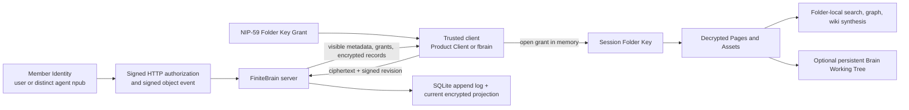

# FiniteBrain as a Secure LLM Wiki: Architecture Review

Status: source-grounded architecture review, 2026-07-18

Scope: the active Rust implementation, first-party Product Client, `fbrain`
agent workflow, storage model, and current production deployment. Evidence is
limited to first-party source, tests, ADRs, specifications, and runbooks in this
repository. This review distinguishes implemented mechanisms from intended
policy and unproven claims.

## Executive conclusion

FiniteBrain is best understood as an **encrypted, access-scoped knowledge
substrate for humans and LLM agents**, not as an LLM inference service or a
server-side RAG system. A Brain is an administrative namespace; each Folder is
both the cryptographic authorization boundary and an independent Markdown-first
LLM wiki. Trusted clients decrypt accessible Folder Objects locally, derive
search/graph/wiki views locally, and upload signed encrypted revisions. The
server stores and filters metadata, grants, ciphertext, and an append-only sync
record stream. [Development guide, lines 10–29](../../development.md#L10-L29)
[Folder-scope ADR, lines 19–46](../adr/0007-make-folders-the-llm-wiki-scope.md#L19-L46)

The security design is coherent around one principle: **plaintext crosses the
cryptographic boundary only on a trusted endpoint that holds an authorized
Member Identity and can open a Folder Key Grant**. The server cannot perform
plaintext search and explicitly rejects that endpoint; the browser and CLI
reconstruct readable state after opening grants. [Search handler, lines
111–128](../../crates/finite-brain-server/src/routes/brains.rs#L111-L128)
[Product Client session contract, lines 223–231](../../README.md#L223-L231)

That is narrower than “zero knowledge” or “operator blind.” The server sees
Brain, Folder, membership, access, grant, actor, revision, and timing metadata.
The hosted Product Client relies on a Finite-operated Hosted Device identity
bridge, and `fbrain` Working Trees are deliberate persistent plaintext. Most
importantly, disaster recovery and an independent Recovery Authority are not
implemented or proven. [Schema, lines 92–165](../../crates/finite-brain-store/src/schema.rs#L92-L165)
[Working Tree warning, lines 174–188](../../README.md#L174-L188)
[Recovery warning, lines 87–91](../../README.md#L87-L91)

## Architectural shape

### Component boundaries

| Component | Architectural responsibility |
| --- | --- |
| `finite-brain-core` | Portable types, validation, AES-GCM Folder Object format, canonical signed records, decrypted Page/Asset and working-tree projection rules |
| `finite-brain-store` | SQLite schema and transactional authority for Brains, access, grants, invitations, append records, and current encrypted projections |
| `finite-brain-server` | HTTP routes, Nostr request authentication, authorization checks, encrypted sync, Product Client assets, CORS, and request limits |
| `finite-brain-app` | Environment-to-server wiring and Axum process entrypoint |
| `finite-brain-cli` / `fbrain` | Local identity, grant opening, persistent Working Trees, sync, conflict handling, access administration, and daemon/watch behavior |
| Product Client | Session-scoped browser decryption, editing, local search/graph/replay, access and invitation workflows |

The split is explicit in the development guide. The crate dependency manifests
also show no model provider, embedding library, or vector database: the active
product implements storage, cryptography, identity, HTTP, and local knowledge
projection, not model execution. [Crate map, lines 44–53](../../development.md#L44-L53)
[core dependencies](../../crates/finite-brain-core/Cargo.toml#L12-L20)
[server dependencies](../../crates/finite-brain-server/Cargo.toml#L12-L28)

## What “LLM wiki” means here

The term describes a durable, agent-legible information architecture rather
than an embedded chatbot:

- Every readable top-level Folder is its own wiki and access domain. Its local
  index and log must not summarize inaccessible siblings. Cross-Folder
  synthesis belongs in the most restrictive Folder implicated by the sources.
  [Folder-scope ADR, lines 36–46](../adr/0007-make-folders-the-llm-wiki-scope.md#L36-L46)
- Markdown is the primary reasoning surface. The standard shape includes local
  instructions and navigation plus `raw/`, `wiki/`, `inventory/`, `datasets/`,
  and `output/` areas. The checked-in agent contract requires agents to sync,
  read local instructions, edit ordinary files, and sync again. [README agent
  rules, lines 190–207](../../README.md#L190-L207)
- Binary evidence is stored as an encrypted Asset under the same Folder key and
  paired with a Markdown Source Note containing provenance, extraction state,
  summaries, and links to synthesized pages. Search and LLM flows reason over
  Source Notes or extracted Markdown, not opaque bytes. [Asset ADR, lines
  14–25](../adr/0008-store-assets-with-markdown-source-notes.md#L14-L25)
- Search, backlinks, graph, replay, and synthesis are derived views, not
  authoritative server state. Rejecting server plaintext search is an
  implementation-level guard, not just a documentation preference. [Search
  handler, lines 111–128](../../crates/finite-brain-server/src/routes/brains.rs#L111-L128)

This gives an LLM a familiar filesystem interface while keeping access checks
below the prompt layer: inaccessible Folder Objects should never be decrypted or
materialized, so prompt instructions are not the primary isolation mechanism.
However, the rule “never summarize restricted material downward” is necessarily
also controller/agent policy after decryption; the cryptographic protocol cannot
control an authorized endpoint’s later plaintext behavior. [Plaintext-egress
ADR, lines 5–12](../adr/0015-deny-plaintext-egress-by-default.md#L5-L12)

## Data and sync model

The authoritative hierarchy is:

1. A Brain is personal (one owner) or organizational (members/admins).
2. Folders declare access as `owner`, `admin_only`, `all_members`, or
   `restricted`, and carry a current key version.
3. Folder Access identifies readable principals; Folder Key Grants deliver the
   matching key version to recipient npubs as NIP-59 wrapped events.
4. Folder Objects are stable ids whose encrypted payloads advance by revision.

These relationships are encoded as SQLite foreign keys and uniqueness
constraints, including one grant per Brain/Folder/key-version/recipient.
[Schema, lines 92–165](../../crates/finite-brain-store/src/schema.rs#L92-L165)

Each accepted mutation is added to a per-Brain monotonic record index. The
server keeps both that record log and a current encrypted object projection;
event ids are unique and records retain actor, client timestamp, accepted
timestamp, type, Folder/Object coordinates, and opaque payload JSON. [Sync
schema, lines 168–216](../../crates/finite-brain-store/src/schema.rs#L168-L216)

On write, the server checks Folder visibility and current key version, validates
the signed revision event against the exact Brain/Folder/Object, revision,
cipher, ciphertext hash, actor, and timestamp, and then submits it through the
store transaction boundary. It does this twice around the lock/transaction
boundary to avoid authorizing against stale loaded state. [Object acceptance,
lines 3–44](../../crates/finite-brain-server/src/object_records.rs#L3-L44)
[Record validation, lines 47–104](../../crates/finite-brain-server/src/object_records.rs#L47-L104)

The server can validate authorization, record shape, sequence, key version, and
ciphertext commitment. It cannot validate the semantic truth, Markdown quality,
Source Note accuracy, or decrypted path/content of an opaque object. Those are
trusted-client responsibilities.

## Cryptography, identity, and authorization

Folder content uses AES-256-GCM. The encrypted envelope names its cipher and key
version; a fresh nonce and canonical additional authenticated data bind the
Brain, Folder, Object, key version, and protocol context. Opening uses the same
AAD and fails authentication on mismatch. [Crypto errors and envelope opening,
lines 1173–1189 and 1380–1414](../../crates/finite-brain-core/src/lib.rs#L1173-L1189)

Mutations are independently signed Nostr events. The signed payload commits to
the operation, base/new revision, coordinates, key version, cipher, ciphertext
hash, author npub, and creation time. [Revision payload, lines
1427–1499](../../crates/finite-brain-core/src/lib.rs#L1427-L1499)

Protected HTTP requests use a Nostr authorization event bound to HTTP method,
canonical public URL, time window, and request body when present. The server
then applies event-id replay rejection and a signer/method/path rate limit.
[Protected auth, lines 67–99](../../crates/finite-brain-server/src/protected_routes.rs#L67-L99)
[Replay/rate limits, lines 119–158](../../crates/finite-brain-server/src/protected_routes.rs#L119-L158)

Authorization is identity-based, not controller-type-based: a human and an
agent are ordinary Member Identities. Safe agent separation comes from distinct
keys plus Folder-scoped grants, not from an “agent” flag. Personal Brain pairing
keeps the user as sole owner, gives a distinct agent npub limited membership,
and defaults it to one restricted Agent Workspace Folder. Expansion is explicit
per Folder; revocation rotates keys and re-encrypts live objects but cannot erase
plaintext or old keys already retained by that endpoint. [Agent access ADR,
lines 28–64](../adr/0020-keep-personal-brains-user-owned-and-grant-agents-folder-scoped-access.md#L28-L64)

## Plaintext and trust boundaries

### Server boundary

The service is plaintext-blind for Folder Object bodies, but not metadata-blind.
SQLite contains Brain and Folder names/paths, membership, access modes, grant
issuer/recipient, key version, actor, revision, timestamps, and record types in
plaintext alongside encrypted payloads. [Schema, lines
92–216](../../crates/finite-brain-store/src/schema.rs#L92-L216)

### Browser Product Client

The first-party browser client starts locked, opens grants through its bounded
identity provider, and reconstructs Pages, drafts, search, graph, and access
views in memory. Locking, Brain switching, navigation lifecycle changes, or an
identity mismatch clear that session state. [README, lines
223–231](../../README.md#L223-L231)

Hosted browser use is still inside a Finite trust boundary. The dashboard gives
the sandboxed Brain frame a signed expiring capability and operation-bound proof;
the custody executor uses the existing Hosted Device User Key. This reduces
ambient authority but does not make hosted plaintext inaccessible to the Finite
process that decrypts it. [Hosted identity bridge, lines
140–148](../../README.md#L140-L148)

### Agent runtime and Working Tree

`fbrain` opens grants per key-using process and does not keep durable unlock
state. Raw Folder Keys are forbidden in managed state; loss of signer/grant
fails closed. [Session-key ADR](../adr/0010-keep-opened-folder-keys-session-only.md)

Once materialized, a Brain Working Tree is intentional persistent plaintext.
The CLI protects the root and managed control files with owner-only filesystem
permissions and rejects managed-path symlink escapes, but it does not encrypt
ordinary content against the device or promise secure deletion. [Working Tree
ADR](../adr/0017-enforce-a-private-brain-working-tree-boundary.md)
[README, lines 174–188](../../README.md#L174-L188)

## Recovery and availability

This is the largest gap in the security architecture. A database backup can
restore valid ciphertext while the sole identity capable of opening a Folder
Key is gone. The component README explicitly blocks a durable-SaaS claim until
each Folder has a tested user-held or Finite-assisted Recovery Principal path
that opens it on an empty replacement client. [Recovery warning, lines
87–91](../../README.md#L87-L91)

The repository-wide recovery ADR states that complete snapshots, key wrapping,
Recovery Authorities, retention, and empty-target restore remain TODOs. It also
forbids claiming zero-loss or operator-blind guarantees. [Recovery ADR, lines
1–19](../../../docs/adr/0001-recoverability-precedes-operator-blindness.md#L1-L19)

Current operational recovery is a consistent SQLite backup plus a byte-for-byte
rollback copy. The deployment runbook explicitly separates compute deployment
from data migration and says offsite Recovery Snapshot and empty-target restore
remain TODO. [Deployment runbook, lines 12–28](../../../infra/runbooks/deploy-brain.md#L12-L28)
[Rollback limits, lines 166–178](../../../infra/runbooks/deploy-brain.md#L166-L178)

## Deployment architecture

Production is a single Axum service backed by a SQLite file. The app defaults to
loopback and reads its bind address, public signing origin, database path,
identity Authority, smoke-only signer/proofs, and optional mailer configuration
from environment variables. [App wiring, lines
14–50](../../crates/finite-brain-app/src/main.rs#L14-L50)

The NixOS unit binds `127.0.0.1:3015`, uses a systemd DynamicUser and dedicated
state directory, restarts automatically, enables `NoNewPrivileges` and
`PrivateTmp`, protects the system filesystem, and permits writes only below the
Brain state directory. Caddy exposes the canonical `brain.finite.computer`
signing/API origin; the WorkOS-protected dashboard embeds `/client`, while Brain
still checks its own signed route proofs. [Nix unit](../../../infra/nixos/modules/finite-brain.nix)
[Deployment topology, lines 1–14](../../../infra/runbooks/deploy-brain.md#L1-L14)

This is a deliberately simple single-node authority. SQLite gives strong local
transactional invariants, but the in-process replay cache and rate limiter do
not coordinate across replicas, and the repository does not define a
horizontally scaled Brain topology. [Replay/rate-limit state, lines
119–158](../../crates/finite-brain-server/src/protected_routes.rs#L119-L158)

## Implemented properties versus residual gaps

| Property or claim | Evidence-backed status |
| --- | --- |
| Folder-scoped confidentiality | Implemented cryptographically for object bodies with per-Folder keys/grants and AES-GCM; metadata remains server-visible. |
| Access-safe search and graph | Implemented in the first-party design by client-side derivation; server plaintext search is rejected. Third-party clients remain outside enforcement after decryption. |
| Agent least privilege | Implemented through distinct npubs, limited Personal Brain membership, explicit Folder grants, and rotation on revocation. Retrospective erasure is impossible. |
| No durable raw Folder Keys | Implemented for current first-party CLI/browser state; old copies in backups or filesystem history are explicitly not erased. |
| Plaintext-safe agent workspace | Owner-only filesystem boundary is implemented; content is persistent plaintext and inherits the runtime/device backup and compromise boundary. |
| Markdown wiki conventions | Seeded, documented, and partially validated by client/working-tree logic. Semantic quality, provenance truth, and safe synthesis remain agent/controller responsibilities. |
| Built-in LLM/RAG | Not implemented. There is no model invocation, embedding pipeline, vector database, or prompt service in the active crates. FiniteBrain supplies authorized knowledge to external agents. |
| Operator blindness | Not a valid current claim. Hosted clients decrypt in Finite-operated processes, metadata is visible, and practical recovery work is incomplete. |
| Disaster recovery | Not proven. Operational SQLite backup/rollback exists; independent keys, complete Recovery Sets, offsite snapshots, and empty-target restore remain TODO. |
| Horizontal scale / distributed abuse controls | Not implemented in the reviewed deployment; replay and rate-limit state are process-local. |

## Overall assessment

FiniteBrain has a strong architectural core for a secure LLM wiki because its
authorization unit, encryption unit, and knowledge-synthesis unit are the same
thing: the Folder. That alignment prevents a common RAG failure mode in which a
global index or generated summary leaks material across ACL boundaries. Signed,
revisioned ciphertext and a transactional append/projection model provide a
clear sync authority, while a Markdown Working Tree gives agents a low-friction
interface without making the LLM itself part of the trusted server.

The honest product description today is therefore: **encrypted at the
FiniteBrain server, access-scoped before plaintext reaches an agent, and
plaintext on authorized trusted endpoints**. It should not yet be described as
operator-blind, zero-knowledge, disaster-recoverable, or as a complete LLM/RAG
platform. The next security milestone is not another encryption layer; it is a
tested Recovery Authority and complete empty-target restore of the same Recovery
Set, followed by explicit treatment of hosted-device and multi-replica trust.
