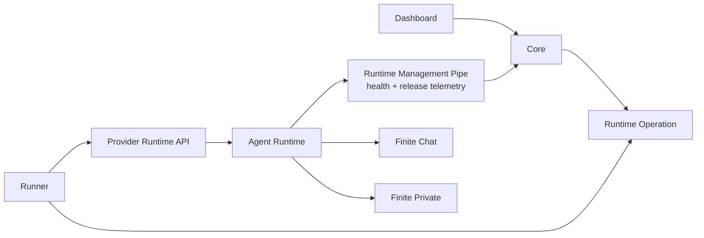

# Runtime Control Contract

Status: active v2 product contract.

## Problem Statement

finitecomputer-v2 should host Hermes agents for non-technical users without
owning the agent's day-to-day configuration state. Core and the dashboard own
account state, agent creation, runtime identity, Finite Private grants, runtime
health, restart, and emergency recovery. The user and agent do real work over
Finite Chat and inside the runtime image.

The dashboard presents chat, connections, Sites, and Brain, but it must not
become a second runtime configuration store. Finite Chat owns chat state;
focused services own their data; and Hermes owns its runtime-local state.
Product features belong in those services, the product UI, stable CLIs, or
skills. They do not become Runtime Management Pipe commands or status fields.

## Acceptance Criteria

- A user can create a hosted agent from the dashboard.
- Core records the provider runtime handle, image/runtime artifact, and Finite
  Private grant/key state.
- Dashboard web chat uses a Hosted Web Device; Electron and native clients can
  enroll as additional independent Finite Chat Devices.
- Dashboard-owned runtime controls are limited to normal restart,
  recover-known-good runtime, stop, and Runtime Retirement. Purge User
  Data is a separate retention/export workflow, not a normal runtime control.
- Runtime Management Pipe v1 is outbound only and carries generic runtime
  health and Product Release telemetry. It carries no product feature command,
  feature-specific status, credential, chat state, or arbitrary payload.
- Every new runtime exposes the Product Release's baked Managed Skills Baseline
  before its first turn. Existing agents keep their installed baseline until
  they explicitly choose `finite skills sync`.
- Restart and recover operations are leased from Core and completed only after
  the runtime proves it is alive again. Stop completes after the provider
  operation succeeds. Runtime Retirement completes only after Recovery
  Readiness is proven and compute is deprovisioned without purging recovery
  material.
- Recovery does not mutate chat identity, room membership, Hermes memory,
  workspace files, user-installed tools, or skills.
- Recover-known-good is a first-class lifecycle request, but its current
  Docker/Kata/Phala implementation is provider restart plus runtime-image boot
  reconciliation. It must not claim stronger mounted-state mutation until that
  behavior exists in the same image used across the test matrix.

## Control Boundary

Core is the source of truth for Desired Runtime State. A Runner implements
provider lifecycle against an opaque Provider Runtime Handle. The Runtime
Management Pipe is a separate provider-neutral Agent Runtime→Core telemetry
boundary; the runtime image implements its outbound client, boot policy, and
mounted durable state.



Core must not shell into the runtime, edit the user's home directory, expose a
general command relay, or proxy orchestrator/provider APIs. Runtime Management
Pipe v1 is not an inbound channel at all. Product integrations own their own
credential and state flows outside this pipe. The Runner may restart or
recreate provider runtimes through its lifecycle contract, but runtime boot
code decides what mounted state is safe to repair.

Managed skills are also outside this pipe. The image supplies a one-time
baseline for new agents. Existing agents will opt into updates locally through
`finite skills sync`; Core and Runner do not select a revision,
write the skill tree, poll for changes, or trigger reloads.

### Current wiring gap

Core already contains authenticated heartbeat, typed event/result,
status-snapshot, and chat-ledger routes from a broader design, but the current
Agent Runtime image has no Runtime Management Pipe client. The Runner also
mints a relay token after launch and records only its hash without injecting
the raw credential into the runtime.

Treat that broader surface as dormant scaffolding, not a contract to finish.
The first implementation must narrow it to outbound generic health and Product
Release telemetry, arrange the bootstrap credential before launch, and avoid
commands, results, chat ledgers, feature schemas, or product-specific status.

## Runtime Operations

These are Core-to-Runner lifecycle operations. They never arrive through the
Runtime Management Pipe.

### Restart

`restart` is the normal emergency lever. It asks the provider to restart the
same runtime with the same durable mount and then waits for a fresh heartbeat or
provider readiness signal.

Restart must not rewrite Hermes config or user state. It is the first action
when Finite Chat, Hermes, or health checks appear stuck.

### Recover Known-Good Runtime

The current API and database kind are named
`recover_known_good_chat_runtime`. That chat-specific name is legacy coupling;
until a generic recovery contract exists, the operation must not accumulate
chat-specific configuration behavior.

It is intended for a case where the runtime is reachable enough to restart but
image-owned boot state is suspected broken.

Today this operation is intentionally equivalent to provider restart in Docker,
Kata, and Phala. That is a real control path with a real Core kind, lease, and
Postgres check constraint, but it does not claim to rewrite mounted state.

A stronger recovery policy may be added later only if the same runtime image
used by Docker, Kata, and Phala implements it. That future image-owned operation must
keep durable chat identity, Hermes memory, workspace files, skills, and user
data intact.

If recovery still does not restore the runtime, the next escalation is a deeper
image or data migration, not dashboard feature state.

### Stop

`stop` asks the provider to stop compute while preserving durable mounted state.
Core records the runtime as `offline` after the provider command succeeds.

### Runtime Retirement

Runtime Retirement deprovisions compute and public endpoints while retaining a
provider-independent Recovery Snapshot for the declared retention period. Core
keeps plaintext-safe historical metadata, marks the runtime `offline`, clears
public runtime URLs, and marks Hermes unavailable. The current `destroy` API
must behave as retirement or remain unavailable until it is split from volume
deletion.

### Purge User Data

Purge User Data irreversibly deletes the Provider Durable Volume and every
retained Recovery Snapshot. It is not a runtime health control. Core must reject
it until retention, fresh Recovery Readiness, explicit user confirmation,
export offer, and separately scoped purge authorization are all satisfied.
Subscription cancellation, non-payment, stop, and Runtime Retirement never
imply purge.

## Managed Skills

The Runtime image contains the tested baseline at `/runtime/finite-skills`. On
a genuinely new Agent Home, the common gateway launcher copies it once to the
durable installed baseline and configures Hermes to discover it:

```text
/runtime/finite-skills                         # immutable image bundle
/data/agent/managed-skills/finite/current      # installed once for this agent
/data/agent/hermes-home/skills                 # durable user-owned skills
```

Restart and image replacement do not overwrite an existing installed baseline.
User-local skills remain separate durable user data and must never be edited or
pruned by a baseline install or sync.

There is intentionally no Core desired revision, automatic fleet updater,
polling loop, Runtime Management Pipe request or status, or Runner skills
operation. `finite skills sync` is an explicit local choice for an existing
agent. It adopts only the tested bundle in the running image, atomically swaps
the durable managed baseline, and never edits user-local skills. New Hermes
slash-command names require `/reload-skills`; the Runtime does not reboot.

## State Roots

Use one durable mounted root for every provider:

```text
/data
```

Within that root, v2 reserves:

```text
/data/agent
/data/agent/hermes-home
/data/workspace
```

`FINITECHAT_HOME` points at `/data/agent`, `HERMES_HOME` points at
`/data/agent/hermes-home`, and `FINITECHAT_WORKSPACE` points at
`/data/workspace`. Local Docker bind-mounts a host directory at `/data`; Kata
and Phala attach Provider Durable Volumes at `/data`. No v2 provider should use
a different in-container durable-state path unless this contract changes first.
The mounted volume is primary state and never counts as its own Recovery
Snapshot.

## Hermes Image Audit

The [Hermes Docker docs](https://hermes-agent.nousresearch.com/docs/user-guide/docker)
describe the official image as stateless with user data stored in a mounted data
directory, and recommend explicit tool-loop hard stops for unattended gateway
deployments. v2 follows the same rule: immutable runtime bits live under
`/runtime`, and per-agent state lives under `/data`.

The [Hermes configuration docs](https://hermes-agent.nousresearch.com/docs/user-guide/configuration)
separate non-secret config from secrets, support environment-variable
substitution, and expose provider timeout settings. The v2 generated config
references `${FINITE_PRIVATE_API_KEY}` instead of persisting the raw key in
`config.yaml`; the runner supplies the key through runtime provider env.

Current v2 runtime image expectations:

- `/runtime` is immutable image state.
- local Docker, Kata, and Phala mount durable state at `/data`.
- generated Hermes config enables the `finitechat` plugin and tool-loop
  hard-stop guardrails.
- on first seed, the runtime refuses OpenRouter or any other fallback when
  Finite Private is the requested default profile and no key is present; after
  `config.yaml` exists, its model/provider block is Hermes/user-owned and a
  stale Runner default neither rewrites nor blocks that durable choice.
- the runtime image packages Hermes Agent 0.18.2, `finitechat`, `fsite`,
  `fbrain`, the Finite Chat Hermes plugin, and the one-time Finite Skills
  baseline.

Current debt:

- the first-class image still uses the Finite Chat owned entrypoint and gateway
  launcher. That is the right product shape for this release.
- recover-known-good is currently equivalent to restart while the current image
  owns narrow config reconciliation on boot. It repairs only Finite Chat and
  managed-skills invariants while preserving inference and other messaging
  platforms. A stronger boot-policy operation must be reintroduced only when it
  is implemented in the same image used by Docker, Kata, and Phala.
- v2 does not currently configure independent Agent Runtime backup. The
  optional entrypoint Restic path now includes the complete `/data` root,
  including `/data/workspace`, but it does not yet provide the required
  application-consistent barrier, independently recoverable key authority, or
  empty-target restore proof. Runtime Retirement and Purge User Data remain
  unavailable until that Recovery Set design restores. This does not block
  normal first-slice launch/restart on preserved provider-durable state.
- Hermes currently runs as root. The narrow sync command is shipped, but Hermes
  0.18.2 still requires explicit `/reload-skills` for newly added or removed
  slash-command names. Do not replace that limitation with an automatic
  updater, Core desired state, Runtime Management Pipe command, or
  Runner-mounted checkout.

## Evaluation Design

The runtime-control path is accepted only when all of these pass:

- Core unit tests prove lifecycle request/lease/dedupe behavior.
- Runner tests prove lifecycle dispatch to provider hooks.
- Runtime Management Pipe tests prove telemetry is outbound, generic, and
  limited to health and Product Release facts; feature commands and
  feature-specific status are rejected by construction.
- Runtime image tests prove entrypoint, healthcheck, and finite-private config
  guardrails plus one-time bundled skill discovery, restart non-overwrite, and
  preserved user-owned skills.
- `finite skills sync` tests prove updates happen only after explicit invocation
  and never through Core, Runner, polling, or Runtime Management Pipe behavior.
- Local Apple Container SaaS proves real dashboard create-agent, Agent
  Principal contact, Hosted Web chat, image replacement with preserved `/data`,
  independent service restart healing, and Finite Private.
- Kata proves the same image and Provider Durable Volume restart for the first
  slice. Runtime Retirement and full Recovery Snapshot restore onto empty
  replacement compute remain post-MVP recovery gates.
- Phala proves the same thin Runner contract plus its claimed confidential
  evidence. Recovery Snapshot format and off-host restore remain a recorded
  post-first-slice TODO; normal lifecycle operations must preserve Provider
  Durable State in the meantime.

Do not climb to Phala if the local Apple Container or Kata rung fails.
