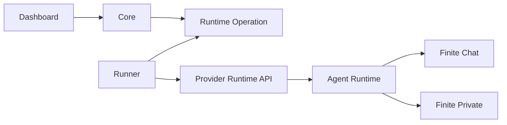

# Runtime Control Contract

Status: active v2 product contract.

## Problem Statement

finitecomputer-v2 should host Hermes agents for non-technical users without
owning the agent's day-to-day configuration state. Core and the dashboard own
account state, agent creation, runtime identity, Finite Private grants, runtime
health, restart, and emergency recovery. The user and agent do real work over
Finite Chat and inside the runtime image.

The dashboard must not become a second configuration plane for chat, tools,
connections, or Hermes sessions. Those belong in Finite Chat, focused Finite
tools, or durable state inside the runtime.

## Acceptance Criteria

- A user can create a hosted agent from the dashboard.
- Core records the provider runtime handle, image/runtime artifact, and Finite
  Private grant/key state.
- The native Finite Chat app is the only chat UI for this release.
- Dashboard-owned runtime controls are limited to normal restart,
  recover-known-good chat runtime, stop, and destroy.
- Restart and recover operations are leased from Core and completed only after
  the runtime proves it is alive again. Stop and destroy complete after the
  provider operation succeeds.
- Recovery does not mutate chat identity, room membership, Hermes memory,
  workspace files, user-installed tools, or skills.
- Recover-known-good is a first-class lifecycle request, but its current
  Docker/Phala implementation is provider restart plus runtime-image boot
  reconciliation. It must not claim stronger mounted-state mutation until that
  behavior exists in the same image used across the test matrix.

## Control Boundary

Core is the source of truth for Desired Runtime State. A Runner implements the
provider-specific Runtime Management Pipe. A runtime image implements boot
policy and owns mounted durable state.



Core must not shell into the runtime, edit the user's home directory, or own
external connection tokens. The runner may restart or recreate provider
runtimes, but runtime boot code is responsible for deciding what mounted state
is safe to repair.

## Runtime Operations

### Restart

`restart` is the normal emergency lever. It asks the provider to restart the
same runtime with the same durable mount and then waits for a fresh heartbeat or
provider readiness signal.

Restart must not rewrite Hermes config or user state. It is the first action
when Finite Chat, Hermes, or health checks appear stuck.

### Recover Known-Good Chat Runtime

`recover_known_good_chat_runtime` is a stronger repair operation. It is for the
case where the runtime is reachable enough to restart, but generated Finite
Chat/Hermes config is suspected broken.

Today this operation is intentionally equivalent to provider restart in Docker
and Phala. That is a real control path with a real Core kind, lease, and
Postgres check constraint, but it does not claim to rewrite mounted state.

A stronger recovery policy may be added later only if the same runtime image
used by Docker and Phala implements it. That future image-owned operation must
keep durable chat identity, Hermes memory, workspace files, skills, and user
data intact.

If recovery still does not restore chat, the next escalation is a deeper image
or data migration, not dashboard connection state.

### Stop

`stop` asks the provider to stop compute while preserving durable mounted state.
Core records the runtime as `offline` after the provider command succeeds.

### Destroy

`destroy` asks the provider to delete compute and the provider-owned durable
mount for that runtime. Core keeps plaintext-safe historical metadata, marks the
runtime `offline`, clears public runtime URLs, and marks Hermes unavailable.

## State Roots

Use one durable mounted root for every provider:

```text
/data
```

Within that root, v2 reserves:

```text
/data/agent
/data/agent/hermes-home
/data/workspace
```

`FINITECHAT_HOME` points at `/data/agent`, `HERMES_HOME` points at
`/data/agent/hermes-home`, and `FINITECHAT_WORKSPACE` points at
`/data/workspace`. Local Docker bind-mounts a host directory at `/data`; Phala
uses a named durable volume mounted at `/data`. No v2 provider should use a
different in-container durable-state path unless this contract changes first.

## Hermes Image Audit

The [Hermes Docker docs](https://hermes-agent.nousresearch.com/docs/user-guide/docker)
describe the official image as stateless with user data stored in a mounted data
directory, and recommend explicit tool-loop hard stops for unattended gateway
deployments. v2 follows the same rule: immutable runtime bits live under
`/runtime`, and per-agent state lives under `/data`.

The [Hermes configuration docs](https://hermes-agent.nousresearch.com/docs/user-guide/configuration)
separate non-secret config from secrets, support environment-variable
substitution, and expose provider timeout settings. The v2 generated config
references `${FINITE_PRIVATE_API_KEY}` instead of persisting the raw key in
`config.yaml`; the runner supplies the key through runtime provider env.

Current v2 runtime image expectations:

- `/runtime` is immutable image state.
- local Docker, remote Docker, and Phala mount durable state at `/data`.
- generated Hermes config enables the `finitechat` plugin and tool-loop
  hard-stop guardrails.
- the runtime refuses OpenRouter or any other fallback when Finite Private is
  the requested default profile and no key is present.
- the runtime image packages Hermes Agent 0.18, `finitechat`, `fsite`, and the
  Finite Chat Hermes plugin.

Current debt:

- the first-class image still uses the Finite Chat owned entrypoint and gateway
  launcher. That is the right product shape for this release.
- recover-known-good is currently equivalent to restart while the current image
  owns config reconciliation on boot. A stronger boot-policy operation must be
  reintroduced only when it is implemented in the same image used by Docker and
  Phala.

## Evaluation Design

The runtime-control path is accepted only when all of these pass:

- Core unit tests prove lifecycle request/lease/dedupe behavior.
- Runner tests prove lifecycle dispatch to provider hooks.
- Runtime image tests prove entrypoint, healthcheck, and finite-private config
  guardrails.
- Local Docker canary proves create-agent, invite, chat, restart persistence,
  and Finite Private.
- Remote Docker proves the same image and invite/chat shape off the laptop.
- Phala proves durable mount restart and memory preservation.

Do not climb to Phala if the local or remote Docker rung fails.
