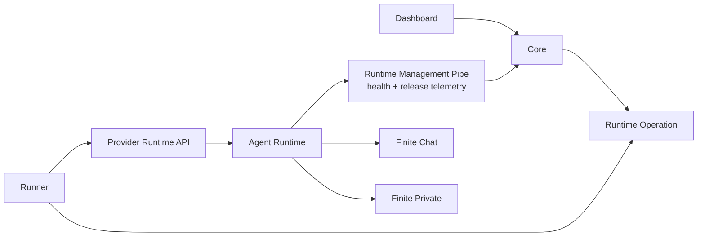

# Runtime Control Contract

Status: active v2 product contract.

Core and the dashboard own account state, creation, runtime identity, grants,
health, and capability-gated lifecycle operations. Product services and Hermes
own their data; the dashboard is not a second runtime configuration store.

## Control Boundary

Core is the source of truth for Desired Runtime State. A Runner implements
provider lifecycle against an opaque Provider Runtime Handle. The Runtime
Management Pipe is a separate provider-neutral Agent Runtime→Core telemetry
boundary; the runtime image implements its outbound client, boot policy, and
mounted durable state.


```mermaid
flowchart LR
  Dashboard["Dashboard"] --> Core["Core"]
  Core --> Request["Runtime Operation"]
  Runner["Runner"] --> Request
  Runner --> Provider["Provider Runtime API"]
  Provider --> Runtime["Agent Runtime"]
  Runtime --> Pipe["Runtime Management Pipe<br/>health + release telemetry"]
  Pipe --> Core
  Runtime --> Chat["Finite Chat"]
  Runtime --> Private["Finite Private"]
```

Core must not shell into the runtime, edit the user's home directory, expose a
general command relay, or proxy orchestrator/provider APIs. Runtime Management
Pipe v1 is not an inbound channel at all. Product integrations own their own
credential and state flows outside this pipe. The Runner may restart or
recreate provider runtimes through its lifecycle contract, but runtime boot
code decides what mounted state is safe to repair.

Managed skills are also outside this pipe. The image supplies a one-time
baseline for new agents. Existing agents will opt into updates locally through
`finite skills sync`; Core and Runner do not select a revision,
write the skill tree, poll for changes, or trigger reloads.

The image has no direct Runtime Management Pipe client. Standing health is
Runner-ferried; see [the current telemetry boundary](runtime-management-contract-v1.md).
TODO: [FIN-21](https://linear.app/finitecomputer/issue/FIN-21).

## Lifecycle State Machine

Core owns one canonical state machine for every Runtime control operation
(migration `0021_runtime_lifecycle.sql`):

```text
requested → launching → compute_up → ready → succeeded   (restart, recover, upgrade)
requested → launching → stopped                          (stop, destroy)
any non-terminal state → failed (always with a named failure_stage)
```

- `succeeded` is reachable only through `ready`; it never again means
  "compute exists". Stop and Destroy
  confirm into `stopped`, so a stopped Runtime can never display as
  ready/succeeded.
- `failed` always names a `failure_stage`: `launch`, `compute`, `readiness`,
  `retirement`, or `unknown` (legacy rows and N-1 writers only).
- Transitions are typed in Core's `runtime_lifecycle` module; illegal
  orderings are unrepresentable rather than guarded at runtime.
- The flat completion wire is parsed once into a `RuntimeControlCompletion`
  (plain / upgrade-with-facts / destroy-with-receipt), so the three
  completion shapes cannot be confused inside Core.
- The Runner reports completion only after its bounded readiness wait
  (default 180s, aligned with agentd's Finite Chat bridge deadline), so Core
  records the up-bound chain atomically.
- Dashboard and `scripts/finite-status` project these states directly; no
  surface re-derives operation state locally.

## Standing Readiness Reports

Runner-ferried standing readiness reports current health independently of any
lifecycle operation (`0022_runtime_health_reports.sql`).

- Core names the poll targets. Every cycle the Runner fetches the
  runner-authed, host-scoped `GET /api/core/v1/runtime-health-targets`
  listing — every live runtime on the credential's host whose lifecycle latch
  is not `offline`, with its contact endpoint, `source_machine_id`, the Agent
  Principal npub Core last observed for it, and its declared report cadence —
  and polls exactly those. The Runner keeps no registry of its own: launches,
  upgrades, relocations, stops and destroys are already Core facts. The only
  runner-side state is the per-runtime poll throttle, in memory, reset on
  process start. A Core without the listing route (N-1) turns reporting off
  for that process with one log line; a listing transport failure skips the
  cycle; a 404 on an individual report is logged and ignored, and the next
  listing decides whether the runtime is still this host's.
- Attribution is pinned to the Agent Principal Core has on record (the npub
  the runtime's earlier reports carried); a runtime with none on record
  reports the first presented principal, which Core then lists as the pin. A
  response presenting any other principal is dropped: ports are reallocated
  across stops, and a squatter's health must never wear this runtime's name.
- Once per poll interval per runtime (default 60s), the Runner reads the
  guest's bounded `/contact` document and posts one
  `POST /api/core/v1/runtime-health-reports` report. The endpoint is
  runner-authed; the source host comes from the credential, never the body, so
  a runner can only report for runtimes on its own host.
- **Transport failure is reported, not skipped.** When nobody answers, the
  Runner posts `ready: false` with reason `unreachable`, so a dead runtime
  reads `not_ready` immediately. Staleness then means exactly one thing — the
  Runner stopped reporting — and reads `stale` (never reported reads
  `unknown`). The two failure classes stay distinguishable.
- Core stores only the latest report on the runtime row and projects at read
  time (no sweeper, no history table): `ready` iff the latest report says
  ready and is fresher than 3x the reported poll cadence; a fresh `not_ready`
  surfaces its reason; no/stale report — or a runtime Core does not consider
  `online` — is the named `unknown` state. Freshness is measured from Core's
  receive clock, so runner clock skew cannot extend it.
- The projection lands in the admin runtime overview
  (`AdminRuntimeOverview.runtime_health`) and in `scripts/finite-status`,
  which rolls a fresh `not_ready` up to red and stale/missing reports to
  unknown over online, active-linked runtimes only.
- This is outbound-only generic health telemetry under the Runtime Management
  Pipe v1 boundary: no inbound command path, no desired state, and a Core
  outage never interrupts a healthy guest. The runner ferries because the
  runtime image does not yet host the RMP client; the wire shape is the
  contract's health leg either way.

## Runtime Operations

These are Core-to-Runner lifecycle operations. They never arrive through the
Runtime Management Pipe.

### Restart

`restart` is the normal emergency lever. It asks the provider to restart the
same runtime with the same durable mount and then waits for the runtime's
readiness signal inside the bounded readiness deadline (default 180s). A
deadline expiry fails the request with the `readiness` stage; there is no
auto-remediation.

Restart must not rewrite Hermes config or user state. It is the first action
when Finite Chat, Hermes, or health checks appear stuck.

### Recover Known-Good Runtime

`recover_known_good_chat_runtime` is Kata-only and gated by the Runtime, worker
and target artifact capabilities. It requires canonical compute and reconciles
an image-owned candidate against the same `/data`, checking the retained Agent
Principal before replacing the old canonical handle. It preserves chat keys,
membership, Hermes memory, workspace and user skills. Missing canonical compute
fails closed. This operation is neither off-host restore nor generic data repair.

### Stop

`stop` asks the provider to stop compute while preserving durable mounted state.
Core records the runtime as `offline` and the request confirms into the
`stopped` terminal after the provider command succeeds.

### Operator-only Cold Relocation

Cold relocation moves one exact, stopped Kata Runtime between Finite-owned
Runner hosts. It is a specialized Agent Creation transaction, not a dashboard
control: Core requires the current Runtime binding, a successful stop receipt,
an exact target host, the retained Agent Principal, and a SHA-256 manifest
computed over the stopped durable tree.

The operator stages that tree separately. Only the named target Runner can
lease the request. Before launch it verifies RuntimeSpec and path bindings, an
absent target compute handle, the complete durable-state manifest, and a
regular identity file. After launch it requires the runtime to expose the same
Agent Principal before Core changes the source binding. Normal Runner secret
resolution supplies fresh target-host credentials; secrets are not copied from
the old compute environment.

A failed pre-commit relocation removes target compute but preserves Core's
existing Runtime/link and both durable trees. The stopped source remains the
rollback boundary and must not be started concurrently. This contract does not
delete source state, select a winner after both copies have changed, restore an
off-host Recovery Set, or make relocation a fleet scheduler. The exact operator
procedure is
[`infra/runbooks/runtime-cold-relocation.md`](../../infra/runbooks/runtime-cold-relocation.md).

### Runtime Retirement and data retention

The Kata retirement implementation binds the exact request, RuntimeSpec,
canonical compute and durable tree. It requires stopped writers and matching
source manifests, produces a versioned ZIP with file hashes, modes and safe
symlinks, and verifies encrypted off-host Borg readback before deleting compute.
Core validates and retains an immutable receipt bound to the request and Runtime.
The local durable tree remains retained; retirement is not data purge.

Capability advertisement and recovery configuration gate availability. Do not
infer permission to destroy from the existence of an adapter implementation.
An archive receipt alone does not prove a complete empty-target restore; the
Recovery Authority must independently possess the required keys and artifacts.

Purge User Data is not an ordinary Runtime operation. Subscription cancellation,
non-payment, stop and retirement do not authorize deleting durable state or
retained Recovery Sets. TODO: [recovery qualification](https://linear.app/finitecomputer/issue/FIN-62).

## Managed Skills

The Runtime image contains the tested baseline at `/runtime/finite-skills`. On
a genuinely new Agent Home, the common gateway launcher copies it once to the
durable installed baseline and configures Hermes to discover it:

```text
/runtime/finite-skills                         # immutable image bundle
/data/agent/managed-skills/finite/current      # installed once for this agent
/data/agent/hermes-home/skills                 # durable user-owned skills
```

Restart and image replacement do not overwrite an existing installed baseline.
User-local skills remain separate durable user data and must never be edited or
pruned by a baseline install or sync.

There is intentionally no Core desired revision, automatic fleet updater,
polling loop, Runtime Management Pipe request or status, or Runner skills
operation. `finite skills sync` is an explicit local choice for an existing
agent. It adopts only the tested bundle in the running image, atomically swaps
the durable managed baseline, and never edits user-local skills. New Hermes
slash-command names require `/reload-skills`; the Runtime does not reboot.

## State Roots

Use one durable mounted root for every provider:

```text
/data
```

Within that root, v2 reserves:

```text
/data/agent
/data/agent/hermes-home
/data/workspace
```

`FINITECHAT_HOME` points at `/data/agent`, `HERMES_HOME` points at
`/data/agent/hermes-home`, and `FINITECHAT_WORKSPACE` points at
`/data/workspace`. `fbrain` keeps its local control state at
`/data/agent/fbrain` and defaults Brain Working Trees below
`/data/workspace/finitebrain`. The Brain server remains the canonical store for
encrypted Brain records; these Working Trees are durable client state and a
local editing/sync surface, not a second Brain database or a backup. Local
Docker bind-mounts a host directory at `/data`; Kata and Phala attach Provider
Durable Volumes at `/data`. No v2 provider should use a different in-container
durable-state path unless this contract changes first. The mounted volume is
primary runtime state and never counts as its own Recovery Snapshot.

## Image boundary

The image packages the pinned Hermes runtime, Finite CLIs, Chat plugin and
Managed Skills Baseline. `/runtime` is immutable; `/data` is user state.
Generated config references `${FINITE_PRIVATE_API_KEY}` without storing its
value. First seed requires the selected provider's credential; after config
exists, its model/provider choice is user-owned and is not overwritten by a
stale Runner default. Hermes currently runs as root.

## Validation

Core and Runner tests cover capability gating, leases, fencing and typed
completion. Image and integration tests cover startup/readiness, preserved
identity and durable state, and explicit-only skills updates. Use the current
[test matrix](hermes-runtime-test-matrix.md) and
[recovery runbook](../../infra/runbooks/hosted-web-chat-recovery.md).
