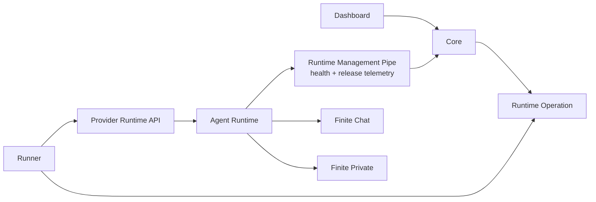

# Runtime Control Contract

Status: active v2 product contract.

Core and the dashboard own account state, creation, runtime identity, grants,
health, and capability-gated lifecycle operations. Product services and Hermes
own their data; the dashboard is not a second runtime configuration store.

## Control Boundary

Core is the source of truth for Desired Runtime State. A Runner implements
provider lifecycle against an opaque Provider Runtime Handle. The Runtime
Management Pipe is a separate provider-neutral Agent Runtime→Core telemetry
boundary; the runtime image implements its outbound client, boot policy, and
mounted durable state.


```mermaid
flowchart LR
  Dashboard["Dashboard"] --> Core["Core"]
  Core --> Request["Runtime Operation"]
  Runner["Runner"] --> Request
  Runner --> Provider["Provider Runtime API"]
  Provider --> Runtime["Agent Runtime"]
  Runtime --> Pipe["Runtime Management Pipe<br/>health + release telemetry"]
  Pipe --> Core
  Runtime --> Chat["Finite Chat"]
  Runtime --> Private["Finite Private"]
```

Core must not shell into the runtime, edit the user's home directory, expose a
general command relay, or proxy orchestrator/provider APIs. Runtime Management
Pipe v1 is not an inbound channel at all. Product integrations own their own
credential and state flows outside this pipe. The Runner may restart or
recreate provider runtimes through its lifecycle contract, but runtime boot
code decides what mounted state is safe to repair.

Managed skills are also outside this pipe. The image supplies a one-time
baseline for new agents. Existing agents will opt into updates locally through
`finite skills sync`; Core and Runner do not select a revision,
write the skill tree, poll for changes, or trigger reloads.

The image has no direct Runtime Management Pipe client. Standing health is
Runner-ferried; see [the current telemetry boundary](runtime-management-contract-v1.md).
TODO: [FIN-21](https://linear.app/finitecomputer/issue/FIN-21).

## Lifecycle State Machine

Core owns one canonical state machine for every Runtime control operation
(migration `0021_runtime_lifecycle.sql`):

```text
requested → launching → compute_up → ready → succeeded   (restart, recover, upgrade)
requested → launching → stopped                          (stop, destroy)
any non-terminal state → failed (always with a named failure_stage)
```

- `succeeded` is reachable only through `ready`; it never again means
  "compute exists". Stop and Destroy
  confirm into `stopped`, so a stopped Runtime can never display as
  ready/succeeded.
- `failed` always names a `failure_stage`: `launch`, `compute`, `readiness`,
  `retirement`, or `unknown` (legacy rows and N-1 writers only).
- Transitions are typed in Core's `runtime_lifecycle` module; illegal
  orderings are unrepresentable rather than guarded at runtime.
- The flat completion wire is parsed once into a `RuntimeControlCompletion`
  (plain / upgrade-with-facts / destroy-with-receipt), so the three
  completion shapes cannot be confused inside Core.
- The Runner reports completion only after its bounded readiness wait
  (default 180s, aligned with agentd's Finite Chat bridge deadline), so Core
  records the up-bound chain atomically.
- Dashboard and `scripts/finite-status` project these states directly; no
  surface re-derives operation state locally.

## Standing Readiness Reports

Runner-ferried standing readiness reports current health independently of any
lifecycle operation (`0022_runtime_health_reports.sql`).

- Core names the poll targets. Every cycle the Runner fetches the
  runner-authed, host-scoped `GET /api/core/v1/runtime-health-targets`
  listing — every live runtime on the credential's host whose lifecycle latch
  is not `offline`, with its contact endpoint, `source_machine_id`, the Agent
  Principal npub Core last observed for it, and its declared report cadence —
  and polls exactly those. The Runner keeps no registry of its own: launches,
  upgrades, relocations, stops and destroys are already Core facts. The only
  runner-side state is the per-runtime poll throttle, in memory, reset on
  process start. A Core without the listing route (N-1) turns reporting off
  for that process with one log line; a listing transport failure skips the
  cycle; a 404 on an individual report is logged and ignored, and the next
  listing decides whether the runtime is still this host's.
- Attribution is pinned to the Agent Principal Core has on record (the npub
  the runtime's earlier reports carried); a runtime with none on record
  reports the first presented principal, which Core then lists as the pin. A
  response presenting any other principal is dropped: ports are reallocated
  across stops, and a squatter's health must never wear this runtime's name.
- Once per poll interval per runtime (default 60s), the Runner reads the
  guest's bounded `/contact` document and posts one
  `POST /api/core/v1/runtime-health-reports` report. The endpoint is
  runner-authed; the source host comes from the credential, never the body, so
  a runner can only report for runtimes on its own host.
- **Transport failure is reported, not skipped.** When nobody answers, the
  Runner posts `ready: false` with reason `unreachable`, so a dead runtime
  reads `not_ready` immediately. Staleness then means exactly one thing — the
  Runner stopped reporting — and reads `stale` (never reported reads
  `unknown`). The two failure classes stay distinguishable.
- Core stores only the latest report on the runtime row and projects at read
  time (no sweeper, no history table): `ready` iff the latest report says
  ready and is fresher than 3x the reported poll cadence; a fresh `not_ready`
  surfaces its reason; no/stale report — or a runtime Core does not consider
  `online` — is the named `unknown` state. Freshness is measured from Core's
  receive clock, so runner clock skew cannot extend it.
- The projection lands in the admin runtime overview
  (`AdminRuntimeOverview.runtime_health`) and in `scripts/finite-status`,
  which rolls a fresh `not_ready` up to red and stale/missing reports to
  unknown over online, active-linked runtimes only.
- This is outbound-only generic health telemetry under the Runtime Management
  Pipe v1 boundary: no inbound command path, no desired state, and a Core
  outage never interrupts a healthy guest. The runner ferries because the
  runtime image does not yet host the RMP client; the wire shape is the
  contract's health leg either way.

## Runtime Operations

These are Core-to-Runner lifecycle operations. They never arrive through the
Runtime Management Pipe.

### Restart

`restart` is the normal emergency lever. It asks the provider to restart the
same runtime with the same durable mount and then waits for the runtime's
readiness signal inside the bounded readiness deadline (default 180s). A
deadline expiry fails the request with the `readiness` stage; there is no
auto-remediation.

Restart must not rewrite Hermes config or user state. It is the first action
when Finite Chat, Hermes, or health checks appear stuck.

### Recover Known-Good Runtime

`recover_known_good_chat_runtime` is Kata-only and gated by the Runtime, worker
and target artifact capabilities. It requires canonical compute and reconciles
an image-owned candidate against the same `/data`, checking the retained Agent
Principal before replacing the old canonical handle. It preserves chat keys,
membership, Hermes memory, workspace and user skills. Missing canonical compute
fails closed. This operation is neither off-host restore nor generic data repair.

### Stop

`stop` asks the provider to stop compute while preserving durable mounted state.
Core records the runtime as `offline` and the request confirms into the
`stopped` terminal after the provider command succeeds.

### Event-trial access suspension

Redeemed event trials on standard accounts lose new-work admission at the trial
end timestamp, or when billing is no longer active/trialing. There is no grace
period. Paid active subscriptions and sponsored/grandfathered accounts remain
exempt. Core owns the same read-only policy for dashboard access, creation, and
up-bound control request/lease admission; login and billing remain available.

Core reconciles trial compute every five seconds and after billing updates,
using the existing Stop operation. Stop is asynchronous: a live control lease
must settle first, and provider shutdown retains its bounded termination
behavior. Running tasks are not promised completion. Stop preserves the runtime,
its durable mount, identity, history, memberships, and credentials.

A durable marker distinguishes trial-owned stops from owner/operator stops.
After billing recovers, Core waits for the trial Stop to settle and requests a
Restart of that same runtime. Explicit Stop/Destroy requests persist a no-resume
intent through failed stops and enforcement retries. Accepted explicit up-bound
requests satisfy automatic recovery and reset that intent. Duplicate
reconciliation uses the existing single-operation
lifecycle slot. Failed operations are retried through that same control path
with exponential backoff (first retry immediate, then 15 seconds up to 30
minutes) rather than on every sweep;
unavailable Runners or unsupported capabilities remain visible errors, not
permission to purge data or create a replacement agent.

### Operator-only Cold Relocation

Cold relocation moves one exact, stopped Kata Runtime between Finite-owned
Runner hosts. It is a specialized Agent Creation transaction, not a dashboard
control: Core requires the current Runtime binding, a successful stop receipt,
an exact target host, the retained Agent Principal, and a SHA-256 manifest
computed over the stopped durable tree.

The operator stages that tree separately. Only the named target Runner can
lease the request. Before launch it verifies RuntimeSpec and path bindings, an
absent target compute handle, the complete durable-state manifest, and a
regular identity file. After launch it requires the runtime to expose the same
Agent Principal before Core changes the source binding. Normal Runner secret
resolution supplies fresh target-host credentials; secrets are not copied from
the old compute environment. For a Runtime enrolled in Core authentication,
Core leases the relocation only to a Runner advertising
`supportsRelocationCredentials`; that Runner fetches one successor credential
for the exact lease before launch, and completion revokes the predecessor in
the same transaction that switches the binding. If the successor cannot also be
activated in that transaction, the whole completion rolls back. A revoked
current credential fails closed.

A failed pre-commit relocation removes target compute but preserves Core's
existing Runtime/link and both durable trees. The stopped source remains the
rollback boundary and must not be started concurrently. This contract does not
delete source state, select a winner after both copies have changed, restore an
off-host Recovery Set, or make relocation a fleet scheduler. The exact operator
procedure is
[`infra/runbooks/runtime-cold-relocation.md`](../../infra/runbooks/runtime-cold-relocation.md).

### Runtime Retirement and data retention

The Kata retirement implementation binds the exact request, RuntimeSpec,
canonical compute and durable tree. It requires stopped writers and matching
source manifests, produces a versioned ZIP with file hashes, modes and safe
symlinks, and verifies encrypted off-host Borg readback before deleting compute.
Core validates and retains an immutable receipt bound to the request and Runtime.
The local durable tree remains retained; retirement is not data purge.

Capability advertisement and recovery configuration gate availability. Do not
infer permission to destroy from the existence of an adapter implementation.
An archive receipt alone does not prove a complete empty-target restore; the
Recovery Authority must independently possess the required keys and artifacts.

Purge User Data is not an ordinary Runtime operation. Subscription cancellation,
non-payment, stop and retirement do not authorize deleting durable state or
retained Recovery Sets. TODO: [recovery qualification](https://linear.app/finitecomputer/issue/FIN-62).

## Managed Skills

The Runtime image contains the tested baseline at `/runtime/finite-skills`. On
a genuinely new Agent Home, the common gateway launcher copies it once to the
durable installed baseline and configures Hermes to discover it:

```text
/runtime/finite-skills                         # immutable image bundle
/data/agent/managed-skills/finite/current      # installed once for this agent
/data/agent/hermes-home/skills                 # durable user-owned skills
```

Restart and image replacement do not overwrite an existing installed baseline.
User-local skills remain separate durable user data and must never be edited or
pruned by a baseline install or sync.

There is intentionally no Core desired revision, automatic fleet updater,
polling loop, Runtime Management Pipe request or status, or Runner skills
operation. `finite skills sync` is an explicit local choice for an existing
agent. It adopts only the tested bundle in the running image, atomically swaps
the durable managed baseline, and never edits user-local skills. New Hermes
slash-command names require `/reload-skills`; the Runtime does not reboot.

## State Roots

Use one durable mounted root for every provider:

```text
/data
```

Within that root, v2 reserves:

```text
/data/agent
/data/agent/hermes-home
/data/workspace
```

`FINITECHAT_HOME` points at `/data/agent`, `HERMES_HOME` points at
`/data/agent/hermes-home`, and `FINITECHAT_WORKSPACE` points at
`/data/workspace`. `fbrain` keeps its local control state at
`/data/agent/fbrain` and defaults Brain Working Trees below
`/data/workspace/finitebrain`. The Brain server remains the canonical store for
encrypted Brain records; these Working Trees are durable client state and a
local editing/sync surface, not a second Brain database or a backup. Local
Docker bind-mounts a host directory at `/data`; Kata and Phala attach Provider
Durable Volumes at `/data`. No v2 provider should use a different in-container
durable-state path unless this contract changes first. The mounted volume is
primary runtime state and never counts as its own Recovery Snapshot.

## Image boundary

The image packages the pinned Hermes runtime, Finite CLIs, Chat plugin and
Managed Skills Baseline. `/runtime` is immutable; `/data` is user state.
Generated config references `${FINITE_PRIVATE_API_KEY}` without storing its
value. First seed requires the selected provider's credential; after config
exists, its model/provider choice is user-owned and is not overwritten by a
stale Runner default. The image does own the named `providers.finite-private`
entry and the Finite Private backup entry in `fallback_providers`; see
[Inference Connections](#inference-connections). Hermes currently runs as
root.

## Inference Connections

The dashboard changes which model provider an agent uses through typed Finite
Agent Daemon commands carried by Finite Chat
([ADR 0003](../../docs/adr/0003-agentd-is-the-agent-owned-platform-boundary.md)).
Core, the Runner and the Runtime Management Pipe take no part. Command schemas
are in `finite-agentd/src/inference_commands.rs`, capabilities in
`finite-agentd/src/inference.rs`, and error codes and messages in
`finite-agentd/src/lib.rs`. Commands no agent
advertises answer `unsupported_command`. TODO:
[FIN-129](https://linear.app/finitecomputer/issue/FIN-129),
[FIN-130](https://linear.app/finitecomputer/issue/FIN-130).

The **Saved Default** is the `model` block of the agent's Hermes
`config.yaml`: the model new conversations use. A conversation's own `/model`
choice (a session override) wins over it for that conversation. It is
user-owned after the first seed, and agentd writes it only for an explicit
owner action.

### Status reports stored facts, never validity

`agent.connections.status` keeps its legacy `inference` fields unchanged and
adds fields that say what is stored: a saved key is `key_saved`, a complete
Finite Private setup is `configured`. Nothing in status says a route works, a
key is valid or a provider will answer; only a request to the provider shows
that. A fact that could not be read is `unknown`, never absent, and the legacy
fields are served even then.

Hermes-side facts come from the helper `hermes_cli.finite_inference_helper
inference-facts`, run in the environment Hermes gets from agentd. It parses
`config.yaml`, `.env` and `auth.json` itself and reads the session store
read-only, because Hermes's own loaders write while they load (the `.env`
sanitizer, a corrupt-file backup, session pruning), and a status read must
never be a writer. A read a reply waits on has a short deadline, so status fits
the Hosted Web Device's wait; the executor's reads allow longer, because no
reply waits on them and a busy Agent Runtime makes the helper slow. The
deadlines are in `finite-agentd/src/helper.rs`.

### v1 apply

`agent.inference.apply` v1 is what every existing dashboard calls, and it keeps
today's wire format, synchronous reply and failure behavior. It is also how
the dashboard saves a pasted OpenRouter key while no agent advertises
`openrouter.connect.v1`.

- **It keeps its `.env` snapshot restore.** v1 writes a key it has not checked.
  Without the restore, a failed write or restart would leave that unchecked
  key in place of a working one.
- **It verifies with one immediate read and never re-applies.** The dashboard
  waits for v1's reply, so anything slower than today's single restart would
  report a timeout for a change that was applied. A mismatch is reported as
  `config_conflict`, with status showing the state as found.

### Select and disconnect

`agent.inference.select` and `agent.inference.disconnect` validate everything
the user controls before any file is touched, then record an Inference Intent
and reply at once. The **Inference Intent** is agentd's single-slot,
secret-free record of an unfinished inference change
(`$FINITECHAT_HOME/agentd/inference-intent.json`; schema and admission in
`finite-agentd/src/intent.rs`). A background executor then writes the
credential, then `model`, restarts, and verifies.

- **Keys are checked only from OpenRouter's key metadata** (`GET /key`). No
  completion request is ever sent to test one: it would spend the user's money
  without consent and still could not promise the next request.
- **One change at a time.** While an intent is running, or a disconnect has
  failed, agentd refuses every other change. A failed select blocks nothing:
  the next change replaces it.
- **Hermes starts first.** At agentd startup the executor resumes only after
  Hermes has been started, so a pending, failing or unreadable intent never
  delays chat.
- **Only a running intent or a failed disconnect is resumed at startup.** A
  failed select or activate is left as it is until the user's next change
  replaces it: the user may have chosen another model in chat since, and
  re-running a stale switch would overwrite that choice. A failed disconnect
  removes only a credential the user asked to remove, and the launcher's
  clears depend on it finishing.
- **Verification compares parsed values, never file bytes.** Hermes rewrites
  `config.yaml` on an agent's first chat turn.
- **Disconnect verification waits for the launcher.** A spawned process can
  still be clearing credentials and overrides before gateway startup. The
  executor polls for a bounded window without restarting it; unknown or failed
  reads mean "not yet". Only an uncleared window triggers a bounded retry.
- **Failed checks undo only agentd's model change.** Daemon configuration
  writers share a lock. If an external writer changes unrelated settings while
  the check runs, those settings survive the undo. If the model itself changed,
  agentd leaves it alone and reports `config_conflict`. Hermes and terminal
  writers do not take this lock; it is not a cross-process transaction.
- **Spawn-failure rollback** restores `config.yaml` only while it still holds
  exactly the bytes agentd wrote. A different file is left intact.
- **Select verification preserves a later model choice.** A retry may replace
  only the model value this attempt originally replaced, checked again under
  the daemon's config lock. Any other value, or an unknown before-image after
  daemon recovery, produces `config_conflict` without a write. It never repeats
  credential migration just to retry the model write.

An operation can outlast dashboard polling; admission stays locked until it
ends. Timing and retry limits are in `finite-agentd/src/executor.rs`.

Disconnecting the Saved Default requires Finite Private settings and a key
known present, without a live probe. Missing setup returns
`finite_private_unavailable`; a failed helper read returns `facts_unavailable`.
Both refusals leave files unchanged.

### What a partial state leaves

A **configured** route has stored settings and credentials; it does not promise
provider availability or credit. Provider failure uses the configured fallback,
or fails the turn. Critical partial states:

- A crash after v1 staged a key, before its restore could run, leaves the
  unchecked key in `.env`, as v1 always has.
- A disconnect interrupted before its cleanup phase leaves the route and
  credential in place; the launcher skips its clears until the intent reaches
  cleanup and the Saved Default is no longer the route.
- A launcher step cut short by its own time limit clears part of what it
  should. Hermes still starts; a remaining OpenRouter override has no key, so
  the patched gateway uses the backup or fails the turn. The next restart
  finishes the clears.

### What disconnect guarantees

During cleanup restart, the launcher runs `apply-pending-disconnect` before the
gateway. It clears the provider's credentials and session overrides only after
the intent reaches cleanup and the Saved Default has moved away. Running these
clears while a gateway exists would let its cached stores restore removed
entries. Failure never prevents Hermes startup.

After the operation succeeds, this is guaranteed for this agent:

- no `OPENROUTER_API_KEY` line remains in `.env`, and `auth.json` holds no
  OpenRouter pool entry except ones Hermes seeds from its environment;
- the gateway was restarted after the removal, and the agentd-launched
  `hermes serve` was stopped and started again only after verification;
- conversations that had an override to the provider follow the Saved Default
  from their next message, and their history is untouched;
- this was verified from fresh facts.

It is not guaranteed that:

- processes the agent or the user started earlier hold no copy. Terminal
  workers started in their own session outlive the gateway, and shells opened
  with `nerdctl exec` are outside agentd;
- the key stops working. It stays valid at OpenRouter until it is revoked
  there;
- no OpenRouter key remains. An `OPENROUTER_API_KEY` in the agent's process
  environment cannot be removed; status then reports it as coming from the
  environment.

While a disconnect is running or failed, the connection may still be in use,
and the dashboard says so. agentd does not start `hermes serve` while any
disconnect intent exists, so the optional native Hermes dashboard is
unavailable until the disconnect succeeds.

### What is not fenced

agentd does not stop other writers while it changes a route. A `/model …
--global` in chat, a terminal worker that outlives the gateway, or an operator
shell can write `config.yaml` or `.env` at any time. Verification catches a
write that lands before it finishes. A later write can undo a verified change;
status then shows the state as found, and the user can repeat the operation.

### Persisted state

| State | Writers | Readers |
| --- | --- | --- |
| `config.yaml` `model` (the Saved Default) | the startup reconciler (first seed, exact legacy Finite Private migrations); agentd v1 apply, select and disconnect; Hermes `/model … --global`, CLI and native API | Hermes; agentd; the helper; the launcher's disconnect step |
| `config.yaml` `providers.finite-private` | the reconciler, on every normal start | Hermes; the helper; the chat notice observer |
| `config.yaml` `fallback_providers` / `fallback_model` | the reconciler seeds the Finite Private backup only when neither key exists, then refreshes only its own entries; the user or Hermes for everything else. agentd never writes them | Hermes; the helper |
| `$HERMES_HOME/.env` `OPENROUTER_API_KEY` | agentd v1 apply, select (legacy key migration), disconnect (removal); Hermes and its native API | Hermes, on every turn; agentd; the helper |
| `auth.json` | Hermes; the helper's `clear-auth`, run only by the launcher's disconnect step | Hermes; the helper, read-only |
| Hermes session store | Hermes; the helper's `clear-session-overrides`, run only by the launcher's disconnect step with no gateway running | Hermes; the helper, read-only |
| the Inference Intent | agentd; any agentd read renames a corrupt record aside | agentd, including the `hermes serve` gate; the launcher's disconnect step, read-only |

The Runner passes the Finite Private key as both `FINITE_PRIVATE_API_KEY` and
`OPENAI_API_KEY`. Every Finite launch point of Hermes code drops that alias;
see
the [Hermes integration](../../finitechat/integrations/hermes/README.md#inference-routes-backup-and-notices).

### Mixed versions

An Agent Runtime keeps the image it launched with until a Runtime Upgrade, so
a new dashboard meets old agents indefinitely. The dashboard ships first,
offers a control only when the agent advertises the capability behind it,
disables change controls while it sees an operation running or a disconnect
failed, and never promises that the chat will show a notice when the backup
answers.

| Dashboard | Agent Runtime | What the user sees |
| --- | --- | --- |
| new | old agentd (no `capabilities`) | The saved route comes from the raw `model.provider`, never from `profile`, so a ChatGPT default shows as ChatGPT and a user's own `custom` endpoint as Finite Private. Finite Private and OpenRouter switch through v1 apply. No backup details, operation line or disconnect; no ChatGPT card unless ChatGPT is the Saved Default |
| old | new agentd | The old panel behaves as before. A ChatGPT default shows as Finite Private. v1 answers `operation_in_progress` while a new dashboard's operation runs or a disconnect has failed. Backup notices appear as ordinary agent messages |
| any | new image, config written by an old one | The first normal start adds `providers.finite-private`, and the backup only if no fallback is configured and the Finite Private key is present. The Saved Default and credentials are not rewritten. A key kept only as a legacy `model.api_key` is not read by Hermes for OpenRouter, so such an agent gets the backup's answer, with no notice, or the gateway's authentication error, until the owner selects OpenRouter again, which checks the key and moves it into `.env` |
| any | rolled back below the Inference Compatibility Floor | Unsupported. See below |

### Rollback

After a Runtime has run an image with this contract, only images at or above
the Inference Compatibility Floor are supported rollback targets; the floor
and the gate are defined in the
[runtime-image runbook](../../infra/runbooks/runtime-image.md#inference-compatibility-floor).
An older image has no Hermes session-route patch and no launch-point rule, so
credentials cross routes again, and it does not know the Inference Intent: a
pending disconnect stops where it was.

## Validation

Core and Runner tests cover capability gating, leases, fencing and typed
completion. Image and integration tests cover startup/readiness, preserved
identity and durable state, and explicit-only skills updates. Use the current
[test matrix](hermes-runtime-test-matrix.md) and
[recovery runbook](../../infra/runbooks/hosted-web-chat-recovery.md).

Inference Connections have a host harness, E-0, which runs the real
`finite-agentd serve`, reconciler, launcher step and packaged helper against a
stub gateway and fake providers. It does not run chat turns, the real gateway
or real providers. What it proves and how to run it are in
[`finite-agentd/README.md`](../../finite-agentd/README.md#e-0-host-harness).
