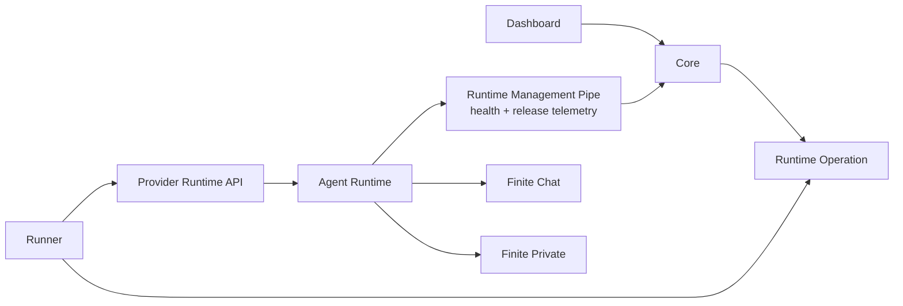

# Runtime Control Contract

Status: active v2 product contract.

Core and the dashboard own account state, creation, runtime identity, grants,
health, and capability-gated lifecycle operations. Product services and Hermes
own their data; the dashboard is not a second runtime configuration store.

## Control Boundary

Core is the source of truth for Desired Runtime State. A Runner implements
provider lifecycle against an opaque Provider Runtime Handle. The Runtime
Management Pipe is a separate provider-neutral Agent Runtime→Core telemetry
boundary; the runtime image implements its outbound client, boot policy, and
mounted durable state.


```mermaid
flowchart LR
  Dashboard["Dashboard"] --> Core["Core"]
  Core --> Request["Runtime Operation"]
  Runner["Runner"] --> Request
  Runner --> Provider["Provider Runtime API"]
  Provider --> Runtime["Agent Runtime"]
  Runtime --> Pipe["Runtime Management Pipe<br/>health + release telemetry"]
  Pipe --> Core
  Runtime --> Chat["Finite Chat"]
  Runtime --> Private["Finite Private"]
```

Core must not shell into the runtime, edit the user's home directory, expose a
general command relay, or proxy orchestrator/provider APIs. Runtime Management
Pipe v1 is not an inbound channel at all. Product integrations own their own
credential and state flows outside this pipe. The Runner may restart or
recreate provider runtimes through its lifecycle contract, but runtime boot
code decides what mounted state is safe to repair.

Managed skills are also outside this pipe. The image supplies a one-time
baseline for new agents. Existing agents will opt into updates locally through
`finite skills sync`; Core and Runner do not select a revision,
write the skill tree, poll for changes, or trigger reloads.

The image has no direct Runtime Management Pipe client. Standing health is
Runner-ferried; see [the current telemetry boundary](runtime-management-contract-v1.md).
TODO: [FIN-21](https://linear.app/finitecomputer/issue/FIN-21).

## Lifecycle State Machine

Core owns one canonical state machine for every Runtime control operation
(migration `0021_runtime_lifecycle.sql`):

```text
requested → launching → compute_up → ready → succeeded   (restart, recover, upgrade)
requested → launching → stopped                          (stop, destroy)
any non-terminal state → failed (always with a named failure_stage)
```

- `succeeded` is reachable only through `ready`; it never again means
  "compute exists". Stop and Destroy
  confirm into `stopped`, so a stopped Runtime can never display as
  ready/succeeded.
- `failed` always names a `failure_stage`: `launch`, `compute`, `readiness`,
  `retirement`, or `unknown` (legacy rows and N-1 writers only).
- Transitions are typed in Core's `runtime_lifecycle` module; illegal
  orderings are unrepresentable rather than guarded at runtime.
- The flat completion wire is parsed once into a `RuntimeControlCompletion`
  (plain / upgrade-with-facts / destroy-with-receipt), so the three
  completion shapes cannot be confused inside Core.
- The Runner reports completion only after its bounded readiness wait
  (default 180s, aligned with agentd's Finite Chat bridge deadline), so Core
  records the up-bound chain atomically.
- Dashboard and `scripts/finite-status` project these states directly; no
  surface re-derives operation state locally.

## Standing Readiness Reports

Runner-ferried standing readiness reports current health independently of any
lifecycle operation (`0022_runtime_health_reports.sql`).

- Core names the poll targets. Every cycle the Runner fetches the
  runner-authed, host-scoped `GET /api/core/v1/runtime-health-targets`
  listing — every live runtime on the credential's host whose lifecycle latch
  is not `offline`, with its contact endpoint, `source_machine_id`, the Agent
  Principal npub Core last observed for it, and its declared report cadence —
  and polls exactly those. The Runner keeps no registry of its own: launches,
  upgrades, relocations, stops and destroys are already Core facts. The only
  runner-side state is the per-runtime poll throttle, in memory, reset on
  process start. A Core without the listing route (N-1) turns reporting off
  for that process with one log line; a listing transport failure skips the
  cycle; a 404 on an individual report is logged and ignored, and the next
  listing decides whether the runtime is still this host's.
- Attribution is pinned to the Agent Principal Core has on record (the npub
  the runtime's earlier reports carried); a runtime with none on record
  reports the first presented principal, which Core then lists as the pin. A
  response presenting any other principal is dropped: ports are reallocated
  across stops, and a squatter's health must never wear this runtime's name.
- Once per poll interval per runtime (default 60s), the Runner reads the
  guest's bounded `/contact` document and posts one
  `POST /api/core/v1/runtime-health-reports` report. The endpoint is
  runner-authed; the source host comes from the credential, never the body, so
  a runner can only report for runtimes on its own host.
- **Transport failure is reported, not skipped.** When nobody answers, the
  Runner posts `ready: false` with reason `unreachable`, so a dead runtime
  reads `not_ready` immediately. Staleness then means exactly one thing — the
  Runner stopped reporting — and reads `stale` (never reported reads
  `unknown`). The two failure classes stay distinguishable.
- Core stores only the latest report on the runtime row and projects at read
  time (no sweeper, no history table): `ready` iff the latest report says
  ready and is fresher than 3x the reported poll cadence; a fresh `not_ready`
  surfaces its reason; no/stale report — or a runtime Core does not consider
  `online` — is the named `unknown` state. Freshness is measured from Core's
  receive clock, so runner clock skew cannot extend it.
- The projection lands in the admin runtime overview
  (`AdminRuntimeOverview.runtime_health`) and in `scripts/finite-status`,
  which rolls a fresh `not_ready` up to red and stale/missing reports to
  unknown over online, active-linked runtimes only.
- This is outbound-only generic health telemetry under the Runtime Management
  Pipe v1 boundary: no inbound command path, no desired state, and a Core
  outage never interrupts a healthy guest. The runner ferries because the
  runtime image does not yet host the RMP client; the wire shape is the
  contract's health leg either way.

## Runtime Operations

These are Core-to-Runner lifecycle operations. They never arrive through the
Runtime Management Pipe.

### Restart

`restart` is the normal emergency lever. It asks the provider to restart the
same runtime with the same durable mount and then waits for the runtime's
readiness signal inside the bounded readiness deadline (default 180s). A
deadline expiry fails the request with the `readiness` stage; there is no
auto-remediation.

Restart must not rewrite Hermes config or user state. It is the first action
when Finite Chat, Hermes, or health checks appear stuck.

### Recover Known-Good Runtime

`recover_known_good_chat_runtime` is Kata-only and gated by the Runtime, worker
and target artifact capabilities. It requires canonical compute and reconciles
an image-owned candidate against the same `/data`, checking the retained Agent
Principal before replacing the old canonical handle. It preserves chat keys,
membership, Hermes memory, workspace and user skills. Missing canonical compute
fails closed. This operation is neither off-host restore nor generic data repair.

### Stop

`stop` asks the provider to stop compute while preserving durable mounted state.
Core records the runtime as `offline` and the request confirms into the
`stopped` terminal after the provider command succeeds.

### Operator-only Cold Relocation

Cold relocation moves one exact, stopped Kata Runtime between Finite-owned
Runner hosts. It is a specialized Agent Creation transaction, not a dashboard
control: Core requires the current Runtime binding, a successful stop receipt,
an exact target host, the retained Agent Principal, and a SHA-256 manifest
computed over the stopped durable tree.

The operator stages that tree separately. Only the named target Runner can
lease the request. Before launch it verifies RuntimeSpec and path bindings, an
absent target compute handle, the complete durable-state manifest, and a
regular identity file. After launch it requires the runtime to expose the same
Agent Principal before Core changes the source binding. Normal Runner secret
resolution supplies fresh target-host credentials; secrets are not copied from
the old compute environment.

A failed pre-commit relocation removes target compute but preserves Core's
existing Runtime/link and both durable trees. The stopped source remains the
rollback boundary and must not be started concurrently. This contract does not
delete source state, select a winner after both copies have changed, restore an
off-host Recovery Set, or make relocation a fleet scheduler. The exact operator
procedure is
[`infra/runbooks/runtime-cold-relocation.md`](../../infra/runbooks/runtime-cold-relocation.md).

### Runtime Retirement and data retention

The Kata retirement implementation binds the exact request, RuntimeSpec,
canonical compute and durable tree. It requires stopped writers and matching
source manifests, produces a versioned ZIP with file hashes, modes and safe
symlinks, and verifies encrypted off-host Borg readback before deleting compute.
Core validates and retains an immutable receipt bound to the request and Runtime.
The local durable tree remains retained; retirement is not data purge.

Capability advertisement and recovery configuration gate availability. Do not
infer permission to destroy from the existence of an adapter implementation.
An archive receipt alone does not prove a complete empty-target restore; the
Recovery Authority must independently possess the required keys and artifacts.

Purge User Data is not an ordinary Runtime operation. Subscription cancellation,
non-payment, stop and retirement do not authorize deleting durable state or
retained Recovery Sets. TODO: [recovery qualification](https://linear.app/finitecomputer/issue/FIN-62).

## Managed Skills

The Runtime image contains the tested baseline at `/runtime/finite-skills`. On
a genuinely new Agent Home, the common gateway launcher copies it once to the
durable installed baseline and configures Hermes to discover it:

```text
/runtime/finite-skills                         # immutable image bundle
/data/agent/managed-skills/finite/current      # installed once for this agent
/data/agent/hermes-home/skills                 # durable user-owned skills
```

Restart and image replacement do not overwrite an existing installed baseline.
User-local skills remain separate durable user data and must never be edited or
pruned by a baseline install or sync.

There is intentionally no Core desired revision, automatic fleet updater,
polling loop, Runtime Management Pipe request or status, or Runner skills
operation. `finite skills sync` is an explicit local choice for an existing
agent. It adopts only the tested bundle in the running image, atomically swaps
the durable managed baseline, and never edits user-local skills. New Hermes
slash-command names require `/reload-skills`; the Runtime does not reboot.

## State Roots

Use one durable mounted root for every provider:

```text
/data
```

Within that root, v2 reserves:

```text
/data/agent
/data/agent/hermes-home
/data/workspace
```

`FINITECHAT_HOME` points at `/data/agent`, `HERMES_HOME` points at
`/data/agent/hermes-home`, and `FINITECHAT_WORKSPACE` points at
`/data/workspace`. `fbrain` keeps its local control state at
`/data/agent/fbrain` and defaults Brain Working Trees below
`/data/workspace/finitebrain`. The Brain server remains the canonical store for
encrypted Brain records; these Working Trees are durable client state and a
local editing/sync surface, not a second Brain database or a backup. Local
Docker bind-mounts a host directory at `/data`; Kata and Phala attach Provider
Durable Volumes at `/data`. No v2 provider should use a different in-container
durable-state path unless this contract changes first. The mounted volume is
primary runtime state and never counts as its own Recovery Snapshot.

## Image boundary

The image packages the pinned Hermes runtime, Finite CLIs, Chat plugin and
Managed Skills Baseline. `/runtime` is immutable; `/data` is user state.
Generated config references `${FINITE_PRIVATE_API_KEY}` without storing its
value. First seed requires the selected provider's credential; after config
exists, its model/provider choice is user-owned and is not overwritten by a
stale Runner default. The image does own the named `providers.finite-private`
entry and the Finite Private backup entry in `fallback_providers`; see
[Inference Connections](#inference-connections). Hermes currently runs as
root.

## Inference Connections

The dashboard changes which model provider an agent uses through typed Finite
Agent Daemon commands carried by Finite Chat
([ADR 0003](../../docs/adr/0003-agentd-is-the-agent-owned-platform-boundary.md)).
Core, the Runner and the Runtime Management Pipe take no part. The Hosted Web
Device waits up to 45 seconds for each command result.

- **Saved Default** and **Inference Intent** are defined in the
  [glossary](../CONTEXT.md).
- **Route**: `finite_private`, `openrouter`, `openai_codex` (ChatGPT) or
  `other`. agentd and the helper classify the Saved Default the same way:
  provider `openrouter`; `openai-codex`, `codex` or `openai_codex`;
  `finite-private` or `custom:finite-private`; or `custom` whose `base_url`
  is a Finite Private URL. Everything else is `other`.
- **Session override**: a conversation's own `/model` choice, stored by Hermes.
  It wins over the Saved Default for that conversation.
- **Backup**: the Finite-owned `provider: finite-private` entry in Hermes's
  `fallback_providers`.
- **Operation**: a `select` or `disconnect` recorded as the Inference Intent
  and finished in the background.

### Commands

| Command | Request schema | Reply | Capability |
| --- | --- | --- | --- |
| `agent.connections.status` | `finite.agent.empty.request.v1` | status | always |
| `agent.inference.apply` (v1) | `finite.agent.inference.apply.v1` `{profile, api_key?, model?}` | the config apply result, synchronously | always |
| `agent.inference.select` | `finite.agent.inference.select.v1` `{route, model}` | `{"accepted": true, "operation_id": "op_<32 hex>"}`, `{"changed": false}`, or an error | `inference.select.v1` |
| `agent.inference.disconnect` | `finite.agent.inference.disconnect.v1` `{route}` | as select | `inference.disconnect.v1` |

agentd also dispatches `agent.openrouter.usage`, `agent.openrouter.connect`,
`agent.codex.login.start`, `agent.codex.login.cancel` and `agent.codex.models`.
They pass admission and answer `unsupported_command`; no capability advertises
them. TODO: [FIN-130](https://linear.app/finitecomputer/issue/FIN-130),
[FIN-129](https://linear.app/finitecomputer/issue/FIN-129). A `select` or
`disconnect` naming `openai_codex` is `invalid_payload` until `codex.login.v1`
is advertised.

**v1 apply** keeps its wire format and failure behavior. It stages a pasted
OpenRouter key in `.env` with an in-memory snapshot, writes the `model` block
through the offer journal, and restarts Hermes. A failed write or spawn
restores the `.env` snapshot and rolls the config back. It also passes
admission, replies `already_applied` without a restart when the block and key
are unchanged, restarts the native `hermes serve` after writing a key, and
reads what it wrote once, immediately after the restart. A mismatch there is
`config_conflict`; nothing is re-applied or restored at that point. v1 never
checks a key with OpenRouter. The dashboard saves a pasted key through v1
while the agent does not advertise `openrouter.connect.v1`.

**Select** does everything the user controls before any file is touched, then
records the Inference Intent and replies:

- `finite_private`: `model` must be null, and `FINITE_PRIVATE_MODEL` and
  `FINITE_PRIVATE_BASE_URL` must be set.
- `openrouter`: `model` is 1 to 256 characters without whitespace or control
  characters. The key the route would use (`.env`, else a legacy
  `model.api_key` on an OpenRouter block) is checked with `GET /key` (8 s),
  with the rejections in the table below. No completion request is ever sent
  to test a key.
- A planned block equal to the current `model` replies `{"changed": false}`.

agentd writes the whole `model` value:

| Route | `model` |
| --- | --- |
| `finite_private` | `{default: $FINITE_PRIVATE_MODEL, provider: custom, base_url: $FINITE_PRIVATE_BASE_URL, api_key: "${FINITE_PRIVATE_API_KEY}", api_mode: chat_completions}`, plus `context_length` from `FINITE_PRIVATE_CONTEXT_LENGTH` when set, and `supports_vision: true` for `glm-5-3-flash` on the product or retired Finite Private URL |
| `openrouter` | `{default: <model>, provider: openrouter, base_url: https://openrouter.ai/api/v1, api_mode: chat_completions}`. The key stays in `.env` |

**Disconnect** takes `openrouter`. If OpenRouter is the Saved Default, the
agent will switch to Finite Private, so agentd first checks, with no live call
to Finite Private, that it can: missing Finite Private settings or a key the
helper reports `absent` is `finite_private_unavailable`; a key reported
`unknown`, because the helper read failed or timed out, is
`facts_unavailable`. Either refusal writes nothing and records no intent. With
the route not saved and nothing stored for it (no key, no `auth.json` pool
entry, no session override), the reply is `{"changed": false}`. A failed
disconnect of the same route is resumed under its original operation id.

Command errors the inference commands return (agentd's fixed messages; the
dashboard shows agentd's message for any code it has no copy for):

| Code | When | Message |
| --- | --- | --- |
| `not_connected` | select `openrouter` with no stored key | "Connect OpenRouter first." |
| `credential_rejected` | `/key` answered 401 or 403, or the key is a management or provisioning key | "OpenRouter didn't accept this key." or "That's an OpenRouter management key. Use an ordinary API key." |
| `key_allowance_exhausted` | `/key` shows a numeric `limit` and `limit_remaining` at or below zero | "This key has no remaining allowance. Raise its limit at openrouter.ai/keys, or use another key." |
| `provider_unavailable` | `/key` failed any other way | "Couldn't reach OpenRouter to check the key." |
| `config_invalid` | Finite Private settings missing for a select, or the intent could not be written | "Finite Private isn't available on this agent." or "The agent couldn't record this change." |
| `operation_in_progress` | admission refused the change (below) | "Another connection change is still finishing. Try again in a moment." |
| `disconnect_in_progress` | `agent.codex.login.start` while a ChatGPT disconnect record exists | "ChatGPT is being removed from this agent. Wait for that to finish, or try the removal again." |
| `finite_private_unavailable` | disconnecting the Saved Default with Finite Private settings missing or its key absent | "Disconnecting would leave this agent without a model: Finite Private isn't fully set up here. Choose another model first." |
| `facts_unavailable` | disconnecting the Saved Default while the Finite Private key is `unknown` | "The agent couldn't check its setup right now. Try again in a moment." |
| `config_conflict` | v1 apply: the post-restart read differs from what it wrote | "Something else changed the agent's model setting after it was saved. Status shows it as found." |

An operation that fails in the background reports its code in
`operation.error_code` instead: `config_invalid`, `config_conflict`,
`supervisor_unavailable`, `helper_unavailable` or `verify_failed`.

### Status reports stored facts

`agent.connections.status` keeps `inference.profile`, `provider` and `model`
exactly as before: `profile` is `openrouter` only when `model.provider` is
`openrouter`, and `finite_private` otherwise. It adds `inference.saved`,
`routes`, `fallback` and `operation`, and a root `capabilities` list
(`inference.status.v2`, `inference.select.v1`, `inference.disconnect.v1`).

Every added field says what is stored. None says a route works, a credential
is valid or a provider will answer. A saved OpenRouter key is `key_saved`, and
a complete Finite Private setup is `configured`.

- `routes.finite_private.state`: `configured`, or `not_configured` with reason
  `settings_missing` or `credential_missing`, or `unknown`.
- `routes.openrouter`: `state` (`key_saved`, `no_key`, `unknown`);
  `key_source` (`agent` for the last `OPENROUTER_API_KEY` line of `.env`,
  `legacy_config` for a `model.api_key` on an OpenRouter block, `environment`
  for a key only in Hermes's process environment); `key_hash`, the SHA-256 of
  the `agent` key only; `hermes_key`, whether the key Hermes would load is
  that key (`saved_key`), another key, none or unknown; `other_pool_keys`, for
  `auth.json` OpenRouter pool entries not seeded from the environment.
- `fallback.state`: `configured` when the effective chain starts with the
  canonical Finite Private entry, the `providers.finite-private` entry is
  canonical, and the Finite Private route is `configured`; `unavailable` when
  the entry is first but one of those is not (reason `settings_missing`,
  `credential_missing` or `stale_config`); `not_configured` when neither
  `fallback_providers` nor `fallback_model` exists; `off` for an empty chain;
  `custom` when the chain starts with anything else; `unknown` otherwise.
- `operation`: the Inference Intent, or the last success for ten minutes after
  its record is deleted.

Hermes-side facts come from `python -m hermes_cli.finite_inference_helper
inference-facts`, run in the environment Hermes gets from agentd. It prints
redacted facts only and reads without writing (Hermes's own `.env` sanitizer
and config loaders are avoided because they rewrite files). Every fact is a
string enum with `unknown`; unknown is never reported as absent.

- **Reads a reply waits on** (status, and a command's own check such as
  disconnect's) allow the helper `STATUS_FACTS_DEADLINE` (10 s). A successful
  read is cached on the `(mtime, size)` of `config.yaml`, `.env` and
  `auth.json` for at most 30 seconds. A failed or timed-out read makes the
  derived fields `unknown`, and is remembered for 15 seconds: until then
  status and command checks answer `unknown` without starting another helper.
  The legacy fields and the operation are always served.
- **The executor's reads** never use that cache and allow the helper
  `EXECUTOR_FACTS_DEADLINE` (30 s), because no reply waits on them and a busy
  Agent Runtime can make the helper slow.

### Operations and the Inference Intent

The Inference Intent is stored at
`$FINITECHAT_HOME/agentd/inference-intent.json` (`/data/agent/agentd/…` in
production). It holds one operation: `v: 1`, `id`, `kind` (`select`,
`activate`, `disconnect`), `route`, `model`, `phase`, `state` (`running` or
`failed`), `error_code`, `attempts` and two timestamps. It never holds a key,
token or code. agentd writes it atomically with mode 0600. A record that does
not parse as version 1, including one with an unknown field or value, is
renamed to `inference-intent.json.corrupt-<unix ms>`, logged and treated as
absent.

| Kind | Phases, forward only |
| --- | --- |
| `select`, `activate` | `accepted` → `config_written` → `restarting` → `verifying` |
| `disconnect` | `accepted` → `login_cancelled` → `route_switched` → `credential_removed` → `cleanup` → `verifying` |

Every command first passes one admission check against the record. Status and
the read-only commands always proceed. While a record is `running`, or a
disconnect is `failed`, v1 apply, select and every other change are refused
with `operation_in_progress`; only a disconnect of the failed disconnect's own
route proceeds, and resumes it. `agent.codex.login.start` is refused with
`disconnect_in_progress` while any ChatGPT disconnect record exists. A failed
`select` never blocks: the next change replaces it. agentd handles commands
one at a time and writes the record before it replies, so nothing runs
between admission and the record.

A background executor runs the record's remaining steps. It writes each phase
before that phase's step, so a retry repeats the recorded step and every step
is idempotent. It makes up to three attempts per agentd process, after
`BACKOFF` delays of 0, 15 and 60 seconds. `helper_unavailable` and
`config_invalid` are retried; `config_conflict`, `verify_failed` and
`supervisor_unavailable` fail at once. A failed record stays on disk with
`state: failed` and its `error_code`. On success agentd deletes the record.

At startup agentd starts Hermes first, exactly as without a record. Only then
does it resume:

- a `running` record, whatever its kind: crash recovery for an operation
  recorded moments before;
- a `failed` disconnect, re-armed with a fresh budget: it removes a
  credential the user asked to remove, writes nothing the user chose, and the
  launcher's clears depend on it finishing.

A `failed` select or activate is left exactly as it is. The user may have
chosen another model in chat since it failed, and re-running a stale switch
would overwrite that choice. Status shows it as failed until the user's next
change replaces it. A pending, failing or unreadable record never delays
chat.

**Select in the background:** migrate a legacy `model.api_key` into `.env`
when `.env` has none, write `model` (validated with `hermes config check`, prior
bytes restored if the check fails), restart the gateway, then verify.

**Verify after restart** compares parsed values, never file bytes, because
Hermes rewrites `config.yaml` on an agent's first chat turn.

- *Select and activate* check what agentd itself wrote before the restart:
  the parsed `model` equals the planned block, and an OpenRouter route has a
  stored `.env` key. agentd reads right after the restart and again
  `VERIFY_DELAY` (5 s) later.
- *Disconnect* checks what the launcher clears during the restart, which lands
  seconds after agentd sees the process spawned. From fresh helper facts, the
  key, the route's pool entries and session overrides must be absent and the
  Saved Default on another route. agentd reads every `VERIFY_DELAY` (5 s) for
  up to `LAUNCHER_WAIT` (60 s) and restarts nothing in that window. It
  succeeds at the first cleared read that the next read confirms. During the
  window an `unknown` fact, or a read that fails or times out, only means "not
  yet". When the window has passed, the last read decides: cleared and
  confirmed is success; not cleared is a mismatch; a failed read ends the
  attempt as `helper_unavailable`, whose retry opens a new window without a
  restart.

A mismatch is re-applied (for disconnect: the switch, the key removal and the
cleanup restart again) at most `MAX_REAPPLIES` (2) more times. Then the
operation fails with `config_conflict` (select) or `verify_failed`
(disconnect), and status shows the state as found.

If the gateway fails to spawn after a select wrote `model`, agentd restores the
previous bytes only if the file still holds exactly what it wrote, restarts
Hermes on the previous route, and fails the operation with
`supervisor_unavailable`. If the file changed in between, it leaves it alone
and reports `config_conflict`. There is no other rollback: operations move
forward and a retry converges.

### Timing

| Step | Bound | Where |
| --- | --- | --- |
| Command result, as the dashboard sees it | 45 s | Hosted Web Device wait |
| Status or a command's facts read | 10 s (`STATUS_FACTS_DEADLINE`); a failure is reused for 15 s | agentd |
| OpenRouter `/key` check | 8 s | select |
| Gateway restart until `Running` | 30 s, which includes the old process's drain (up to 10 s) | supervisor |
| `hermes serve` stop | 10 s drain | agentd |
| Executor facts read | 30 s (`EXECUTOR_FACTS_DEADLINE`) | executor |
| Disconnect verification window | `LAUNCHER_WAIT` 60 s, plus the read in flight and at most one confirmation read | executor |
| Launcher's pending-disconnect step | 20 s, then killed 5 s later if needed | launcher |
| Dashboard polling | every 3 s while an operation runs and the tab is visible; stops after 5 minutes and offers "Check again" | dashboard |

`hermes config check` has no deadline of its own. Worst cases for a background
operation, from those constants (restarts at their bound, config checks not
counted):

- **Select whose verification keeps finding another writer's change:** three
  writes, restarts and double reads, then `config_conflict`: about 3 × (30 s +
  5 s), under 2 minutes.
- **Disconnect whose launcher never clears** (reads succeed): the cleanup
  restart and a 60 s window, then two re-runs of both, then `verify_failed`.
  About 3 × 65 s ≈ 3¼ minutes when restarts and reads are quick; at most
  3 × (10 s + 30 s + 95 s) ≈ 6¾ minutes.
- **Disconnect whose helper fails throughout:** the cleanup restart, then
  three windows separated by the 15 s and 60 s backoffs, each ending
  `helper_unavailable`, then `failed`. About 3 × 65 s + 75 s + 40 s ≈ 5
  minutes when every read runs to its 30 s deadline; at most
  3 × 95 s + 75 s + 40 s ≈ 6⅔ minutes.

The quick disconnect case fits inside the dashboard's 5-minute polling. The
others can outlast it: the page then stops polling, offers "Check again", and
re-enables its controls, while agentd keeps refusing other changes with
`operation_in_progress` until the operation ends.

### Partial states

A route is **configured** when the Saved Default names a provider whose
settings and credential are stored. That is all Finite claims. Whether the
provider answers a request depends on the key's allowance, the account's
credit and the provider, which Finite cannot see. When the provider fails a
request, the backup answers if it is configured; otherwise the turn fails
with Hermes's error.

| Operation stopped after… | What is left | Recovery |
| --- | --- | --- |
| v1: key staged in `.env` (crash, no restore) | the new, unchecked key in `.env`; `model` unchanged | the user applies again |
| v1: config check or spawn failed | config and `.env` restored; previous route configured | none |
| v1: restart, then a mismatch | `config_conflict`; whatever the file holds | the user applies again |
| select: validation | nothing written | none |
| select: record written (crash) | files unchanged; record `running` | the executor, now or at the next agentd start |
| select: `model` written, before restart | the new route is on disk and configured; the gateway uses it no later than the restart | restart and verify on resume |
| select: spawn failed | previous bytes restored under the byte guard; `failed` / `supervisor_unavailable` | the user retries |
| select or activate: `failed` for any reason | whatever the files hold; agentd never re-runs it | the user's next change replaces it |
| disconnect: before `cleanup` (crash or restart) | route and credential unchanged; the launcher skips its clears | the executor resumes |
| disconnect: `route_switched` | Finite Private is the Saved Default; the key is still stored and overrides still use it | the executor resumes |
| disconnect: key removed, before restart | the running gateway still holds the key | the cleanup restart |
| disconnect: launcher step cut short by its 20 s limit, or clears partly applied | Hermes runs; a remaining OpenRouter override has no key, so the patched gateway uses the backup, or fails the turn | the window ends as a mismatch and a re-run's restart lets the launcher finish; after two re-runs, `failed` / `verify_failed` |
| disconnect: helper slow or failing | nothing changes | a new window per retry, then `failed` / `helper_unavailable`; a failed disconnect resumes at the next agentd start or on Try again |

### What disconnect guarantees

A disconnect runs in the background: cancel any ChatGPT sign-in (a no-op for
OpenRouter); if the route is the Saved Default, write the Finite Private block
and confirm the switch; remove every `OPENROUTER_API_KEY` line from `.env`;
enter `cleanup`, stop the native `hermes serve`, and restart the gateway;
verify. During that restart the launcher runs `apply-pending-disconnect`
before Hermes starts, while no gateway process exists. It clears Hermes's
stored credential for the provider (`clear_provider_auth`) and every session
override naming it, only when the record is in `cleanup` or `verifying` and
the Saved Default on disk is no longer the route. Otherwise it changes
nothing. It always lets Hermes start. The clears run there because a running
gateway's session store and credential pool write cleared entries back.

After the operation succeeds, this is guaranteed for this agent:

- no `OPENROUTER_API_KEY` line remains in `.env`, and `auth.json` holds no
  OpenRouter pool entry except ones Hermes seeds from its environment;
- the gateway was restarted after the removal, and the agentd-launched
  `hermes serve` was stopped and started again only after verification;
- conversations that had an override to the provider follow the Saved Default
  from their next message, and their history is untouched;
- this was verified from fresh facts.

It is not guaranteed that:

- processes the agent or the user started earlier hold no copy. Terminal
  workers started in their own session outlive the gateway, and shells opened
  with `nerdctl exec` are outside agentd;
- the key stops working. It stays valid at OpenRouter until it is revoked
  there;
- no OpenRouter key remains. An `OPENROUTER_API_KEY` in the agent's process
  environment cannot be removed; status then shows `key_source:
  environment`.

While a disconnect is `running` or `failed`, the connection may still be in
use, and the dashboard says so. agentd does not start `hermes serve` while any
disconnect record exists, including at startup, and starts it again after the
record is verified and deleted. The optional native Hermes dashboard is
therefore unavailable while a disconnect is pending or failed.

### What is not fenced

agentd does not stop other writers while it changes a route. A `/model …
--global` in chat, a terminal worker that outlives the gateway, or an operator
shell can write `config.yaml` or `.env` at any time. Verify after restart
catches a write that lands before it finishes. A later write can undo a
verified change; status then shows the state as found, and the user can repeat
the operation.

### Persisted state

| State | Writers | Readers |
| --- | --- | --- |
| `config.yaml` `model` (the Saved Default) | first seed and the exact legacy Finite Private model migrations (reconciler, before Hermes starts); agentd v1 apply, select and disconnect, only for an explicit owner action; Hermes `/model … --global`, CLI and native API | Hermes; agentd status and verification; the helper; the launcher's disconnect step |
| `config.yaml` `providers.finite-private` | the reconciler, replaced with the canonical value on every normal start | Hermes; the helper; the chat notice observer (its `base_url` identifies Finite Private) |
| `config.yaml` `fallback_providers` / `fallback_model` | the reconciler seeds `[finite-private entry]` only when neither key exists and the Finite Private key is present, and refreshes Finite-owned entries in place; the user or Hermes for everything else. agentd never writes either key | Hermes; the helper |
| `$HERMES_HOME/.env` `OPENROUTER_API_KEY` (mode 0600) | agentd v1 apply (upsert), select (legacy key migration), disconnect (removes every line); Hermes and its native API | Hermes, which reloads `.env` on every turn (last line wins); agentd; the helper |
| `auth.json` (Hermes credential store and pools) | Hermes; the helper's `clear-auth`, run only by the launcher's disconnect step | Hermes; the helper, read-only |
| Hermes session store (`state.db`, `sessions.json`) | Hermes `/model`, `/new`, `/reset`, expiry; the helper's `clear-session-overrides`, run only by the launcher's disconnect step with no gateway running | Hermes; the helper, read-only |
| `agentd/inference-intent.json` (the Inference Intent) | agentd command handlers and executor; any agentd read renames a corrupt record aside | agentd (status, admission, executor, the `hermes serve` gate); the launcher's disconnect step, read-only |

The Runner sets `FINITE_PRIVATE_API_KEY` and also passes the same value as
`OPENAI_API_KEY`. Every Finite launch point of Hermes code (the launcher,
agentd's `hermes serve`, and the helper) unsets `OPENAI_API_KEY` only when it
equals the Finite Private key, so a user's own OpenAI key stays available to
Hermes's other features, and sets
`CODEX_HOME=/dev/null/finite-codex-home-disabled` so no desktop Codex login
is imported.

### Mixed versions and the Connections page

An Agent Runtime keeps the image it launched with until a Runtime Upgrade, so
a new dashboard meets old agents indefinitely. The dashboard ships first. Its
Connections page follows these rules for every agent:

- A control is offered only when the agent advertises the capability behind
  it.
- Controls that start a change are disabled while an operation is `running`
  (until the page stops polling after 5 minutes) and while a disconnect is
  `failed`, matching agentd's admission. "Try again" on the operation line
  stays enabled. A failed select or activate locks nothing.
- A route's card agrees with the operation line while that route's
  disconnect is `running` or `failed`.
- The ChatGPT card is shown only when ChatGPT is the Saved Default or the agent
  advertises `codex.login.v1`, and the `/model` hint names `openai-codex`
  only when that card is shown.
- The page says when the backup is configured. It makes no promise that the
  chat will show a notice when the backup answers.

| Dashboard | Agent Runtime | What the user sees |
| --- | --- | --- |
| new | old agentd (no `capabilities`) | The saved route comes from the raw `model.provider`, never from `profile`: a ChatGPT default shows as ChatGPT, anything unknown as "Custom model", and a user's own `custom` endpoint as Finite Private. Finite Private and OpenRouter switch through v1 apply. No backup details, no operation line, no disconnect control, and no ChatGPT card unless ChatGPT is the Saved Default. If an unadvertised command is reached anyway, the dashboard answers "This agent needs an update for this." |
| old | new agentd | The old panel behaves as before: legacy fields and v1 are unchanged. A ChatGPT default shows as Finite Private. v1 answers `operation_in_progress` while a new dashboard's operation runs or a disconnect has failed. Backup notices appear as ordinary agent messages |
| any | new image, config written by an old one | The first normal start adds `providers.finite-private`, and the backup only if no fallback key exists and the Finite Private key is present. The launcher drops the Runner's `OPENAI_API_KEY` alias. `model` and credentials are not rewritten. A key kept only as a legacy `model.api_key` is not read by Hermes for OpenRouter, so an OpenRouter default with no `.env` key gets the backup's answer, with no notice, or the gateway's authentication error. Connections shows it as a key saved in an older format; Use OpenRouter checks it and moves it into `.env` |
| any | rolled back below the Inference Compatibility Floor | Unsupported. See below |

### Inference Compatibility Floor

The Inference Compatibility Floor ([glossary](../../infra/CONTEXT.md)) is the
first promoted Agent Runtime artifact that contains this contract: the
Inference Intent, the helper's disconnect step, the Hermes session-route patch
and the launch-point rule. After a Runtime has run the floor image or a later
one, only an artifact at or above the floor is a supported rollback target,
because every such image can complete every recorded Inference Intent. The
intent schema (version 1, its fields, kinds, routes and phases) is part of the
floor: agentd on any floor image renames aside a record it cannot parse, which
drops the operation. A change to that schema raises the floor.

An image below the floor does not know the intent file. Its agentd neither
reads nor removes it, its launcher never clears, and it starts `hermes serve`
normally. A pending disconnect then stops where it was, and the image's Hermes
has no session-route patch. Its reconciler keeps the `providers.finite-private`
entry and the backup, as it keeps every key it does not know. The intent file
stays on `/data`. If the Runtime is upgraded to the floor again, agentd resumes
a `running` record or a `failed` disconnect at startup; a `failed` select stays
failed. The runbook gate is in
[runtime-image.md](../../infra/runbooks/runtime-image.md#inference-compatibility-floor).

## Validation

Core and Runner tests cover capability gating, leases, fencing and typed
completion. Image and integration tests cover startup/readiness, preserved
identity and durable state, and explicit-only skills updates. Use the current
[test matrix](hermes-runtime-test-matrix.md) and
[recovery runbook](../../infra/runbooks/hosted-web-chat-recovery.md).

Inference Connections have a host harness, E-0. It runs the real
`finite-agentd serve` with the real reconciler, the real launcher
pending-disconnect step and the packaged helper, behind a fake Finite Chat
bridge and a Hosted Web Device endpoint. A stub stands in for the Hermes
gateway, and OpenRouter and Core are fakes. Its proofs cover the command
contract, an Inference Intent surviving a killed agentd, Hermes starting
before the intent resumes, value-based verification, the launcher's clears,
`hermes serve` gating, helper facts on real files, a slow launcher step, and a
launcher step cut short while facts reads hang. It does not cover chat turns,
the real gateway, the encrypted transport, real providers or Linux. Commands
and options are in
[`finite-agentd/README.md`](../../finite-agentd/README.md#e-0-host-harness).
