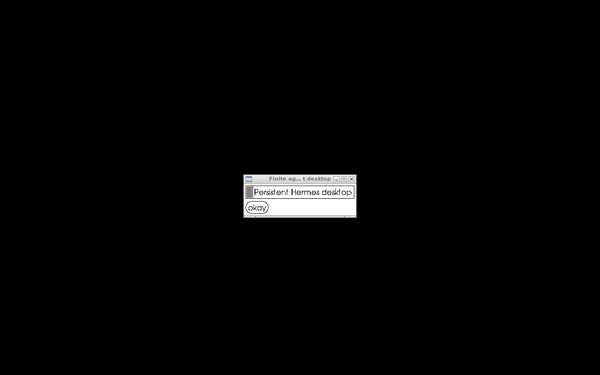

# Local evidence — 2026-09-21

**Local acceptance passed:** two owners, real Finite Private model conversations
through native Hermes WebSockets, sleep and URL wake, persistent conversation,
and a real desktop screenshot. The external SimpleX variant additionally
passed real incoming-message wake for both owners, with two cycles each.
No cloud resources or production state were changed.

## Measured results

| Check | Result |
| --- | --- |
| Independent native credentials; anonymous and cross-owner rejection | PASS |
| Client-supplied actor routing header overwritten | PASS |
| Native Hermes WS model chat for Alice and Bob | PASS |
| Suspend with no worker assigned; same URL wakes actor | PASS |
| Model recalls prior verification word after wake | PASS for both owners |
| Home marker and exact live session ID/start time survive | PASS |
| Bob remains available while Alice sleeps | PASS |
| Hermes model uses terminal tool to capture X11 desktop PNG | PASS |
| Separate SimpleX users and native pairing approval | PASS; no allow-all |
| Real SimpleX message wakes fully suspended Hermes and gets a model reply | PASS, four cycles |
| Relay rejects unauthenticated WS; admin cannot steal event stream | PASS |
| Offline transport queues message; PVC restart restores identity and wakes actor | PASS |
| Disk queue survives relay object restart; unacknowledged event replays | PASS |

Baseline suspend took 0.873s and 0.818s. HTTP wake plus native shell marker read
took 3.039s and 2.918s. A native model reply recalling prior conversation took
about 4.5–4.7s including URL wake in the initial run. These are local observations,
not latency guarantees or a load test.

SimpleX send through to model reply after sleep:

| Owner | Cycle 1 | Cycle 2 |
| --- | --- | --- |
| Alice | 11.119s | 11.160s |
| Bob | 11.272s | 11.103s |

The test checked provider state was SUSPENDED, waited three seconds, checked
again, then sent through the separate human SimpleX client. While waiting for
the reply, the harness made **no HTTP request to the actor**. The received
prompt did not contain the earlier verification word: Hermes had to retrieve
it from the persistent conversation. The final provider state was RUNNING.
The lightweight SimpleX daemon and relay remained awake outside the actor.

A further outage test suspended Alice and scaled her transport to zero. A real
message was sent while both were unavailable. Restoring the transport from its
PVC delivered the queued message, woke Alice, and obtained the remembered word
in 8.807s from restart. Again, the harness made no actor HTTP requests.
[Transport restart report](evidence/simplex-transport-restart.json).

Reports: [baseline lifecycle](evidence/lifecycle.json),
[stricter repeated lifecycle](evidence/lifecycle-repeat.json),
[initial real model chat](evidence/model-chat.json),
[final variant native model chat](evidence/model-chat-relay.json),
[Alice SimpleX wake](evidence/simplex-wake.json),
[Bob SimpleX wake](evidence/simplex-wake-bob.json).

## Fixes needed to pass

- Substrate default egress denies outbound connections. Created explicit
  per-actor egress policies through its API, enabling inference and SMP traffic.
- Full snapshot succeeded but atelet cleanup of read-only Hermes skill folders
  failed. The included one-line cleanup patch passed its Linux ARM64 regression
  with all capabilities dropped; the original implementation failed it.
- SimpleX 7 emits `receivedContactRequest`; the Hermes pin expected the older
  event name. The patch handles both and uses the numeric API accept command.
- The adapter's receive loop cannot wait on a response that the same loop must
  read. Contact acceptance now sends without blocking that loop.
- For automatic wake, the optional relay protocol adds bearer authentication
  and event acceptance ACKs to the existing adapter.

The native resume probe uses `stored_session_id`, which is distinct from the
live WebSocket session ID. Passing the latter to `session.resume` gives a 404;
that initial harness mistake was corrected before the successful tests.

## Exact local images and reproducibility

- Baseline Hermes: `localhost:5017/finite-hermes-spike@sha256:14c199557770d3ad3b63f3b73eec8a5f8d35614189bd5bbc7a56e7c8664fa7fd`
- Accepted external-SimpleX variant: `localhost:5017/finite-hermes-spike@sha256:3a71f459bfb5231d4002259b0590a3351b613077c08a5183c2ac2037dfeae100`
- Worker: `localhost:5017/ateom-gvisor-715889664656de67e44382a8d6ab981d@sha256:30f456cf61710f70331e071d0b06f8b63898846619a27b5afba0f7bd5f5eea46`
- Patched atelet: `localhost:5017/atelet-89dbecdd4e8d5cd4d125a2de341f399c@sha256:d1d9f15981555e40c80ae8031d90ab7724286a50cbf6103f31a7c6d1fe1fe79c`

`build-relay-image.sh` reproduced the accepted variant's exact digest. These are
local registry artifacts, not published production releases. Credential-bearing
fixtures and runtime state are outside git in `/private/tmp/finite-substrate-state`.
The user-supplied API key was read from its authorized file and not printed,
embedded in an image, or checked in.

## Limits

This is a successful local architecture spike, not a production replacement.
The relay's ACK does not prove crash-safe exactly-once model execution. Text
messages were tested; external attachment transfer was not. The recovery set
includes actor snapshots and SimpleX PVCs; independent backup/restore was not
qualified. Public TLS/DNS, idle sleep policy, multi-node failures, capacity and
GKE deployment are untested. See the README's state ownership and failure edges.

## Retained local demo

The cluster `kind-finite-hermes-spike` remains available through
`/private/tmp/finite-substrate-state/kubeconfig`. Final actors `alice-simplex`
and `bob-simplex` are left SUSPENDED; their per-owner transport Deployments and
PVCs remain running. The earlier `*-agent` baseline actors are retained as
suspended test snapshots. Native URLs are routed through loopback port 18080
with hosts `alice.agents.test` and `bob.agents.test`; the probes set those Host
headers without changing system DNS. Test user containers are
`finite-simplex-test-user` (Alice) and `finite-simplex-test-bob` (Bob). No recurring
Codex task or cloud deployment is needed for the relay's automatic wake path.
